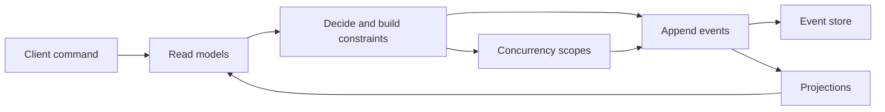

# Dynamic Consistency Boundary in Chronicle

Chronicle was designed to support decision-scoped consistency long before DCB was named. You can append events independently, project read models from disparate streams, and still enforce consistency for the specific facts used to decide.

## Mapping DCB to Chronicle

- Decision facts are read from projections or other read models.
- Constraints validate that the decision is still valid when appending events.
- Concurrency scopes let you define which streams or partitions must be checked together.
- Projections update read models asynchronously after the append.

## Constraints and concurrency scopes

Constraints are the primary way to express decision correctness. They are evaluated at append time, so the decision is validated against the most recent events. Concurrency scopes complement this by defining which streams must be checked together to keep the decision consistent without forcing a single aggregate boundary.

## Aggregate roots

If you prefer an aggregate root style, Chronicle supports it through Cratis.Arc. See [aggregate roots support](xref:Arc.Chronicle.AggregateRoots).

## Practical flow

1. Read the projections needed to decide.
2. Build constraints that capture the decision rule.
3. Choose concurrency scopes that match the decision boundary.
4. Append events and let projections update.

## Next steps

- [Constraints](../constraints/index.md)
- [Appending events](../events/appending.md)
- [Concurrency scopes](../events/concurrency.md)
- [Projections](../projections/index.md)

## Related resources

- https://github.com/bwaidelich/dcb-example-courses

