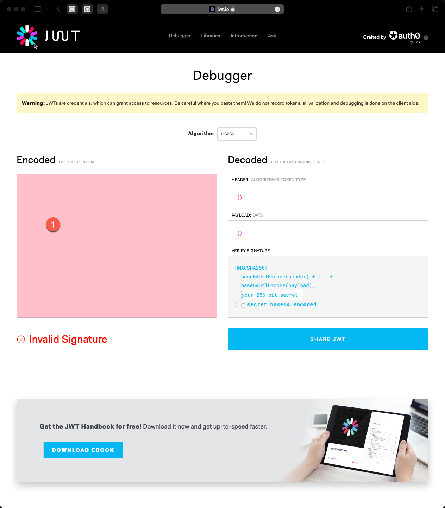
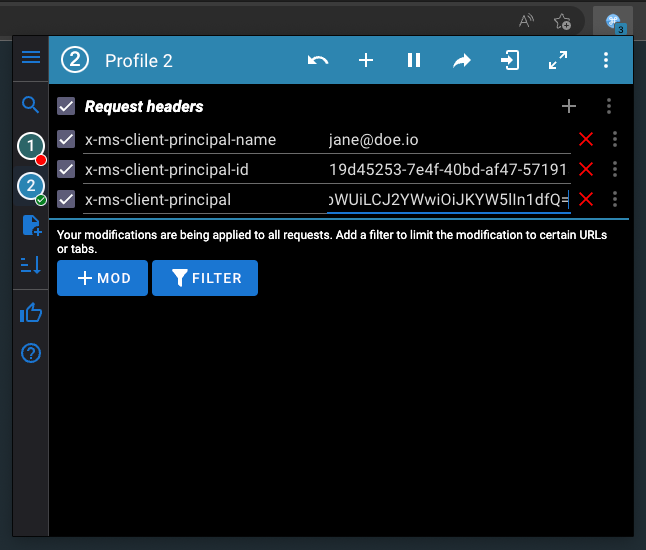

# Generating principal

While working locally you still want to test the different identities and possibly claims that are put on the identity in combination.
The [backend part](./identity.md) of the identity system is relying on the following HTTP headers being set:

| Header | Description |
| ------ | ----------- |
| x-ms-client-principal | The token holding all the details, base64 encoded JWT token |
| x-ms-client-principal-id | The unique identifier from the identity provider for the identity |
| x-ms-client-principal-name | The name of the identity, typically resolved from claims within the token |

Once these are set and the `x-ms-client-principal` is in the expected format (Base64 encoded JWT token with claims), it
will pass these onto your **identity details provider**.

To simulate users, all you have to do is generate the correct values and use an extension for your browser to set the
HTTP request headers.

You can generate the information using the site [JWT.io](https://jwt.io). This allows you to edit a JSON with the
expected structure and then get the finished base64 encoded value to use.

The first step is to clear the "Encoded" text field on the left hand side at [JWT.io](https://jwt.io):

Next you can enter the valid JSON on the right. On the left side it will generate as you work with it the correct
base64 encoded token to use.

> Important: You don't want the entire string in the "Encoded" section. Only the first part before the first *.* (dot).

Copy this value.

In your browser you can use an extension such as [ModHeader](https://modheader.com). It allows you to setup headers
that can be added to the request. Use this to add the expected headers.
The `x-ms-client-principal-id` is often just a `Guid` or an identifier that the source identity provider identifies the
person with. While the `x-ms-client-principal-name` is often just an email address for the person.

For the `x-ms-client-principal` you want to paste the value generated from **JWT.io** but add a `=` at the end.
This will make sure the base64 string is valid.

> Pro-tip: With ModHeader you can create profiles. This is super useful if you want to be testing with different users and easily just switch between them.
