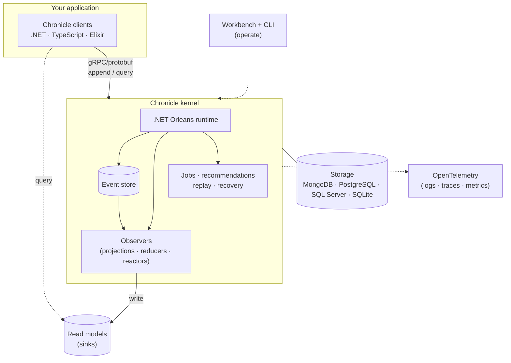
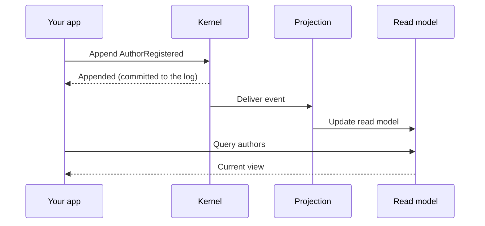

Chronicle is a **client–server** event platform. Your application talks to a small **kernel** through gRPC/protobuf contracts; the kernel owns the event store and runs the processing that turns events into read models. The .NET client is the first-class, most mature experience, but the boundary is not .NET-only: the repository also ships TypeScript and Elixir clients/contracts generated from the same protocol.

Understanding this shape makes the rest of the docs click into place: client language, storage engine, processing runtime, and operating tools are separate choices that still share one event model.

## The pieces

- **Client boundary** — gRPC/protobuf contracts. The .NET client is the main developer experience; TypeScript and Elixir clients/contracts let other runtimes talk to the same kernel.
- **Kernel** — the server. It validates and stores events, and runs the [observers](./concepts/observer-patterns.md) (projections, reducers, reactors) that react to them.
- **Orleans runtime** — the kernel is built on .NET Orleans, using grains for stateful, distributed processing such as event sequences, observer state, jobs, reminders, and recovery.
- **Storage** — the event log and read models persist here; MongoDB is the default, with PostgreSQL, Microsoft SQL Server, and SQLite available through the SQL storage implementation.
- **Read models / sinks** — projections write their output to a [sink](./sinks/); your queries read from there.
- **Workbench and CLI** — web and terminal tools for inspecting and operating the store: events, observers, read models, recommendations, jobs, failed partitions, and replay.
- **OpenTelemetry** — Chronicle exports logs, traces, and metrics through standard OTLP configuration.

## Why the boundary matters

The event log is often the system's longest-lived asset. Chronicle keeps that boundary explicit:

- **Client language is a choice.** .NET is first-class and receives the richest API, analyzers, hosting integration, and testing helpers. The gRPC/protobuf contract keeps Chronicle accessible from other runtimes too; the repository currently ships TypeScript and Elixir clients/contracts generated from that protocol.
- **Storage is a deployment choice.** You can run MongoDB locally by default, or configure PostgreSQL, Microsoft SQL Server, or SQLite when that fits your platform better. The event model above the storage layer does not change.
- **Operations are part of the model.** Observers track their position, failed partitions are recorded, jobs have state, recommendations can be listed and performed, and replay is a first-class operation.

## How an event becomes a read model

The single most important flow to internalize:

The append and the read-model update are **separate steps**. The event is committed first; the projection updates the read model shortly after. That gap is why read models are [eventually consistent](./read-models/) — usually imperceptible, occasionally something to design around.

## Why client–server

Keeping event processing in the kernel means your application stays thin: it expresses *intent* (append this fact, run this query) and the kernel handles ordering, delivery, replay, projection, observer state, and recovery. Because the kernel is built on Orleans, that processing can scale and recover independently of your app, and multiple apps can share one store.

## Next

- [Concepts](./concepts/) — each piece in depth, starting with the [Glossary](./concepts/glossary.md).
- [Projections, reducers, and reactors](./concepts/observer-patterns.md) — what runs inside the kernel.
- [Storage configuration](./hosting/configuration/storage.md) — MongoDB, PostgreSQL, Microsoft SQL Server, and SQLite.
- [CLI Chronicle commands](/cli/chronicle/) — operate events, observers, read models, jobs, and recommendations from a terminal.
- [OpenTelemetry](./hosting/configuration/open-telemetry.md) — logs, traces, and metrics.
- [Hosting](./hosting/) — running the kernel in development and production.
