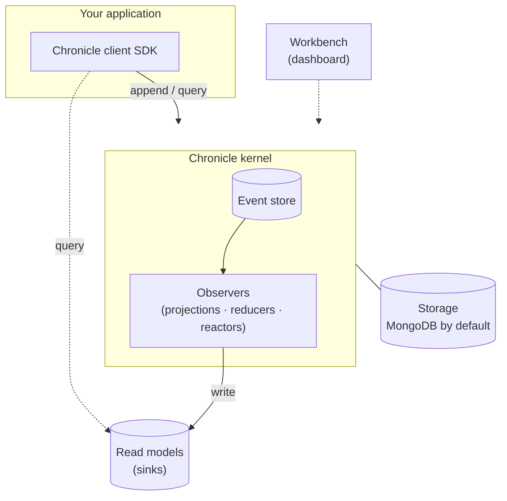
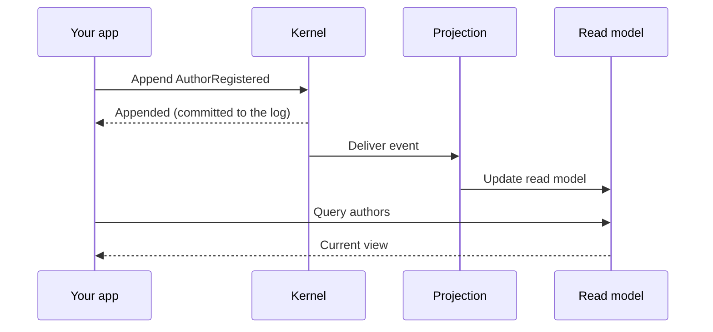

Chronicle is a **client–server** system. Your application talks to a small **kernel** through the client SDK; the kernel owns the event store and runs the processing that turns events into read models. Understanding this shape makes the rest of the docs click into place.

## The pieces

- **Client SDK** — the .NET library you reference. You append events and run queries through it; it talks to the kernel over the wire.
- **Kernel** — the server. It validates and stores events, and runs the [observers](./concepts/observer-patterns.md) (projections, reducers, reactors) that react to them. You can run it in Docker locally and scale it in production.
- **Storage** — the event log and read models persist here; MongoDB is the default, with other stores available through extensions.
- **Read models / sinks** — projections write their output to a [sink](./sinks/); your queries read from there.
- **Workbench** — a web dashboard for inspecting and operating the store.

## How an event becomes a read model

The single most important flow to internalize:

The append and the read-model update are **separate steps**. The event is committed first; the projection updates the read model shortly after. That gap is why read models are [eventually consistent](./read-models/) — usually imperceptible, occasionally something to design around.

## Why client–server

Keeping event processing in the kernel means your application stays thin: it expresses *intent* (append this fact, run this query) and the kernel handles ordering, delivery, replay, and projection. It also means processing can scale and recover independently of your app, and multiple apps can share one store.

## Next

- [Concepts](./concepts/) — each piece in depth, starting with the [Glossary](./concepts/glossary.md).
- [Projections, reducers, and reactors](./concepts/observer-patterns.md) — what runs inside the kernel.
- [Hosting](./hosting/) — running the kernel in development and production.
