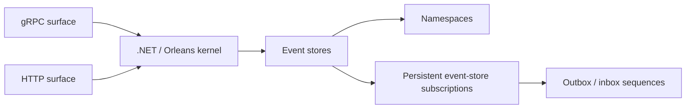

Chronicle uses a .NET/Orleans actor-based kernel behind gRPC/HTTP surfaces and
supports multiple event stores, namespaces, and persistent event-store
subscriptions with outbox/inbox sequences.

```mermaid
flowchart LR
    Grpc["gRPC surface"] --> Kernel[".NET / Orleans kernel"]
    Http["HTTP surface"] --> Kernel
    Kernel --> Stores["Event stores"]
    Stores --> Namespaces["Namespaces"]
    Stores --> Subscriptions["Persistent event-store subscriptions"]
    Subscriptions --> Sequences["Outbox / inbox sequences"]
```

## Boundaries shown by the diagram

- **Protocol surfaces:** the kernel is available behind separate gRPC and HTTP
  surfaces; this diagram does not assign both transports to every client or tool.
- **Kernel:** the server uses .NET and Orleans.
- **Runtime scopes:** Chronicle supports multiple event stores and namespaces.
- **Persistent subscriptions:** event-store subscriptions use outbox/inbox
  sequences.

## Related inspection surfaces

Chronicle Workbench provides a bundled local browser surface for authorized
inspection of Chronicle runtime state and preview of supported projection
behavior.

The Cratis CLI provides terminal workflows for inspecting and diagnosing
Chronicle. These statements do not assign either tool to a specific transport in
the diagram above.

## What this architecture statement does not establish

This page does not claim horizontal scale, throughput, guaranteed delivery,
exactly-once behavior, client/provider parity, durability tier, compliance, or
support for every topology.

- [Chronicle overview](/chronicle/)
- [Chronicle Workbench](/chronicle/workbench/)
- [Cratis CLI](/cli/)
- [Chronicle source](https://github.com/Cratis/Chronicle/tree/main/Source)
- [Chronicle releases](https://github.com/Cratis/Chronicle/releases)
