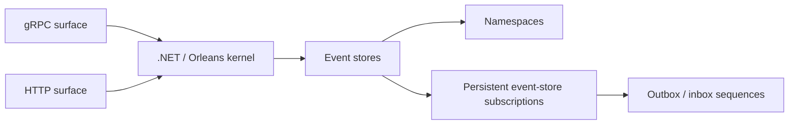

import { CardGrid } from '@astrojs/starlight/components';
import SimpleCard from '@components/SimpleCard.astro';
import TopicHero from '@components/TopicHero.astro';
import YouWillLearn from '@components/YouWillLearn.astro';

<TopicHero
  icon="puzzle"
  eyebrow="Chronicle"
  title="Kernel and protocol boundaries"
>
  Chronicle uses a .NET/Orleans actor-based kernel behind gRPC/HTTP surfaces and
  supports multiple event stores, namespaces, and persistent event-store
  subscriptions with outbox/inbox sequences.
</TopicHero>

<YouWillLearn title="Use this page to locate">

- the gRPC and HTTP protocol surfaces;
- the .NET/Orleans kernel;
- event-store and namespace runtime scopes; and
- persistent-subscription outbox/inbox sequences.

</YouWillLearn>

## Runtime shape

| Boundary | Owns in this diagram | Does not imply |
| --- | --- | --- |
| Protocol surfaces | gRPC and HTTP entry boundaries around the kernel | Every client or tool uses both transports |
| Kernel | .NET/Orleans runtime | Horizontal scale, throughput, recovery, or topology guarantees |
| Event stores and namespaces | Separate runtime scopes | Client/provider parity or compatibility breadth |
| Persistent subscriptions | Event-store subscription state with outbox/inbox sequences | Guaranteed or exactly-once delivery |

## Related inspection surfaces

Chronicle Workbench provides a bundled local browser surface for authorized
inspection of Chronicle runtime state and preview of supported projection
behavior.

The Cratis CLI provides terminal workflows for inspecting and diagnosing
Chronicle. These statements do not assign either tool to a specific transport
in the diagram above.

:::caution[Architecture is not an operational guarantee]
This page does not claim horizontal scale, throughput, guaranteed delivery,
exactly-once behavior, client/provider parity, durability tier, compliance, or
support for every topology.
:::

## Continue

<CardGrid>
  <SimpleCard title="Chronicle overview" icon="seti:db" link="/chronicle/">
    Start the reviewed self-hosted development profile and keep its limits visible.
  </SimpleCard>
  <SimpleCard title="Workbench" icon="laptop" link="/chronicle/workbench/">
    Use the bounded local browser inspection and projection-preview surface.
  </SimpleCard>
  <SimpleCard title="Cratis CLI" icon="rocket" link="/cli/">
    Use terminal inspection and diagnostic workflows.
  </SimpleCard>
</CardGrid>
