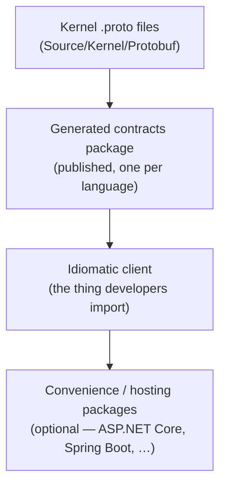

# Building a Chronicle Client

Chronicle speaks gRPC. In theory that means any language with a gRPC implementation can talk to
it. In practice, hand-rolling a client means solving the same handful of hard problems every
client has to solve before it can do anything useful: generating strongly-typed bindings from the
wire contract, exchanging credentials for a token and keeping that token fresh, discovering and
load-balancing across a cluster of servers, reconnecting when a connection drops, and rejecting a
server whose contract has drifted instead of silently sending it garbage.

None of that is domain logic. It's the same plumbing whether the client ends up written in Go,
Python, Rust, or Java — and it's exactly the plumbing Chronicle's own team has already built,
three times over, for TypeScript, Elixir, and Kotlin. This section is that experience written
down, so a fourth client doesn't have to rediscover it.

## The shape of every Chronicle client so far

Every client Chronicle has shipped follows the same layering, whether or not that was the plan
going in:

- **[Two ways to start](./starting-points.md)** — use the `.proto` files directly, or ask the
  Cratis team to generate and publish a contracts package for your language. Most clients so far
  took the second path.
- **[Layering an idiomatic client](./layering-an-idiomatic-client.md)** — why the generated
  contracts are deliberately not the client developers use, and how a raw client and optional
  convenience packages sit on top of them.
- **[Authentication and bearer tokens](./authentication-and-bearer-tokens.md)** — how a client
  turns connection-string credentials into a bearer token on every call, and keeps it fresh.
- **[Clustering and the connection lifecycle](./clustering-and-connection-lifecycle.md)** — what
  a client has to implement to be a good citizen of a multi-server Chronicle cluster.
- **[Connection string elements](./connection-string-elements.md)** — the object model a client
  SDK typically wraps around the connection string grammar.
- **[How TypeScript, Elixir, and Kotlin were built](./client-history.md)** — the real history,
  including what worked, what didn't, and what's still incomplete.
- **[Documentation and snippets](./documentation-and-snippets.md)** — how a new client repo's
  `Documentation/` folder plugs into the shared Chronicle docs site.

## Talk to us first

Before generating anything yourself, get in touch with the Cratis team. Every contracts package
Chronicle has shipped so far — TypeScript, Elixir, and Kotlin — was generated from the kernel's
own `.proto` files and published to the right registry (npm, Hex, Maven Central) from Chronicle's
own release pipeline, version-locked to the kernel release it matches. That pipeline already
exists; turning it on for a new language is normally a matter of days, not the weeks it takes to
build a `protoc` toolchain from scratch and get the packaging right. See
[Two ways to start](./starting-points.md) for what that conversation looks like and what you get
out of it.

:::note
This section is written for whoever builds and maintains a **new** Chronicle client — Cratis team
members and community contributors alike. If you're building an *application on* Chronicle rather
than a new client SDK, you want the [get started](../get-started/) guide instead.
:::
