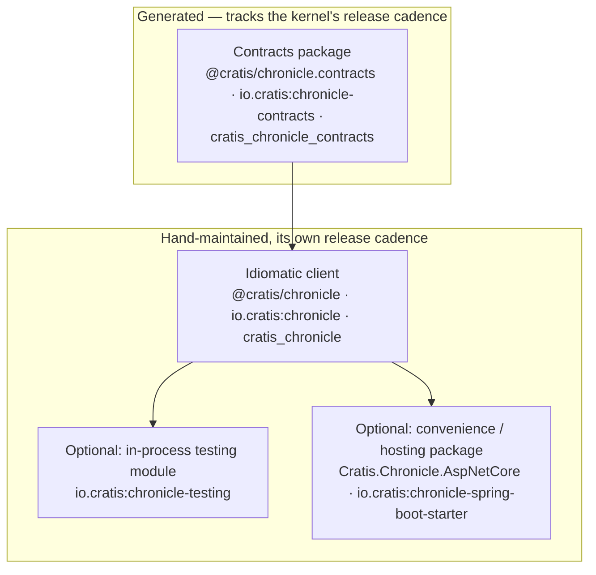

# Layering an idiomatic client

A generated contracts package is not something you'd want to hand a developer and call it a day.
It's a faithful mechanical translation of the wire format — service interfaces, message types,
`int64` fields as `bigint`, `Guid` as whatever protobuf-net's BCL extensions say a `Guid` is. It
has no decorators, no fluent builder, no idea what a "read model" or a "reactor" is. That's by
design: it's generated on every kernel release, so nothing generated can carry hand-written
idiomatic API surface without it being overwritten the next time.

The idiomatic client is a second, separate thing built *on top of* the contracts package, hand
written and hand maintained, with its own release cadence. This split — raw contracts underneath,
idiomatic API on top — is the one structural decision every Chronicle client has made so far,
independent of language.



## Why the split exists

- **The generated layer can't carry taste.** Attribute-based artifact discovery, fluent builders,
  a `ChronicleClient` → `EventStore` → `EventLog` API shape — none of that survives regeneration.
  It has to live somewhere the generator never touches.
- **The two layers version independently.** The contracts package tracks the kernel's release
  number; the idiomatic client tracks its own API stability. Chronicle.Kotlin, for example, is
  presently at `2.1.1` while the `io.cratis:chronicle-contracts` package it depends on tracks the
  kernel's `16.x` version — two numbers, two meanings, on purpose.
- **The value contract, not the whole API, is what has to agree across languages.** Only what
  crosses the wire — how a `Guid`, a date, a duration, a concept, a derived type is serialized —
  has to be identical everywhere. Everything above that (dependency injection, task scheduling,
  how a language discovers its own artifacts) is free to be idiomatic. See
  [The Value Contract](../contributing/clients/value-contract.md) for the exact, short list of
  things that must agree, and
  [Client Types](../contributing/clients/client-types.md) for how the .NET client's own project
  dependency graph reflects this layering internally.

## How C# does it differently — and why that's not the model to copy

C#'s idiomatic client, `Cratis.Chronicle`, does not depend on a separately published contracts
NuGet package the way the other three languages do. Instead, `Contracts.csproj` is referenced
directly and packaged as a **runtime-only** dependency: it ships inside the `Cratis.Chronicle`
NuGet package under `runtimes/`, invisible to IntelliSense and uncompilable against directly, while
the SDK's own types occupy `lib/`. A build-time step (`GrpcClients`, using
`System.Reflection.Emit`) even pre-generates the gRPC client implementations that would otherwise
need a compile-time reference to the internalized contracts types. The mechanics are in
[Internalization](../contributing/clients/internalization.md).

That's possible because C# is Chronicle's own implementation language and NuGet's `ref`/`lib`
split gives it a tool the other ecosystems don't have as cleanly. It is not a pattern to reach for
in a new client. The other three languages hide the seam a simpler way: publish the contracts
package on its own, and let the idiomatic client's package name and its exports be the only thing
a developer ever consumes directly. Nobody imports `@cratis/chronicle.contracts` in application
code; they import `@cratis/chronicle`, which happens to depend on it.

## The raw client is usable on its own

The idiomatic client — on its own, with no convenience package — is a complete, general-purpose
client. It's what you reach for in a console tool, a script, a background worker, or a test
project. Every one of the four existing clients treats this as the default entry point:

```typescript
const client = new ChronicleClient(ChronicleOptions.development());
const store = await client.getEventStore('MyStore');
await store.eventLog.append('employee-123', new EmployeeHired('Jane', 'Doe'));
```

## Convenience packages sit above that, and are optional

Once the raw client is stable, it's common — not mandatory — to build a thin package on top that
wires the client into a specific hosting environment: registering it in a DI container, resolving
configuration from the host's standard config system, binding request-scoped concerns like tenant
or identity to the current HTTP request. C# has done this since early on with
`Cratis.Chronicle.AspNetCore`. Kotlin followed the same shape much later, once its idiomatic
client's artifact-discovery machinery existed to build on: `io.cratis:chronicle-spring-boot-starter`
provides Spring auto-configuration, `ChronicleProperties`, and per-request namespace resolution
(fixed, HTTP-header, subdomain, or authentication-claim based) — the direct JVM analogue of the
ASP.NET Core package.

TypeScript and Elixir don't have an equivalent yet (no Express/Fastify/NestJS package for
TypeScript, no Phoenix package for Elixir). That's a genuine gap in those ecosystems today, not a
sign the pattern doesn't apply — build a convenience package when your idiomatic client is stable
enough to build one on top of, and there's an obvious dominant hosting framework in your language
to target.

A fourth, optional layer is worth knowing about too: an **in-process testing module**
(`io.cratis:chronicle-testing` in Kotlin, `Cratis.Chronicle.Testing`/`Cratis.Chronicle.XUnit` in
.NET) that depends on the idiomatic client and lets application code exercise slices without a
live kernel. It's the same "build it once the layer beneath is stable" story as the convenience
package, just aimed at test authors instead of host authors.

Next: [Authentication and bearer tokens](./authentication-and-bearer-tokens.md) covers the first
thing the idiomatic client actually has to do once it opens a connection.
