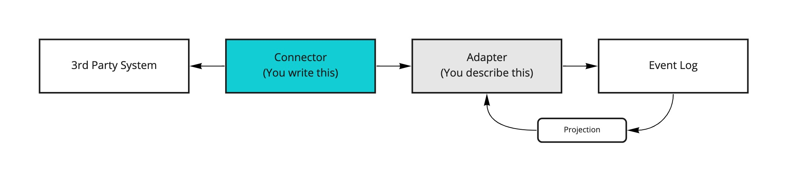
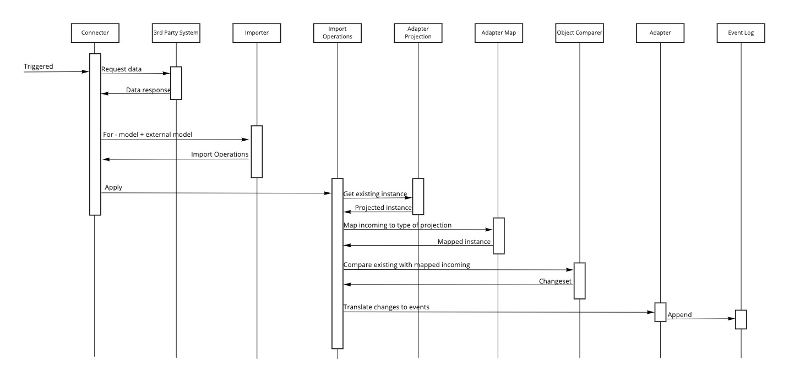

# Integration

Since Cratis is focused on Event Sourcing, connecting with 3rd parties can become a challenge.
Most 3rd parties don't offer integration where we can ask for domain events that has occurred in a
sequenced manner as we would expect.

The following depicts the high level architecture:



## Adapters

The essential piece of the puzzle is the adapter. Its role is to tell how to translate the external data
from the 3rd party into events. In order for it to do so, it needs to compare with what we already
have with the incoming and then deduce what the changes mean to us in the form of events.

The shape of the incoming data might differ from what we have and its always considered a good practice
to not leverage a 3rd parties construction directly as our representation since it is maintained and belongs
to the third party (read more about [anti-corruption layers](https://docs.microsoft.com/en-us/azure/architecture/patterns/anti-corruption-layer)).
The adapter therefor offers a map of how to map from the incoming type to the type we maintain.

Our type is a projection of the truth as we know it which are represented as events. The adapter defines
a way to project from the event log to a type we call the model.

With the two instances; the external model and our model - both now with the same shape, we can perform
a comparison. From the comparison, you define what events should be produced based on for instance which
properties have changed.

The following describes the flow in more detail:



## Getting started

### Models

Lets start my defining the models we have; the external model and our internal model.

The external model could be something like below (PS: our sample shows an imaginary Norwegian external model):

```csharp
public record KontoEier(string Fnr, string Fornavn, string Etternavn, DateTime FodselsDato, string Adresse, string By, string PostNr, string Land);
```

> Note: The external model might already be something that is coming from the 3rd party as a library or other and you
> wouldn't then need to create this.

For our internal model we want to represent that differently, in English:

```chsarp
public record AccountHolder(string FirstName, string LastName, DateTime DateOfBirth, string SocialSecurityNumber, string Address, string City, string PostalCode, string Country);
```

### Identification

In order for the integration engine to work with the instances, it needs to know what property on the external model
represents the key. This key will be used as the event source id/key when applying any events and is also what
we query the event log for based on this key to project into a model instance for comparison.

```csharp
public class AccountHolderDetailsAdapter : AdapterFor<AccountHolder, KontoEier>
{
    public override Func<KontoEier, EventSourceId> KeyResolver => _ => _.Fnr;
}
```

> Note: Since the property for resolving the key is a `Func` callback, you can do complex key resolution from any of the
> properties within the external model. E.g. composite keys. As long as it can be a string - which the `EventSourceId`
> is the concept of.

### Model Projection

To get to a comparable state we leverage projections. The projections are as any other projections in
Aksio and leverages the projection engine found in [Cratis](https://github.com/cratis/cratis).
Its job is to describe how we go from events to a single model instance.
The projection setup for integration is slightly different than for regular projections, as we're
working concretely on instances.

```csharp
public class AccountHolderDetailsAdapter : AdapterFor<AccountHolder, KontoEier>
{
    public override Func<KontoEier, EventSourceId> KeyResolver => _ => _.Fnr;

    public override void DefineModel(IProjectionBuilderFor<AccountHolder> builder) => builder
        .From<AccountHolderRegistered>(_ => _
            .Set(m => m.FirstName).To(ev => ev.FirstName)
            .Set(m => m.LastName).To(ev => ev.LastName)
            .Set(m => m.DateOfBirth).To(ev => ev.DateOfBirth))
            .Set(m => m.Address).To(ev => ev.Address))
        .From<AccountHolderAddressChanged>(_ => _
            .Set(m => m.Address).To(ev => ev.Address)
            .Set(m => m.City).To(ev => ev.City)
            .Set(m => m.PostalCode).To(ev => ev.PostalCode)
            .Set(m => m.Country).To(ev => ev.Country));
}
```

### External Model to Model mapping

Since the shape of the external model is likely to be different from our representation, we need
to be able to map properties across to get the external model represented in the same shape
as our model is. This is done by overriding the `DefineImportMapping` method of the adapter.
The mapping engine that is used is [AutoMapper](https://automapper.org).

Out of the box there is a convenience extension method called `.MapMember()`, this allows for a
simpler mapping where you basically map a destination property to a source property. While if you
want to have more complex mapping, you use the out of the box `.ForMember()` giving you the
ability to do more conversion - both type and value conversion and more.

```csharp
public class AccountHolderDetailsAdapter : AdapterFor<AccountHolder, KontoEier>
{
    public override Func<KontoEier, EventSourceId> KeyResolver => _ => _.Fnr;

    public override void DefineImportMapping(IMappingExpression<KontoEier, AccountHolder> builder) => builder
        .MapMember(_ => _.SocialSecurityNumber, _ => _.Fnr)
        .MapMember(_ => _.FirstName, _ => _.Fornavn)
        .MapMember(_ => _.LastName, _ => _.Etternavn)
        .MapMember(_ => _.DateOfBirth, _ => _.FodselsDato)
        .MapMember(_ => _.Address, (source, context) => new Address(source.Adresse, source.PostNr, source.By, source.Land));
}
```

If your destination type is a `record` type - AutoMapper needs to know about it. The reason for this
is that `records` are typically used for immutable types; having their properties as part of its constructor with
read-only properties. The above mapping wouldn't work for the `record` type used in this sample.
You would need to use the extension method we provide called `.MapRecordMember()`, the mapping would then
be like the following:

```csharp
public class AccountHolderDetailsAdapter : AdapterFor<AccountHolder, KontoEier>
{
    public override Func<KontoEier, EventSourceId> KeyResolver => _ => _.Fnr;

    public override void DefineImportMapping(IMappingExpression<KontoEier, AccountHolder> builder) => builder
        .MapRecordMember(_ => _.SocialSecurityNumber, _ => _.Fnr)
        .MapRecordMember(_ => _.FirstName, _ => _.Fornavn)
        .MapRecordMember(_ => _.LastName, _ => _.Etternavn)
        .MapRecordMember(_ => _.DateOfBirth, _ => _.FodselsDato)
        .MapRecordMember(_ => _.Address, (source, context) => new Address(source.Adresse, source.PostNr, source.By, source.Land));
}
```

### Import Definition

The last piece of the puzzle is to tell the integration engine what to do with the differences
found when doing comparison. This is done by overriding the `DefineImport` method.
It gives you a builder to work with, which is essentially a reactive [Subject](https://docs.microsoft.com/en-us/previous-versions/dotnet/reactive-extensions/hh229173(v=vs.103))
with the context object created vby the engine. With this you can create your own conditionals
using the [reactive API](https://github.com/dotnet/reactive).
To append events there are extension methods for the `IObservable` that gives you that possibility.

```csharp
public class AccountHolderDetailsAdapter : AdapterFor<AccountHolder, KontoEier>
{
    public override Func<KontoEier, EventSourceId> KeyResolver => _ => _.Fnr;

    public override void DefineImport(IImportBuilderFor<AccountHolder, KontoEier> builder)
    {
        builder
            .WithProperties(_ => _.FirstName, _ => _.LastName, _ => _.DateOfBirth)
            .AppendEvent(_ =>
                new AccountHolderRegistered(
                    _.Changeset.Incoming.FirstName,
                    _.Changeset.Incoming.LastName,
                    _.Changeset.Incoming.DateOfBirth,
                    _.Changeset.Incoming.Address));

        builder
            .WithProperties(
                _ => _.Address.AddressLine,
                _ => _.Address.City,
                _ => _.Address.PostalCode,
                _ => _.Address.Country)
            .AppendEvent(_ =>
                new AccountHolderAddressChanged(
                    _.Changeset.Incoming.Address.AddressLine,
                    _.Changeset.Incoming.Address.City,
                    _.Changeset.Incoming.Address.PostalCode,
                    _.Changeset.Incoming.Address.Country));
    }
}
```

For filtering for changes using the `.WithProperties()` with nested properties in complex structures.
The system will automatically recurse within any nested property as long as you filter the top level property.

> Note: There are multiple overloads of `AppendEvent`. One with a callback for creating the event and one without a callback.
> The latter will then match properties by convention from the model type to the event type and copy the content over.
> With the callback you have full flexibility of how you create the event and maybe there is a last minute
> condition for selecting which event to append.

### All together

Putting it all together you'll get an adapter like below.

```csharp
public class AccountHolderDetailsAdapter : AdapterFor<AccountHolder, KontoEier>
{
    public override AdapterId Identifier => "71741aaf-9f6b-4c6f-bfe6-af77aec464a2";

    public override Func<KontoEier, EventSourceId> KeyResolver => _ => _.Fnr;

    public override void DefineModel(IProjectionBuilderFor<AccountHolder> builder) => builder
        .From<AccountHolderRegistered>(_ => _
            .Set(m => m.SocialSecurityNumber).ToEventSourceId()
            .Set(m => m.FirstName).To(ev => ev.FirstName)
            .Set(m => m.LastName).To(ev => ev.LastName)
            .Set(m => m.DateOfBirth).To(ev => ev.DateOfBirth)
            .Set(m => m.Address).To(ev => ev.Address))
        .From<AccountHolderAddressChanged>(_ => _
            .Set(m => m.Address.AddressLine).To(ev => ev.AddressLine)
            .Set(m => m.Address.City).To(ev => ev.City)
            .Set(m => m.Address.PostalCode).To(ev => ev.PostalCode)
            .Set(m => m.Address.Country).To(ev => ev.Country));

    public override void DefineImport(IImportBuilderFor<AccountHolder, KontoEier> builder)
    {
        builder
            .WithProperties(_ => _.FirstName, _ => _.LastName, _ => _.DateOfBirth)
            .AppendEvent(_ =>
                new AccountHolderRegistered(
                    _.Changeset.Incoming.FirstName,
                    _.Changeset.Incoming.LastName,
                    _.Changeset.Incoming.DateOfBirth,
                    _.Changeset.Incoming.Address));

        builder
            .WithProperties(
                _ => _.Address,
                _ => _.Address.AddressLine,
                _ => _.Address.City,
                _ => _.Address.PostalCode,
                _ => _.Address.Country)
            .AppendEvent(_ =>
                new AccountHolderAddressChanged(
                    _.Changeset.Incoming.Address.AddressLine,
                    _.Changeset.Incoming.Address.City,
                    _.Changeset.Incoming.Address.PostalCode,
                    _.Changeset.Incoming.Address.Country));
    }

    public override void DefineImportMapping(IMappingExpression<KontoEier, AccountHolder> builder) => builder
        .MapRecordMember(_ => _.SocialSecurityNumber, _ => _.Fnr)
        .MapRecordMember(_ => _.FirstName, _ => _.Fornavn)
        .MapRecordMember(_ => _.LastName, _ => _.Etternavn)
        .MapRecordMember(_ => _.DateOfBirth, _ => _.FodselsDato)
        .MapRecordMember(_ => _.Address, (source, context) => new Address(source.Adresse, source.PostNr, source.By, source.Land));
}
```

> Note: All `AdapterFor<,>` implementations will automatically be discovered, there is no need for registering them anywhere.
> As you start using the engine, they will be instantiated and configured as needed.

### Integration jobs

What triggers an integration flow is whatever you want it to be, for instance an ASP.NET controller action could
be such an entrypoint. You leverage the engine by making use of the `IImporter` interface. But you might want to
consider encapsulating the **connector** itself, so that it can be leveraged from different scenarios.

Lets say we have the following definition of our external API:

```csharp
public interface IKontoEierSystem
{
    Task<KontoEier> GetBySocialSecurityNumber(string socialSecurityNumber);
}
```

For the simplicity of the demo, you can implement it with hard-coded data as follows:

```csharp
public class KontoEierSystem : IKontoEierSystem
{
    public Task<KontoEier> GetBySocialSecurityNumber(string socialSecurityNumber) =>
        Task.FromResult(new KontoEier(
            "03050712345",
            "John",
            "Doe",
            new DateTime(2007, 5, 3),
            "Greengrass 42",
            "Paradise City",
            "48321",
            "Themyscira"));
}
```

We then create an encapsulation of our connector as something like the following:

```csharp
public class KontoEierConnector
{
    readonly IKontoEierSystem _externalSystem;
    readonly IImporter _importer;

    public KontoEierConnector(IKontoEierSystem externalSystem, IImporter importer)
    {
        _externalSystem = externalSystem;
        _importer = importer;
    }

    public async Task ImportOne(string socialSecurityNumber)
    {
        var accountHolder = await _externalSystem.GetBySocialSecurityNumber(socialSecurityNumber);
        await _importer.For<AccountHolder, KontoEier>().Apply(accountHolder);
    }

    public async Task ImportAll(IEnumerable<string> socialSecurityNumbers)
    {
        var accountHolders = await _externalSystem.GetBySocialSecurityNumbers(socialSecurityNumbers);
        await _importer.For<AccountHolder, KontoEier>().Apply(accountHolders);
    }
}
```

The connector basically does the coordination of talking to the external system and handing the
result of that over to the importer and its operations, which will under the covers grab
hold of your adapter configuration and run it through the pipeline as expected.

> Note: Notice that the `ImportOperations` support applying a single item or an enumerable of items.
> It will do the looping for you.

To start the job, you can have something like an API controller that calls the connector and triggers
the import. Something like the following:

```csharp
[Route("/api/integration")]

public class IntegrationController : Controller
{
    readonly KontoEierConnector _connector;

    public IntegrationController(KontoEierConnector connector)
    {
        _connector = connector;
    }

    [HttpGet]
    public async Task Trigger()
    {
        await _connector.ImportOne("03050712345");
    }
}
```
