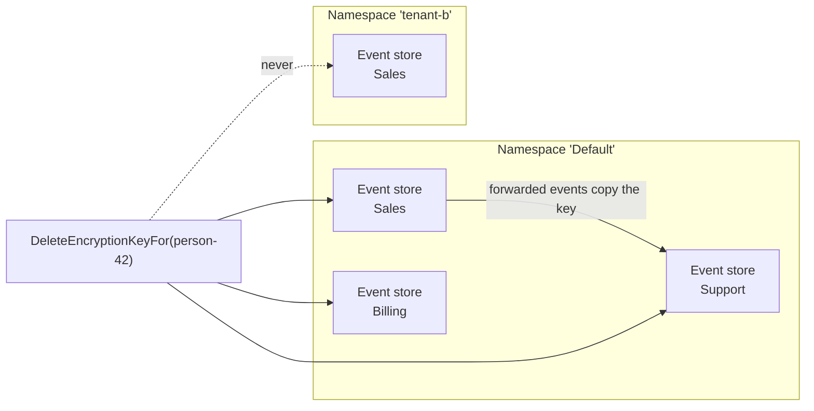

# Erasing a subject

A right-to-erasure request arrives naming one person, and Chronicle gives you exactly one call to make. This page covers what that call reaches, what happens to that person afterwards, and what you still have to do yourself before you can certify the erasure as complete.

## The one call

Erasure in Chronicle is the deletion of an encryption key. Every `[PII]` value is encrypted at append time under a key held for the event's [subject](../concepts/subject), so deleting that key makes every PII value for that subject unreadable at once, without touching the append-only log:

```csharp
var eventStore = await chronicleClient.GetEventStore("Sales");
await eventStore.PII.DeleteEncryptionKeyFor("person-42");
```

`IEventStore.PII` is an `IPIIManager`. `DeleteEncryptionKeyFor` removes every revision of the key, evicts it from every silo's cache, and records the erasure so that nothing puts the key back afterwards.

Read one of that subject's events afterwards and nothing breaks. The event is still there, its sequence number is still there, and every field that was not marked `[PII]` still holds its value — only the PII properties come back as empty strings. That is the whole point of crypto-shredding: the log stays immutable and the personal data stops existing.

## What one call reaches

The erasure covers **every event store in the namespace you erased in**, not only the event store you resolved `PII` from.

That is not generosity, it is arithmetic. When an [event store subscription](../subscriptions/index.md) forwards a subject's events from one event store to another, Chronicle copies that subject's encryption key into the target event store — and it never copies across namespaces. So the set of places the key can have reached is exactly *every event store, in this namespace*, and that is the set the erasure covers:



The erasure runs in two phases across that set: it records the erasure in every event store first, and only then destroys the key material. Fencing everything before destroying anything is what closes the window a per-store fan-out could not — between the first delete and the last, one event store still held the key and another did not, and an event forwarded in that interval copied the survivor into a store that had just been cleared.

Every phase attempts every event store even when one of them fails, and the failures are reported together as `EncryptionKeyErasureIncomplete`. **A partial erasure is not an erasure** — repeat the call once the failing store is reachable. A call that returns without throwing reached everything.

> [!IMPORTANT]
> The namespace is the boundary. In a multi-tenant deployment the same person in two namespaces has two keys and is, as far as Chronicle is concerned, two subjects. Erasing in one namespace deliberately leaves the other untouched — issue one erasure per namespace the person appears in.

## The subject is fenced, not banned

Deleting the key is only half of an erasure; the other half is making sure nothing puts it back. Chronicle records the erasure beside the keys, and from then on that store refuses to provision a key for the subject, refuses to accept the destroyed key material back, and refuses to let a subscription copy a key in.

The practical consequence is worth knowing before you erase:

**Appending a `[PII]` value for an erased subject fails.** It does not quietly mint a new key, and it does not quietly blank the value — both of those would be a silent surprise, one restarting protection for a person who asked to be forgotten and the other losing data with no signal. It fails with `EncryptionKeyErased` instead.

If the same person later has a lawful basis to be protected again, say so:

```csharp
var eventStore = await chronicleClient.GetEventStore("Sales");
await eventStore.PII.AllowNewEncryptionKeyFor("person-42");
```

That creates no key. It authorizes the next `[PII]` value written for the subject to provision a fresh, independent one — which protects data written from then on and can decrypt nothing that came before. The erased key itself never comes back. Like the erasure, the authorization covers every event store in the namespace.

The mechanics of the fence, and what it cannot protect you against, are in [The encryption key lifecycle](key-lifecycle.md).

## What you still have to do

Chronicle erases keys. It does not know what else your system did with the data.

- **Erase in every namespace the person appears in.** One call per namespace; there is no cross-namespace erasure, by design.
- **Deal with the failed partition, if there is one.** An event carrying `[PII]` for a subject you erased cannot be appended, so a forwarding subscription or a reactor that keeps producing them will report a failed partition for that event source. That is the signal that something is still writing the person's data — either stop it, or authorize a new key.
- **Keep your own erasure record.** Chronicle's own log line about key propagation deliberately does not name the subject, because a durable, unencrypted line naming a person is exactly what the erasure exists to remove. What was erased, when, and on whose request is yours to record.
- **Chase the copies outside Chronicle.** Read models exported to a warehouse, search indexes, backups, and anything a reactor sent to a third party are outside the key store and outside the erasure.

## See also

| Topic | Description |
|---|---|
| [The encryption key lifecycle](key-lifecycle.md) | How the fence works, and what it does not protect against |
| [Compliance](index.md) | How Chronicle protects personal data in an immutable log |
| [Subject](../concepts/subject) | The identity a PII encryption key is held under |
| [Compliance and PII in subscriptions](../subscriptions/compliance-and-pii.md) | What forwarding preserves, and what it no longer copies |
| [Compliance Storage](../hosting/configuration/compliance-storage.md) | Where encryption keys are stored |
| [Event Redaction](../events/redaction) | Removing an event's content rather than its key |
