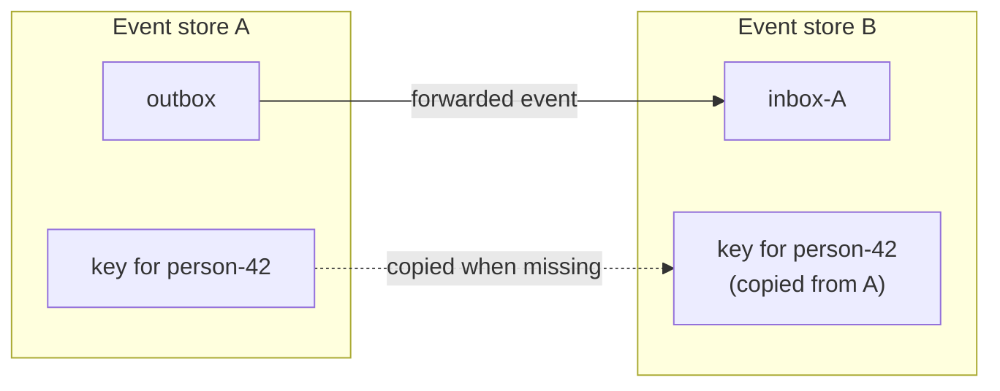

# Erasing a subject

A right-to-erasure request arrives naming one person, and Chronicle gives you exactly one call to make. What the call does not tell you is the thing you actually have to certify: **when is the erasure complete?**

The answer depends on how many event stores that person's data reached — and Chronicle may have put their key into more event stores than you appended to. This page walks through what one erasure reaches, what it leaves behind, and how to write an erasure that covers everything.

## The one call

Erasure in Chronicle is the deletion of an encryption key. Every `[PII]` value is encrypted at append time under a key held for the event's [subject](../concepts/subject), so deleting that key makes every PII value for that subject unreadable at once, without touching the append-only log:

```csharp
var eventStore = await chronicleClient.GetEventStore("Sales");
await eventStore.PII.DeleteEncryptionKeyFor("person-42");
```

`IEventStore.PII` is an `IPIIManager`, and `DeleteEncryptionKeyFor` removes every revision of the key and evicts it from every silo's cache.

Read one of that subject's events afterwards and nothing breaks. The event is still there, its sequence number is still there, and every field that was not marked `[PII]` still holds its value — only the PII properties come back as empty strings. That is the whole point of crypto-shredding: the log stays immutable and the personal data stops existing.

## The erasure is scoped to one event store and one namespace

`IEventStore.PII` is bound to the event store *and* the namespace you resolved the event store from. So is the key it deletes. Chronicle holds encryption keys per `(event store, namespace)` pair — a separate key store per pair, whichever [compliance storage](../hosting/configuration/compliance-storage.md) backend you configure — and a delete addressed at one pair never touches another.

That scoping is the right default. It is also the part that is easy to get wrong, for two reasons:

- **A delete that reaches nothing still succeeds.** Erasing a subject in an event store that holds no key for them is a no-op, not an error. If you name the wrong event store, or spell it wrong, nothing at runtime tells you the erasure removed nothing.
- **A namespace is a separate scope too.** In a multi-tenant deployment, the same person in two namespaces has two keys. Erasing in one leaves the other readable.

## A subscription copies the key into another event store

Here is the part that is not obvious from anything you wrote. When an [event store subscription](../subscriptions/index.md) forwards a subject's events from one event store to another, Chronicle copies that subject's encryption key into the target event store — once per subject, the first time an event for them is forwarded:



You never asked for the key to be there, and no client API reports that it is. The kernel logs the copy at information level, naming the identifier, both event stores and the namespace, so it is at least visible in the kernel log:

```text
Copied the encryption key for 'person-42' from event store 'Sales' to event store 'Support'
in namespace 'Default' while forwarding events. The subject now holds a key in both event
stores, and erasing it reaches only the one it is asked for
```

Two consequences follow, and both matter for compliance:

- **Erasing through one event store is an incomplete erasure.** The copy in the other event store keeps decrypting that subject's forwarded events exactly as before.
- **A surviving copy can restore a deleted key.** The copy happens whenever the target store has *no* key for the subject — which is precisely the state you just created by erasing. If events for that subject are still being forwarded *into* the store you erased, the next one copies the surviving key back, and PII you had already shredded becomes readable again.

> [!CAUTION]
> An erasure is only durable once no event store that still holds the subject's key forwards events into an event store you erased. Erase everywhere, and erase after forwarding for that subject has stopped — not before.

## Erasing everywhere

The complete erasure enumerates every event store and every namespace and deletes in each. Both enumerations are on the client, so this needs no configuration and no hard-coded store names:

```csharp
public class SubjectErasure(IChronicleClient chronicleClient)
{
    public async Task Erase(EncryptionKeyIdentifier subject)
    {
        foreach (var eventStoreName in await chronicleClient.GetEventStores())
        {
            var eventStore = await chronicleClient.GetEventStore(eventStoreName);

            foreach (var @namespace in await eventStore.GetNamespaces())
            {
                var scopedEventStore = await chronicleClient.GetEventStore(eventStoreName, @namespace);
                await scopedEventStore.PII.DeleteEncryptionKeyFor(subject);
            }
        }
    }
}
```

Deleting in a pair that holds no key for the subject costs one round-trip and removes nothing, so enumerating everything is safe — and it is more robust than listing the event stores you believe are involved, because it stays correct when someone adds a subscription later.

Prefer this over hard-coding the other event store's name. A hard-coded name that no longer matches produces a delete that succeeds and erases nothing, which is the failure mode with no signal at all.

## Honest limits

There is no API that answers "which event stores hold a key for this subject", and no cascading delete that follows the copies Chronicle made. The fan-out above is the complete erasure available today, and the kernel log line is the only place the propagation itself surfaces.

Between the first delete and the last, one event store has the key and another does not. A subject's event forwarded in that interval copies the survivor back into a store you already cleared. Quiesce forwarding for the subject before erasing, or re-run the fan-out afterwards and check the kernel log for a copy that landed mid-erasure.

## See also

| Topic | Description |
|---|---|
| [Compliance](index.md) | How Chronicle protects personal data in an immutable log |
| [Subject](../concepts/subject) | The identity a PII encryption key is held under |
| [Compliance and PII in subscriptions](../subscriptions/compliance-and-pii.md) | What forwarding preserves, and what it copies |
| [Compliance Storage](../hosting/configuration/compliance-storage.md) | Where encryption keys are stored |
| [Event Redaction](../events/redaction) | Removing an event's content rather than its key |
