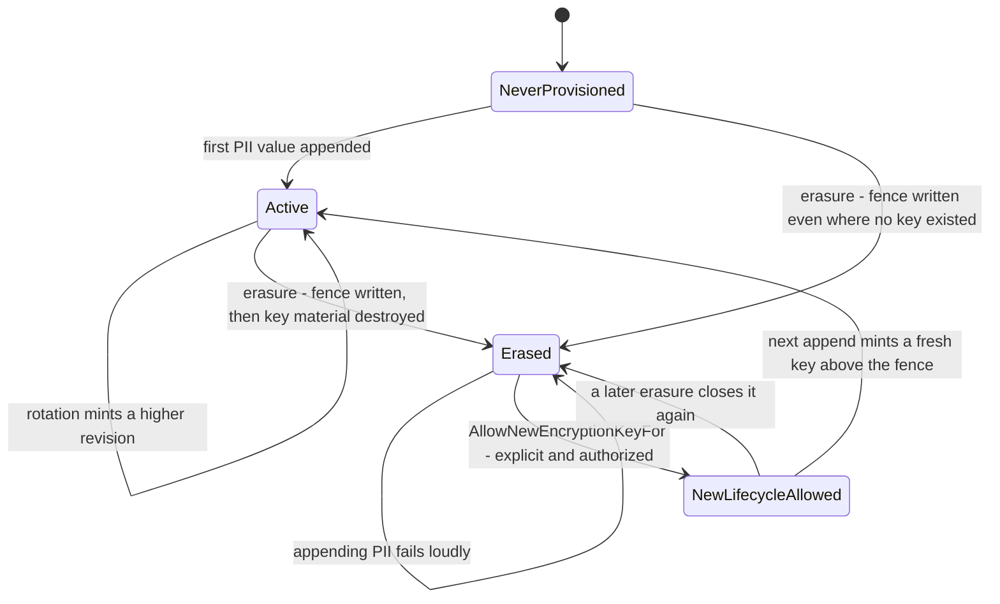
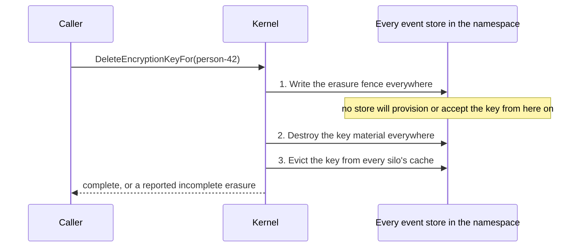

# The encryption key lifecycle

Crypto-shredding only works if a destroyed key stays destroyed. Deleting a key is easy; making sure nothing puts it back is the hard part, and it is what this page is about.

Read [Erasing a subject](erasing-a-subject.md) first if you only need to know which call to make. This page explains the machinery underneath it: the states a subject's key moves through, what stops an erased key coming back, how a person who returns gets a new key, and — just as important — what Chronicle *cannot* protect you from.

## Why deleting the key is not enough

A key store that only ever holds key material has exactly two states for a subject: there is a key, or there is not. Those two states have to carry three different meanings:

| Meaning | What the store shows |
|---|---|
| This subject was never protected here | no key |
| This subject's key was destroyed for right-to-erasure | no key |
| This subject's key has not been provisioned *yet* | no key |

Because the last two look identical, every code path that provisions a key on demand treats a completed erasure as an invitation to create a fresh one — and any path that still holds the *original* key material puts the original back. Chronicle has two such paths:

- **Provisioning on append.** Appending a `[PII]` value for a subject with no key mints one. After an erasure, that is a new key, and it cannot read the old ciphertext — but it silently restarts protection for a person who asked to be forgotten.
- **The cross-event-store copy.** An [event store subscription](../subscriptions/compliance-and-pii.md) copies the subject's key into the event store it forwards into, whenever the target has none. "The target has none" is precisely the state an erasure creates, so a forwarded event puts the *pre-erasure key material* back and personal data that was already shredded reads in clear again.

Both are resurrections, and neither can be fixed by deleting harder.

## The erasure fence

Chronicle records the erasure itself, next to the keys, in the same key store. That record is the **erasure fence**, and it is what makes "erased" a state the store can tell apart from "never provisioned".

A fence for one `(event store, namespace, subject)` carries three things:

| Field | Meaning |
|---|---|
| `ErasedThrough` | The highest key revision the erasure covered. No key at or below this revision may ever be provisioned, saved, healed or copied again. |
| `ErasedKeyFingerprints` | The SHA-256 fingerprints of the public keys that were destroyed. That exact key material may never be stored again, at any revision. |
| `NewKeyAllowed` | Whether an explicitly authorized new lifecycle may mint a fresh key *above* the fence. Set to `false` by every erasure. |

The fence lives in the key store because that is the only place it can be written in the same breath as the deletion, and the only place that travels with the store — into its backups, its replicas, and every composed store that serves it. A fence held in memory expires; a fence held beside the key does not.



### What the fence refuses

Once a fence exists, the key store refuses, in every backend:

- **Provisioning.** `GetOrAddFor` no longer mints a key. It throws `EncryptionKeyErased` instead of quietly creating one, so a resurrection is a loud failure rather than an invisible restart.
- **Saving at or below the floor.** `SaveFor` refuses any revision at or below `ErasedThrough`. This is what stops a composed store healing a survivor back into the store that was erased.
- **Restoring the destroyed material.** Any save of a key whose public-key fingerprint matches a destroyed one is refused, *at any revision, even after a new lifecycle is authorized*. This is the one that closes the cross-store copy: the copy carries the very same key bytes, and those bytes are exactly what the fingerprint fence names.

Reads are untouched. `TryGetFor`, `HasFor` and `GetFor` answer about key material and keep answering exactly as they did — an erased subject has no key, so `[PII]` values release as empty strings and queries keep working.

### What it does *not* refuse

The fence is not a ban on the subject identifier. Ada's D98 ruling settled that erasure removes the key incarnation that exists now, not the person's ability to ever be a customer again — so a later, lawful lifecycle for the same identifier is a supported operation. It is just not an accident.

## Erasure reaches every event store in the namespace

A subscription copies a subject's key across event stores, but never across namespaces — the namespace is the tenancy boundary and the copy always stays inside it. So the set of places a key can have reached is exactly *every event store, in the namespace you erased in*, and that is the set a single erasure now covers:

```csharp
var eventStore = await chronicleClient.GetEventStore("Sales");
await eventStore.PII.DeleteEncryptionKeyFor("person-42");
```

That one call now runs in three phases:



Fencing everywhere *before* destroying anything is what closes the window the previous fan-out could not: between the first delete and the last, one event store still held the key and another did not, and an event forwarded in that interval copied the survivor into a store that had just been cleared. With the fence written first, there is no interval in which any store will accept the key.

Every phase attempts every event store even after one fails, and the failures are reported together as `EncryptionKeyErasureIncomplete`. A partial erasure is not an erasure — repeat the call once the failing store is reachable.

The fence is written even in event stores that never held a key for the subject. That is deliberate: it makes the erasure uniform, it removes the ordering hazard above, and it means a subscription cannot later carry the subject's personal data into a store the erasure did not visit.

## A later lifecycle for the same person

When a person who was erased has a lawful basis to be protected again, authorize a new key explicitly:

```csharp
var eventStore = await chronicleClient.GetEventStore("Sales");
await eventStore.PII.AllowNewEncryptionKeyFor("person-42");
```

Like erasure, this reaches every event store in the namespace, and like erasure it is a deliberate, explicit act rather than something ordinary traffic can cause. It does **not** create a key. It sets `NewKeyAllowed` on the fence, and the next `[PII]` value appended for that subject mints a fresh key at revision `ErasedThrough + 1`.

Chronicle does not keep a per-subject record of who authorized it or when — the same reason it does not name the subject in its logs, since a durable line naming an erased person is the thing an erasure exists to remove. That record is yours to keep, alongside the erasure record.

The new key is independent of the erased one in every sense that matters:

- It is generated from scratch — it cannot decrypt anything written before the erasure. Values from the old lifecycle stay blank forever.
- It cannot *be* the old key. The fingerprint fence survives the authorization, so the destroyed material is still refused.
- It protects only data written after the new lifecycle begins.

Until you make that call, appending a `[PII]` value for an erased subject fails with `EncryptionKeyErased` rather than silently minting a key or silently blanking the value. That failure is the point: after an erasure, storing that person's personal data again is a decision somebody has to make on purpose.

> [!IMPORTANT]
> A forwarded event carrying `[PII]` for an erased subject fails to append in the target event store, and the observer partition for that event source enters a failed state. The rest of the subscription keeps flowing. Either stop appending that subject's personal data, or authorize a new key — both are deliberate acts, which is the intent.

The same refusal reaches anything that *writes* protected values, not only appends. Replaying a projection or reducer into a stored read model re-applies what the release produced, so a rebuild that touches an erased subject asks for a key and is refused for that subject's partition. This is deliberate: the alternative is to store the subject's slot in the clear, which changes what a unique constraint over a `[PII]` property means, or to mint a key on replay, which is the resurrection the fence exists to stop. Authorize a new key for the subjects you intend to keep protecting before a rebuild that has to cover them.

## The threat model

What the fence stops, and what it does not, stated plainly.

### Stopped

| Attempted resurrection | What refuses it |
|---|---|
| `GetOrAddFor` minting a fresh revision 1 after an erasure | The fence: provisioning throws `EncryptionKeyErased` |
| A cross-event-store subscription copying the pre-erasure key back in | The fence in the target, plus the fingerprint of the destroyed key |
| A composed key store healing a surviving member's copy into the erased member | `SaveFor` refusing every revision at or below `ErasedThrough` |
| A composed store *serving* a copy that survived in one member after another member was erased | Every member is asked whether it recorded that key's material as destroyed; if any did, the read returns nothing and reports the divergence |
| A silo cache handing back a key after the erasure landed | The fence invalidates the local cache, and the erasure evicts every silo's cache cluster-wide |
| An erasure that reached three stores out of four reporting success | `EncryptionKeyErasureIncomplete`, listing every failure |
| A key erased for subject A being provisioned for subject B | Fences and keys are per subject; nothing in this path is shared between subjects |

### Not stopped

Be honest about these when you write your erasure procedure — the fence is a mechanism inside one deployment, not a proof about the physical world.

- **Restoring a backup.** A restore that predates the erasure brings back the key material *and* removes the fence that would have refused it, so it is undetectable from inside Chronicle. A blocking restore-and-re-erase procedure is still required; the fence does not replace it.
- **Copies made outside Chronicle.** A key exported from the key store, an application-level cache, a dump of the backing database, or a secrets-manager audit trail is outside the fence's reach.
- **Mixed-version silos.** A silo running a version without the fence will happily provision over it. Upgrade every silo before relying on the contract; a cluster running both is unsupported while an erasure is in force.
- **A third-party key store.** A custom `IEncryptionKeyStorage` that does not implement the fence fails loudly the first time an erasure is attempted through it, rather than silently erasing reversibly. That is the safe failure, not a working erasure.
- **A composed store whose only fenced member is unreachable.** When key stores are composed, a member that cannot be reached is skipped rather than allowed to fail every read — otherwise one backend's outage would blank every protected value in the deployment. While it is down, a fence that only it holds is invisible, so provisioning can mint a fresh key for a subject it had erased. Its erasure was reported incomplete when it happened; repeat it once the store is back.
- **New personal data written before an erasure lands.** The fence stops what happens after it is recorded. A value appended in the same instant is protected under the key that is being destroyed, which means it is erased too — but a value appended a moment later, after a new key is authorized, is not.
- **Ciphertext already read.** Erasure makes stored values unreadable. Anything already decrypted, projected into an external system, or displayed is beyond it.
- **The fence itself is a durable record.** It states that *some* identifier was erased in a given store. It holds no key material and no personal data beyond the subject identifier, which every appended event already carries in the clear — but it does outlive the key, by design, because that is what makes the erasure stick.

## Upgrading an existing deployment

There is no data migration and no rewrite of existing keys. A key store that has never recorded an erasure has no fences, and no fence means no change: provisioning, reading, rotation and deletion all behave exactly as before. Deployments that do not use `[PII]` are unaffected entirely.

Two things do need your attention.

**Erasures performed before the upgrade are not fenced.** They left the same absence as "never provisioned" — that is the defect — so the upgrade has nothing to recognize. They stay resurrectable until you erase those subjects again. **Re-run the erasure for every subject erased before the upgrade.** It is idempotent, it costs one call per subject, and it is the only way to lay down a fence retroactively.

**Upgrade every silo together.** The fence is enforced by the key store, so a silo that predates it provisions straight over one. Do not run mixed versions while an erasure is in force.

Backend by backend, the fence needs:

| Backend | What is added |
|---|---|
| MongoDB | An `encryption-key-erasures` collection per `(event store, namespace)`, created on first use |
| SQL | An `EncryptionKeyErasures` table, created by a migration that runs automatically on startup |
| HashiCorp Vault | An `erasure` secret beside the revisions under `{store}/{namespace}/{identifier}` |
| Azure Key Vault | A `chronicle--{store}--{namespace}--{identifier}--erasure` secret |
| In-memory | Nothing persisted; the fence lives as long as the process |

## See also

| Topic | Description |
|---|---|
| [Erasing a subject](erasing-a-subject.md) | The call to make, and how to certify an erasure is complete |
| [Compliance](index.md) | How Chronicle protects personal data in an immutable log |
| [Compliance and PII in subscriptions](../subscriptions/compliance-and-pii.md) | What forwarding preserves, and what it no longer copies |
| [Compliance Storage](../hosting/configuration/compliance-storage.md) | Where encryption keys and their fences are stored |
| [Subject](../concepts/subject) | The identity a PII encryption key is held under |
