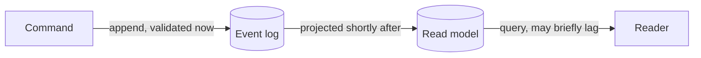

Consistency is where event sourcing feels different from CRUD, and where most early confusion lives. The short version: **writes are validated immediately; reads are usually eventual.** This page unpacks that and shows how to choose the right tool for each decision.

## The two sides

In a CRUD system, you write a row and read it straight back — one place, one consistency model. Event sourcing splits the write side from the read side, and they have different guarantees:

- **The write side is consistent now.** When you append an event, it's committed and ordered immediately. Invariants enforced at append time (constraints, the boundary below) hold the moment the command returns.
- **The read side is eventual.** A [projection](./projection.md) updates the read model *after* the append. The window is usually milliseconds, but a read taken instantly after a write may not reflect it yet.

## Why not just make reads immediate?

Because eventual reads are what make the model scale and stay simple: projections run independently, read models specialize per use case, and the write path doesn't wait on every view being updated. The cost is the small lag — and most UIs handle it naturally, especially with [observable queries](../scenarios/real-time-query.md) that update the moment the projection catches up.

When you genuinely need read-after-write for a specific case, Chronicle offers **immediate projections** — a read model materialized synchronously so it's current the instant the command returns. Use them deliberately and sparingly; they trade the benefits above for strong read consistency. See [Immediate projections](../projections/immediate-projections.md).

## Protecting invariants: don't read, constrain

The classic mistake is enforcing a rule by reading a model first: "is this email taken? no → append." Because the read is eventual, two commands can race and both pass. Enforce invariants on the **write side** instead:

- A [constraint](../constraints/) rejects an append that would violate a rule (uniqueness, for example) — evaluated against authoritative state at append time.
- A **Dynamic Consistency Boundary** scopes a decision to exactly the events it depends on, so the decision is made against consistent state without loading a whole aggregate.

## The Dynamic Consistency Boundary

Traditional event sourcing draws the consistency boundary around a fixed **aggregate** — you load all of an entity's events to make any decision about it. That's rigid: real decisions often span more or less than one entity.

A [Dynamic Consistency Boundary](../dynamic-consistency-boundary/) lets the *decision* define the boundary. You scope to precisely the events that matter for the rule you're enforcing — no more, no less — and Chronicle guarantees consistency over that scope. It's the boundary, made to fit the decision instead of the other way around.

## How to choose

| You need… | Use |
|---|---|
| A view to read and render | A normal [projection](./projection.md) — embrace eventual consistency |
| The UI to update as data changes | An [observable query](../scenarios/real-time-query.md) |
| An invariant guaranteed at write time | A [constraint](../constraints/) or a [DCB](../dynamic-consistency-boundary/) |
| Read-after-write for one specific case | An [immediate projection](../projections/immediate-projections.md), deliberately |

## See also

- [Read Models](../read-models/) — consistency and retrieval in depth.
- [Dynamic Consistency Boundary](../dynamic-consistency-boundary/) — the full model.
- [Designing read models](./designing-read-models.md) — designing for eventual consistency.
