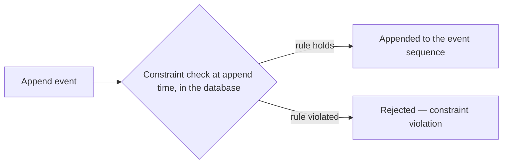

# Constraints

To keep integrity within typically an [event source](./event-source.md) when appending events to an [event sequence](./event-sequence.md),
you can leverage constraints. Constraints are rules that run on a database level within Chronicle, allowing or not allowing an event to be
appended. This is one of the main ways Chronicle enforces the [Dynamic Consistency Boundary](../dynamic-consistency-boundary/chronicle.md)
by validating that the decision remains correct at append time.

## Unique Constraint

A **unique constraint** keeps a property value unique across event sources. By default it reserves one value per event source: claiming a new value releases that source's previous one. Reclaiming the same value by its owner is allowed.

Per-value mode instead reserves every value a source claims until a removal event releases it. A removal event can identify one value or release every value the source holds. See [keeping every value](../constraints/model-bound/unique.mdx#keeping-every-value).
For instance, let's say you're creating a system for registering users, the username is typically something you want to keep a unique
constraint on. Any events that either create the user or modify the user name in any way would typically then be included in the
constraint definition.

## Unique Event Type Constraint

The **unique event type constraint** lets you constrain on a specific event type being unique per event source. If any attempt is made
to append the same event type twice for an event source, it will be a constraint violation.
