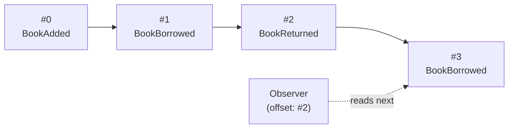

# Event Sequence

Chronicle has the concept of event sequences. These can be looked upon as collections of events.
Every event gets assigned an incremental unique sequence number, this if the sequence
number that [observers](./observers.md) uses to maintain their offset.

With every event, Chronicle collects additional metadata that is stored together with the event.

A sequence is the timeline of your system — events laid out in the order they happened, each at a
fixed sequence number that never changes:

The observer's offset is just a sequence number — it remembers how far it has read, and picks up from
there when new events arrive.

Chronicle has formalized the following event sequences:

| Type | Description |
| ---- | ----------- |
| Event Log | The main sequence you typically append to |

## Event Type generations

Every [event type](./event-type.md) can evolve over time. Evolutions are represented as generations.
The `content` property stores event content per generation, allowing for a perfect audit trail of
the events and its evolution and at the same time also supporting scenarios of delivering different
versions of the events, depending on the observer.

## Revisions

An event sequence is append only, meaning that we do not delete anything within a sequence.
Changing the content of an event is also not supported by Chronicle, instead one should perform
revisions.

Revisions are replacements of the original event instance and are in fact the same event type and
are stored together with the original event it replaces. Every revision is stored with the same
type of metadata as for the root event.

This approach help us guarantee a perfect audit trail of the system.

> Note: Revisions are not fully implemented yet, there is no API surface for it.
> Internally Chronicle has been prepared for it and that is why you'll see the revisions array on every
> event.
