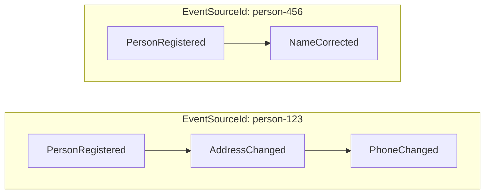

# Event Source

An event source can be viewed as instance grouping together all state changes to form a story for the particular
entity in your domain. Each state change is represented as an event.
With each event being completely autonomous and representing a just its part of the truth, the event source identifier
is (`EventSourceId`) what what binds it together.

For instance, take the notion of a person. What identifies the person uniquely is in many systems the **social security number**
assigned by the government for all residents. All state changes relevant for an instance of a person should be identified
by this unique identifier, this is what we call an **event source id**.

It can be compared to the **primary key** often used in database modelling.

The diagram below shows two event sources — two people — each with its own ordered story of events,
all sharing the same event source id throughout:

When events are appended in Chronicle, you'll see that the first argument is the `EventSourceId`.
