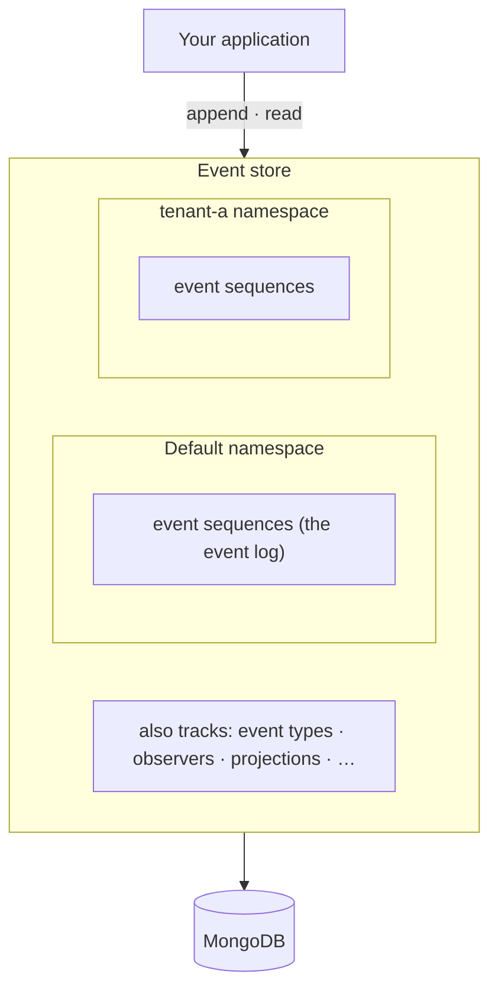

Chronicle offers what is called an event store which basically means a special purpose database
for storing events. The events are stored in [event sequences](./event-sequence.md).

In addition to this, the Chronicle event store also maintains information about things like the
[event types](./event-type.md), [observers](./observers.mdx), [projections](./projection.md) and more.

Chronicle stores the event store in a database you provide: [MongoDB](https://mongodb.com), PostgreSQL,
Microsoft SQL Server, or SQLite — see [Storage configuration](../hosting/configuration/storage.mdx). MongoDB is the
default. For local development, Chronicle provides a development Docker image that comes with MongoDB bundled inside it.

## Namespaces

Every event store can have [namespaces](./namespaces.md). The namespaces provides a way to segregate data that is specific for
a partition. Typically, a namespace can be used for multi-tenancy.

By default, Chronicle will use the **Default** namespace if a namespace is not provided.
