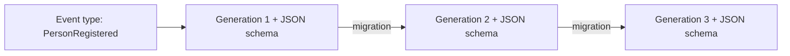

# Event Type

Every [event](./event.md) stored in the [event store](./event-store.md) must have
a type associated with it.

Any client connecting to Chronicle needs to communicate the event types before any events
can be appended to an [event sequence](./event-sequence.md).

An event type can contain multiple generations. Every new event starts with generation 1
and any changes to the event should then become a new generation. This allows versioning
your event types so that multiple schema generations can coexist in the same event store.

The concept of generations is important when working with systems that evolve over time.
Each generation registers its own JSON schema, which Chronicle uses to validate and store
events correctly for that generation.

You keep the record for every past generation in your codebase alongside the current one. The
recommended way to declare a previous generation is `[EventTypeGenerationFor<T>]`, where `T` is
the current generation's type — Chronicle resolves the shared event type id from `T`'s own
`[EventType]`, so the previous generation never carries (and can never mistype) an id of its own.

For detailed information on how to define and use migrations — including this attribute, the
older explicit-id style it replaces, and the operations available for transforming events between
generations — see [Event Type Migrations](./event-type-migrations).
