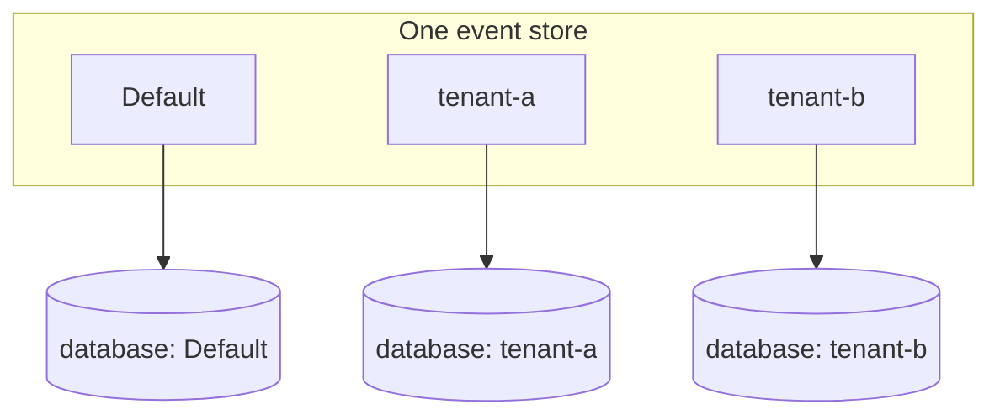

# Namespaces

Chronicle has been designed with the concept of namespaces from the ground up.
Namespaces provide a way to provide segregation of data in the same event store.
This can typically be used for multi-tenant scenarios were you have multiple
tenants of your system and you want to provide data segregation between them.

When not specified, Chronicle will use the **Default** namespace.

> Note: A tenant is typically an organization or an organizational unit that uses a system.
> In cloud terminology it is often linked to Software as a Service offerings were companies
> can sign up to use a system. The system being the same for all these companies, or tenants,
> but all their data segregated from each other.

## Data Segregation

With Chronicle, all namespace specific data sits in its own database in the underlying
data storage. This helps us avoid data leakage between namespaces, or tenants. With this
you also get a better utilization of resources with mechanisms like indexing that happens
on a database level.

## Database Naming

The databases are named from the event store name and the namespace. For an event store named
`Ada` on MongoDB:

| Holds | Namespace `Default` | Namespace `tenant-a` |
| --- | --- | --- |
| Event store wide state | `Ada+es` | `Ada+es` |
| Event sequences | `Ada+es+Default` | `Ada+es+tenant-a` |
| Read models | `Ada` | `Ada+tenant-a` |

Note the one asymmetry: **read models of the default namespace are materialized into the bare event
store name**, without a namespace suffix, while event sequences suffix every namespace including the
default. Anything reading read models outside Chronicle — for instance an injected
`IMongoCollection<TReadModel>` bound to a database name composed by hand — has to reproduce that rule.
Composing `<eventStore>+<namespace>` unconditionally resolves `Ada+Default`, a database that does not
exist, and reads then come back **empty rather than failing**.

Since the namespace becomes part of a database name, it has to be a legal one. MongoDB rejects the
characters `/ \ . " $ * < > : | ?`, the space, and the null character, and limits the whole name to 63
bytes. This bites most often when the namespace is resolved from a tenant id — a display-style tenant id
such as `Hive Consulting` composes a name MongoDB will not accept. Chronicle checks the composed name and
throws `InvalidDatabaseName`, naming the event store, the namespace, and the offending character, rather
than letting the driver fail later with a bare `Invalid namespace specified`.
