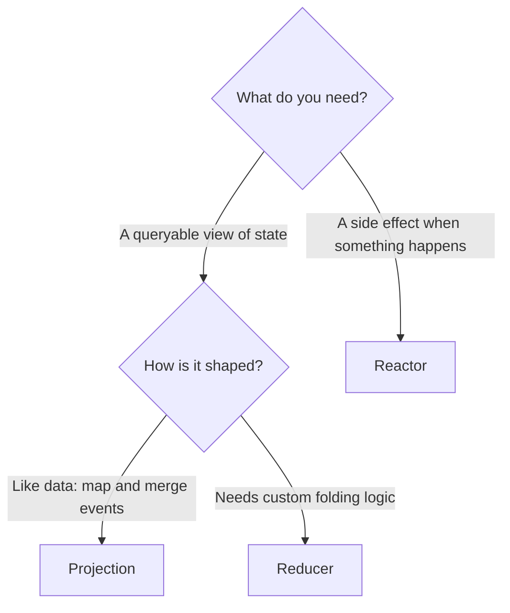

Projections, reducers, and reactors are all **observers**: they watch an [event sequence](./event-sequence.md) and run as events arrive. The confusion is that they look similar and are often explained on separate pages. This page puts them side by side so you can pick the right one without second-guessing.

The one-line distinction:

- **Projection** and **reducer** *build state* (a read model) — declaratively or imperatively.
- **Reactor** *causes effects* (notify, integrate, trigger a command) — it builds nothing.

## Side by side

| | Projection | Reducer | Reactor |
|---|---|---|---|
| **Purpose** | Build a read model | Build a read model | Do a side effect |
| **How** | Declarative (`[ReadModel]` + model-bound attributes, AutoMap) | Imperative fold you write | A method per event type |
| **Produces** | A document you query | A value you query | Nothing (acts on the outside world) |
| **Reach for it when** | The read side is shaped like data | A projection can't express the logic cleanly | You must notify, integrate, or trigger a command |
| **Must be idempotent** | Handled for you (rebuildable) | Handled for you (rebuildable) | **Yes — you own this** |

## Choosing

1. **Do you want state you can query, or an effect in the outside world?**
   - State → projection or reducer.
   - Effect → reactor.
2. **If state: can you express it as "map these event properties onto this model"?**
   - Yes → [Projection](./projection.md). Start here — it's the least code and AutoMap does most of the work.
   - No, it needs real logic (running totals, conditional accumulation) → [Reducer](../reducers/).
3. **If effect:** use a [Reactor](../reactors/) — and design it to be safe to run more than once, because it will be (replay, recovery, redeploy).

## The rules that keep them honest

- A **projection/reducer never causes side effects** — no emails, no API calls. They only build state.
- A **reactor never builds state and never writes to the event log directly** — if it must produce new events, it executes a command through the command pipeline.
- All of them are **rebuildable**: because events are the source of truth, you can replay to rebuild a read model at any time.

## Go deeper

- [Projections](../projections/) — the full range, including declarative and model-bound styles.
- [Reducers](../reducers/) — when and how to fold.
- [Reactors](../reactors/) — side effects and idempotency.
- [Read Models](../read-models/) — what projections and reducers write to, and how consistency works.
