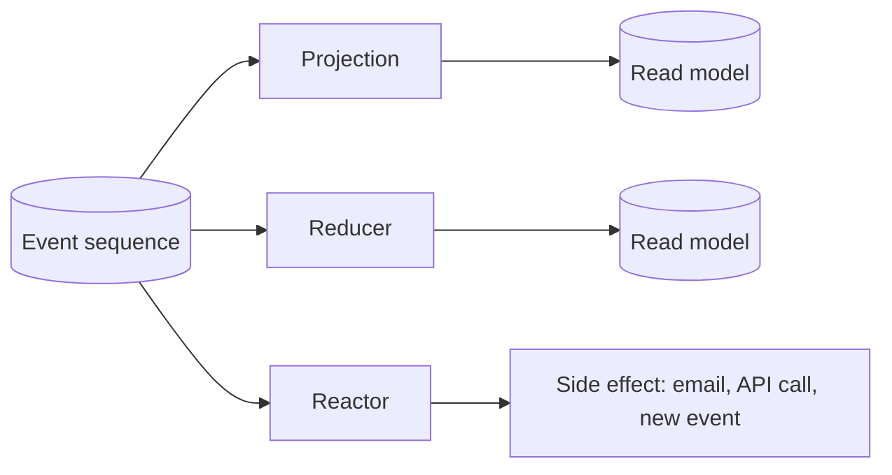

# Observers

An observer is a part of your system that is "listening" to events.
When events are appended to an [event sequence](./event-sequence.md) that the observer
is observing, it will automatically be notified of the event.

Every observer decides what events they are interested in during the subscription process.
This information is stored in the [event store](./event-store.md).

If the observer gets additional event types it is observing, the event store will look if there
are events prior to its current offset of the new event type it is now observing. If there are,
it will automatically be rewound to the beginning of the sequence and replayed.

During replay, the observer will not be active and when it reaches the end of the sequence it
will become active again and observe any new events.

There are three kinds of observer, each turning events into something different — queryable state, or
an action:



## Failed partitions

A failed partition identifies the event source an observer stopped processing and records its attempts. The Workbench distinguishes unresolved failures that remain eligible for automatic retries from **quarantined** partitions, where automatic retries have stopped. Resolved failures are no longer active failures and are normally removed from the active list.

The client exposes `IsResolved` and nullable `IsQuarantined`. A missing quarantine value means the connected server did not supply that state; it does **not** mean healthy or automatically retryable. The Workbench displays it as **Unknown** rather than guessing.

SQL-backed failed-partition queries observe the shared database at the configured live-query polling interval, including changes made by another instance. They emit only changed snapshots, and unsubscribe when the query consumer disconnects. Resolution and retry activity therefore update the view without a manual refresh, subject to the polling interval.

## Removing an observer

An observer outlives the code that declared it. Delete a read model and its projection, or remove a reactor, and nothing tells the event store — the observer simply stops being reported by any client, settles into `Disconnected` and stays there, keeping its definition, its state and handled counts in every namespace, its failed partitions and, for a projection, its projection definition.

Removing one deletes exactly that bookkeeping:

```csharp
var result = await eventStore.Observers.Remove("the-observer");
if (!result.IsRemoved)
{
    Console.WriteLine($"Not removed: {result.Outcome} in namespace {result.BlockingNamespace}");
}
```

The same operation is available in the Workbench, on the **Observers** page under a namespace, and from the CLI:

```shell
cratis chronicle observers remove the-observer
```

Three things are worth knowing before you use it.

**It covers the whole event store, not one namespace.** An observer's definition — and the projection definition it has when it is a projection — are store-level records shared by every namespace. Deleting those while leaving namespaced state behind in the other namespaces would produce the same half-present observer the removal exists to clear up, so the operation reaches every namespace.

**It refuses while the observer is alive.** If the observer is running, or a client is still subscribed to it, in *any* namespace, nothing is deleted and the result names the namespace that blocked it. There is no force flag: stop the application that declares the observer and try again. An observer that is `Disconnected`, `Suspended` or `Quarantined` with no subscribed client is removable — quarantine in particular is where an abandoned observer tends to end up.

**Read models are not touched.** Removal deletes the observer's bookkeeping, never a sink container or the data a projection wrote into it. If you want the read model gone too, delete it separately.

Removal is not a reset. If the code that declared the observer registers it again, the event store treats it as brand new and it replays the sequence from the beginning. To rewind an observer you still have, use replay instead.

## State management

One of the things you can use an observer for is to maintain application state, typically update
data in a database that is used for reading. However, it is recommended to use [projections](./projection.md)
for this purpose, as long as projections support your scenario. Projections are not a catch all
solution, and sometimes you need to do it manually. It is also a possibility to combine manual state
management with **immediate projections**.

## Reactors

Reactors are great for the **if this then that** type of scenarios. When an event occurs,
you can react to it and perform an action. This could be any type of action, e.g. out-of-process actions
like sending emails or calling an API. You could also append new events in an observer and make
your observer become a pattern matcher or a state machine that responds to certain conditions and
then generate more specific events for that condition.

## Reducers

While projections is a declarative approach and has some limitations, a reducer can help give you more
capabilities. With a reducer, Chronicle manages the actual storage. Chronicle will call you on every
event you are interested in for your reducer and you will get the existing state of the read model, if any,
and you can then provide a new representation of state as a consequence of the event. The result will then
be stored.
