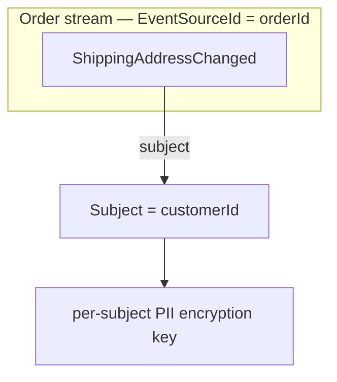

# Subject

The **subject** of an event is the target the event is *about* — the identity used to key
compliance concerns such as PII encryption. In most systems the subject and the
[`EventSourceId`](event-source.md) are the same, but they don't have to be.

Consider a `ShippingAddressChanged` event. The `EventSourceId` is the order identifier
(that is what binds all events for that order together), but the *subject* is the customer
the address is about. PII encryption keys are held per-subject, not per-event-source, so that
every event that touches the same person can be decrypted with the same key regardless of
which aggregate produced it.

## Default — the `EventSourceId`

When you don't specify a subject, Chronicle uses the `EventSourceId` as the subject. This is
the right default for most slices where the aggregate and the subject coincide:

<ChronicleClientTabs snippet="concepts/subject/default" />

## Specifying an explicit subject

When the event source is different from the subject, pass `Subject` explicitly. `Subject` has
an implicit conversion from `EventSourceId`, so mixing the two is painless:

<ChronicleClientTabs snippet="concepts/subject/explicit" />

`Subject` also converts implicitly from `string` and `Guid`. Kotlin and Java pass a subject through `AppendOptions`. TypeScript doesn't currently expose a `subject` append option at all.

## Implicit subject with `[Subject]`

Rather than threading `subject` through every call site, decorate the relevant property on the
event type with `[Subject]`. Chronicle will read the property value automatically when no
explicit subject is provided:

<ChronicleClientTabs snippet="concepts/subject/implicit-with-attribute" />

An explicit `subject` argument always takes precedence over a `[Subject]` property. This declarative form is C#-only — Elixir, Kotlin, and Java pass the subject explicitly on every append (shown above), and TypeScript doesn't support a subject at all yet.

## Compliance

When an event type declares `[PII]` properties, Chronicle encrypts those properties at append
time using a per-subject encryption key. The key is created on first use and stored in the
encryption key store. Because the key lives under the subject, every event that shares a
subject is encrypted with the same key — and once that key is deleted (for example, to honor a
right-to-erasure request), every PII property across every event for that subject becomes
unrecoverable in one operation.

Read more about [PII compliance](./../compliance/pii).
