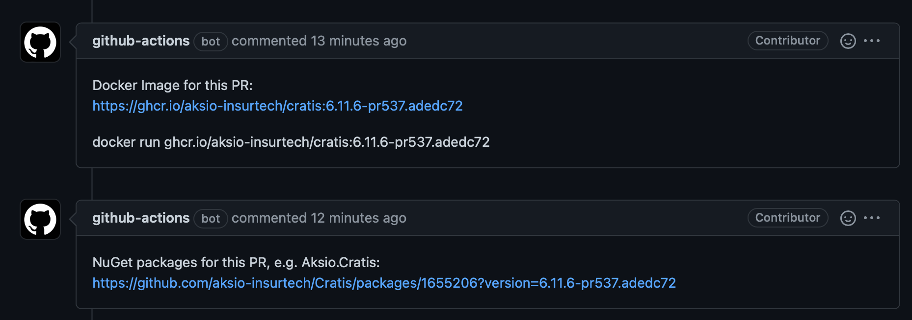

# Consuming pre-releases

All PRs will have binary artifacts built for it so that one can test things out before the PR is accepted and merged in.
The artifacts are not published to the production sources, as everything is built in debug mode and not considered ready
for production. We leverage GitHub packages for these builds. You can find all the packages built [here](https://github.com/orgs/aksio-insurtech/packages?repo_name=Cratis).

Whenever packages have been built, the build with add comments with links to the artifacts into the pull request:



To consume the packages, you'll need to configure the sources in your local repository.

## Docker

All Docker container images can be found [here](https://github.com/orgs/aksio-insurtech/packages?ecosystem=container).

For Docker there is no need to configure anything locally, all you need to do is change the image you're using
from for instance `aksio-insurtech/cratis:latest-development` to the specific one @ GitHub, e.g. : `ghcr.io/aksio-insurtech/cratis:6.11.6-pr537.adedc72`.

## NuGet

All Docker container images can be found [here](https://github.com/orgs/aksio-insurtech/packages?ecosystem=nuget).

NuGet supports having multiple sources, you can simply add a source through having a local `NuGet.Config` file at the root of your
repository and add the pre-release source for it as follows:

```xml
<?xml version="1.0" encoding="utf-8"?>
<configuration>
    <packageSources>
        <add key="CratisPreReleases" value="https://nuget.pkg.github.com/aksio-insurtech/index.json" />
    </packageSources>
</configuration>
```

Then all you need to do is use the correct version number for the package references you have.
For instance in your `.csproj` file(s):

```xml
<PackageReference Include="Aksio.Cratis" Version="6.11.6-pr537.adedc72"/>
```

## NPM

All Docker container images can be found [here](https://github.com/orgs/aksio-insurtech/packages?ecosystem=npm).

> Note: For the time being we're not producing pre-release NPM packages.
