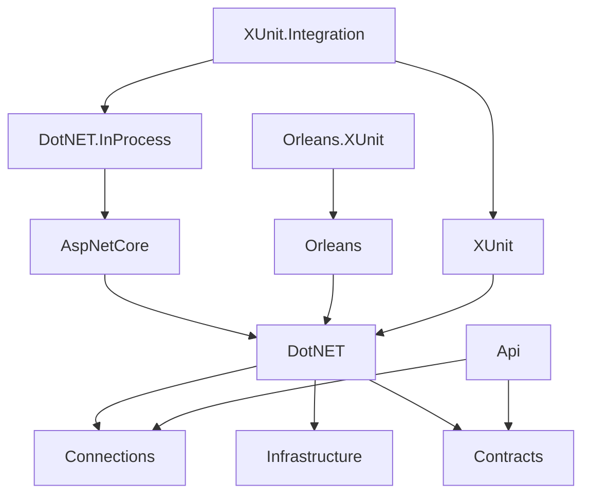

# Client Types

Chronicle has different types of clients for different purposes and levels, depending on the use case.
They are all located in `./Source/Clients` relative to the root of the Chronicle repository.

Client types include regular clients, test clients and REST APIs.

## Project dependencies

The different client projects have the following dependency graph from top to bottom.

## Common building blocks

All clients share some base common building blocks they all use directly or indirectly.

### Connections

The `Connections` project contains common abstractions for dealing with connections to the Chronicle **Kernel** and
keeping these alive.

This is also the project that holds the `ChronicleUrl` definition.

### Contracts

All the **gRPC** protobuf data and service definitions are defined in a code-first manner leveraging
the [protobuf-net.Grpc](https://github.com/protobuf-net/protobuf-net.Grpc) package.

We call these definitions [contracts](./contracts.md).

### Infrastructure

The infrastructure project, which is not located within the `Clients` folder but rather in the `./Source/Infrastructure`
project represents common infrastructure that are both used by the **Kernel** and the clients.

## .NET

Most clients share the common .NET client, making it the C# idiomatic entry point for most of the **Kernel** API surface.
It depends heavily on the [gRPC contracts](./contracts.md) as the protocol for communication.
The philosophy behind the client is to create an API surface that is idiomatic to C# and .NET and at the same
time make it easier to work with, read more in details about [the .NET client](dotnet.md).

## .NET InProcess

The InProcess client represents a way of running Chronicle entirely in-memory in the same process as your application.
This means that it is embedding the entire Kernel within it and is a much heavier NuGet package as a consequence.
It does however not expose any of the Kernel APIs - which is very important, as we don't want to support the
Kernel APIs as public APIs. We want to retain the freedom of being able to change the internals as we go, without
having to think about the APIs being leveraged directly.

You can read more about the [internalization process](./internalization.md).

## ASP.NET Core

With the ASP.NET Core client the developer gets a way to work with Chronicle that feels more natural in
that environment by basically just providing methods that extend the `WebApplicationBuilder` and
configured everything to work properly from that.

## XUnit

For unit level tests, there are test helpers found in the XUnit that allows one to write tests that
does not rely on infrastructure.

## XUnit.Integration

With the `XUnit.Integration` project the testing is more focused on a full stack with all the infrastructure
in place. It provides test setup for both in-process as well as out-of-process.

## Orleans

The `Orleans` project provides the developer with the opportunity to leverage some of the capabilities of
Orleans in conjunction with Chronicle in a tighter way. For instance, it has an implementation of
`AggregateRoot` that is a Grain, making your aggregates actors.

## Orleans.XUnit

With the building blocks found in the `Orleans` project, the `Orleans.XUnit` project provides test utilities
to build tests when using these.

## API

The `API` project holds all the REST endpoints leveraged by the Workbench. Read the [API Project](./api.md) docs for more details.
