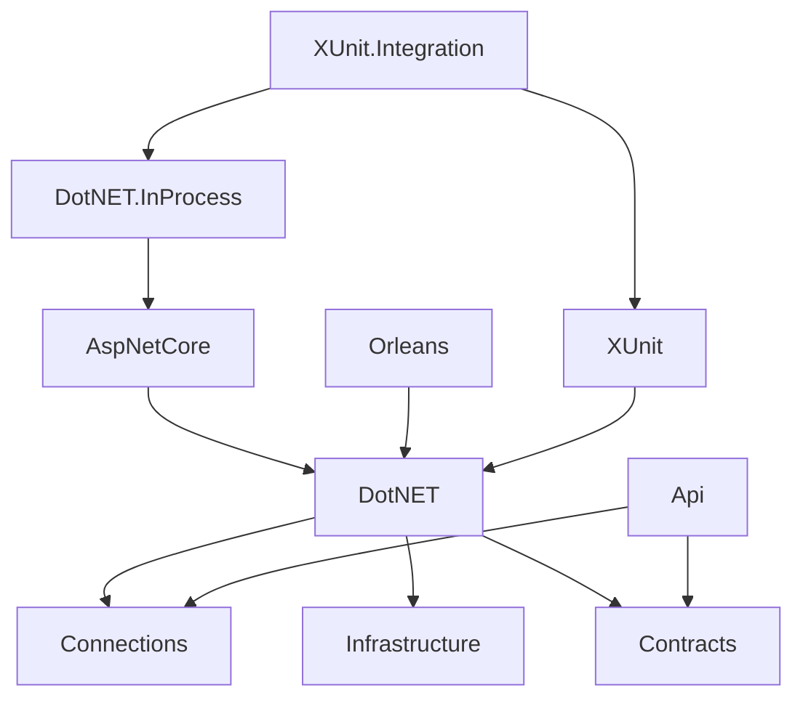

# Client Types

Chronicle provides several types of clients, each designed for specific scenarios and use cases.
All client implementations are found in `./Source/Clients` at the root of the Chronicle repository.
Client types include standard clients, test clients, and REST APIs.

## Project Dependencies

The various client projects have the following dependency hierarchy:

## Common Building Blocks

All clients share a set of foundational building blocks, used either directly or indirectly:

### Connections

The `Connections` project provides abstractions for managing connections to the Chronicle **Kernel** and maintaining their lifecycle. It also defines the `ChronicleConnectionString` type.

### Contracts

All **gRPC** protobuf data and service definitions are created in a code-first manner using the [protobuf-net.Grpc](https://github.com/protobuf-net/protobuf-net.Grpc) package.
These definitions are referred to as [contracts](../kernel/contracts.md).

### Infrastructure

The `Infrastructure` project, located at `./Source/Infrastructure`, contains shared infrastructure components used by both the **Kernel** and the clients. It is not part of the `Clients` folder.

## .NET

Most clients are built on top of the common .NET client, which serves as the idiomatic C# entry point to the **Kernel** API surface.
It relies on the [gRPC contracts](../kernel/contracts.md) for communication.
The goal is to provide a C#-friendly API that is intuitive and easy to use. For more details, see [the .NET client documentation](dotnet.md).

## .NET InProcess

The InProcess client allows Chronicle to run entirely in-memory within the same process as your application.
This approach embeds the full Kernel, resulting in a larger NuGet package.
Importantly, it does **not** expose any Kernel APIs publicly, preserving the flexibility to evolve internal APIs without
breaking consumers. Learn more about the [internalization process](./internalization.md).

## ASP.NET Core

The ASP.NET Core client enables seamless integration with Chronicle in ASP.NET Core applications.
It provides extension methods for `WebApplicationBuilder` to simplify configuration and setup.

## XUnit

For unit-level testing, the XUnit project provides helpers that allow you to write tests without depending on infrastructure.

## XUnit.Integration

The `XUnit.Integration` project focuses on full-stack testing with all infrastructure in place.
It provides test setup for both in-process and out-of-process scenarios.

## Orleans

The `Orleans` project enables deeper integration with Microsoft Orleans, allowing you to leverage Orleans features alongside Chronicle.
For example, it provides an `AggregateRoot` implementation as a Grain, turning aggregates into actors.

## API

The `API` project contains all REST endpoints used by the Workbench. For more information, see the [API documentation](./api.md).
