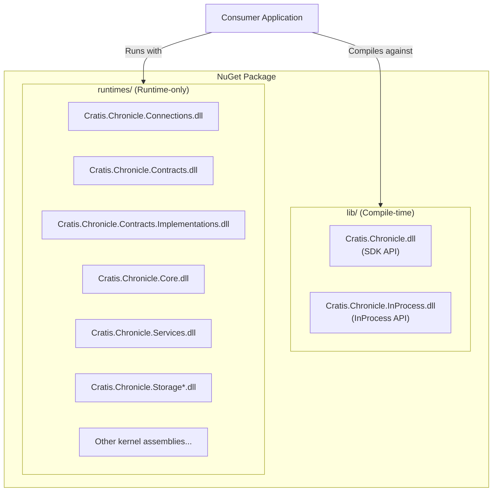

# Internalization

Clients must present a single, clear, and idiomatic API surface. Any dependencies required to implement this API should remain hidden from consumers.
This prevents confusion caused by exposing internal concepts or types that may exist in multiple namespaces or packages for different purposes.
When tools like IDEs auto-import namespaces, exposing these internals can lead to ambiguous references and a degraded developer experience.

Furthermore, some APIs are not intended for public consumption or long-term support.
Exposing these would require us to maintain and version them alongside the official client APIs, which is undesirable.

Typical examples of APIs we internalize include [contracts](../kernel/contracts.md) and any Kernel APIs bundled with the full .NET InProcess client.

## Runtime-only packaging

To prevent exposing APIs that are not intended for public use, we package our assemblies using a runtime-only strategy.
This approach separates compile-time dependencies (what developers see in IntelliSense) from runtime dependencies (what's available at execution time).

The core idea is to:
- **Package SDK assemblies under `lib/`** as compile-time references
- **Ship Server, Contracts, Services, and other kernel assemblies as runtime-only assets** in the `runtimes/` folder

This means:
- IntelliSense/autocomplete shows only SDK types
- `using Cratis.Chronicle.Projections;` binds to SDK's IProjection interface
- Even if consumers manually type internal server type names, they won't compile (no compile-time reference to those DLLs)
- Server/contracts can contain identical namespaces and types—they simply aren't part of compilation

The following diagram illustrates the packaging structure:



## Configuring runtime-only packaging

Runtime-only packaging is handled **automatically** by the shared `Source/Clients/Directory.Build.props`.
The only thing you need to do in your `.csproj` is mark the dependency with `<PrivateAssets>all</PrivateAssets>`.

### Convention

Any `ProjectReference` with `<PrivateAssets>all</PrivateAssets>` is treated as a runtime-only dependency.
When at least one such reference exists in a library project, the build infrastructure automatically:

1. Places the **main assembly** in `ref/{tfm}/` — this is the only assembly visible to consumers at compile time and in IntelliSense.
2. Places each **private reference assembly** (DLL + PDB) in `lib/{tfm}/` — available at runtime but hidden from consumers.

`IncludeBuildOutput` is set to `true` by the shared props file so the main assembly is also placed in `lib/` for runtime.
Projects that need a different value (e.g. Roslyn analyzers) can override it locally.

### Example: marking a dependency as private

```xml
<ItemGroup>
    <ProjectReference Include="../../Kernel/Contracts/Contracts.csproj">
        <PrivateAssets>all</PrivateAssets>
    </ProjectReference>
</ItemGroup>
```

That single annotation is all that is needed. The `ref/lib` split, `<None>` items, and NuGet packaging are generated
automatically — no manual `<None Include="..." Pack="true" PackagePath="..." />` entries required.

### Non-ProjectReference private assemblies

Some assemblies are generated at build time and are not represented by a `ProjectReference`.
For these, add a `<PrivatePackageAssembly>` item with the assembly name (without file extension):

```xml
<ItemGroup>
    <PrivatePackageAssembly Include="Cratis.Chronicle.Contracts.Implementations" />
</ItemGroup>
```

These assemblies are packaged in `lib/{tfm}/` alongside the private project-reference assemblies.

### How it works

The `_SetupPrivateRefPackaging` MSBuild target in `Source/Clients/Directory.Build.props` is registered
via `TargetsForTfmSpecificContentInPackage`, which is the official NuGet SDK extension point for
adding per-TFM content to packages. During `dotnet pack`, NuGet's `_WalkEachTargetPerFramework`
invokes this target once per target framework in an inner build where `$(TargetFramework)` is set.

The target:

1. Filters `ProjectReference` items for those with `PrivateAssets=all`.
2. Invokes `GetTargetPath` on each to resolve the output assembly name.
3. Adds the main assembly to `ref/{tfm}/` and all private assemblies to `lib/{tfm}/` as `TfmSpecificPackageFile` items.

The target only fires for library projects (`OutputType != Exe`) that have at least one private `ProjectReference`.

## Grpc Client Factory

To efficiently reuse the core connection logic while internalizing implementation details, we take a specialized approach
to generating and consuming gRPC clients.

When kernel assemblies are packaged as runtime-only, types such as `ChronicleConnection` from the `Connections` project are not available at compile-time, making it
impossible to reference them in generated gRPC client code. To address this, we generate the required client
types at build time and include them in the .NET client assembly.

This process involves two key steps:

- **Build-time client generation:** The `GrpcClients` project uses `System.Reflection.Emit` and gRPC tooling to generate a dedicated assembly containing all required client implementations. These types are pre-generated and ready for use, eliminating the need for runtime code generation.
- **Custom ClientFactory:** We override the default `ClientFactory` to discover and instantiate these pre-generated client types. Instead of attempting to create new clients dynamically (which would fail due to missing compile-time references), the factory locates and uses the generated implementations.

The resulting workflow for the .NET client is as follows:


By generating clients ahead of time and customizing the factory, we ensure that all necessary gRPC clients are available and
discoverable, even without compile-time access to internal types. This approach maintains a clean public API, leverages shared connection logic,
and avoids runtime errors related to inaccessible types.

## Projects with access to internals

When a project depends on a packaged assembly and requires access to its internalized types—such as the `AspNetCore` project,
we must explicitly grant visibility to those internals. This is achieved by adding an `<InternalsVisibleTo>` entry for the consuming assembly.

For example, in the `DotNET.csproj` file, you will find an `<ItemGroup>` containing one or more such entries:

```xml
<ItemGroup>
    <InternalsVisibleTo Include="Cratis.Chronicle.AspNetCore" />
</ItemGroup>
```

This configuration ensures that `AspNetCore` can access internal members of the SDK assembly, while those internals remain
hidden from all other consumers.

## Internals Verifier

When a public API inadvertently exposes a type from an assembly that should be runtime-only, consumers may attempt to use these types in their code, leading to compilation errors.
This is a common source of accidental leaks—such as a public property, method, or constructor referencing an internal type—which can compromise the intended encapsulation.

To prevent this, we use the `InternalsVerifier` as a post-build tool. It scans assemblies for any public members that reference types originating from assemblies marked for
runtime-only packaging. If such a violation is detected, the build fails immediately, ensuring that no internal implementation details are exposed to consumers.

Typical violations include public properties or constructors that use runtime-only types, which are easy to overlook during development. The `InternalsVerifier` enforces this boundary
automatically, maintaining a clean and intentional API surface.
