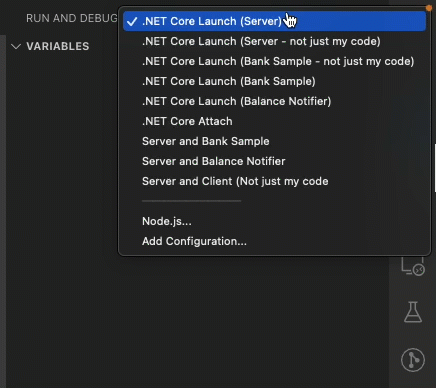

# Contributing

Before you start contributing, you should read our guidelines [here](https://github.com/aksio-insurtech/.github/blob/main/contributing.md).

## Prerequisites

This repository requires the following:

- [Docker](https://www.docker.com/products/docker-desktop)
- [.NET Core 6](https://dotnet.microsoft.com/download/dotnet/6.0)
- [Node JS version 16](https://nodejs.org/)

## Development principles

### Don't fall into the "not invented here" pitfall

### Focus on maintainability of the code

### Code should be tested and made testable

### Favor characteristics over principles (CUPID over SOLID)

## Code Tour

This project has a set of [code tours](https://marketplace.visualstudio.com/items?itemName=vsls-contrib.codetour) that guide you through
the project structure and where to find what. Install the [VSCode extension](https://marketplace.visualstudio.com/items?itemName=vsls-contrib.codetour)
and open the **Code Tour explorer** for different tours.

## Build and Test

All C# based projects are added to the solution file at the root level, you can therefor
build it quite easily from root:

```shell
dotnet build
```

Similarly with the specifications you can do:

```shell
dotnet test
```

If you're using an IDE such as Visual Studio, Rider or similar - open the [cratis.sln](../../cratis.sln)
file and do the build / test run from within the IDE.

> Note: if it takes a long time on every build, perform a `dotnet clean` from the project you're working on
> and then `dotnet build` - subsequent builds should then be fast. This is due to the Orleans CodeGenerator being confused
> and hindering incremental builds.

## Running locally

## Database

Cratis is built using MongoDB as a storage engine. It leverages some features that require MongoDB be in cluster mode.
For convenience running locally for development there is an [image](https://hub.docker.com/r/aksioinsurtech/mongodb)
specifically set up with the features needed.

```shell
docker run -p 27017:27017 aksioinsurtech/mongodb
```

## Backend

The Cratis Kernel can be started by navigating your terminal to [/Source/Kernel/Server](../../Source/Kernel/Server)
and run `dotnet run`.

For running the Bank sample on top of this, navigate to [/Samples/Banking/Bank/Main](../../Samples/Banking/Bank/Main)
and run `dotnet run`.

If you're interested debugging through, there are a set VSCode launch configuration that can be used.
Open the debug panel in VSCode and select the profile you want and click the debug button or hit F5.



Running the server alone is the **.NET Core Launch (Server) profile**, while the **Server and Bank Sample** is a debug compound
of the server and the bank sample.

### Frontend

If you want to run the frontend of the bank sample in addition, you can start this by navigating your terminal to
[/Samples/Banking/Bank/Web](../../Samples/Banking/Bank/Web) and then run `yarn start:dev`. This will start the
WebPack devserver. You can then point your browser to [http://localhost:5100](http://localhost:5100).

For the Kernel you can run the Workbench on top by navigating to the [./Source/Workbench](../../Source/Workbench) and
then run `yarn start:dev`. You can then point your browser to [http://localhost:8080](http://localhost:8080).

## Static Code Analysis

All projects are built using the same static code analysis rules found [here](https://github.com/aksio-insurtech/Defaults).
You can find the rule-sets [here](https://github.com/aksio-insurtech/Defaults/tree/main/Source/Defaults).
