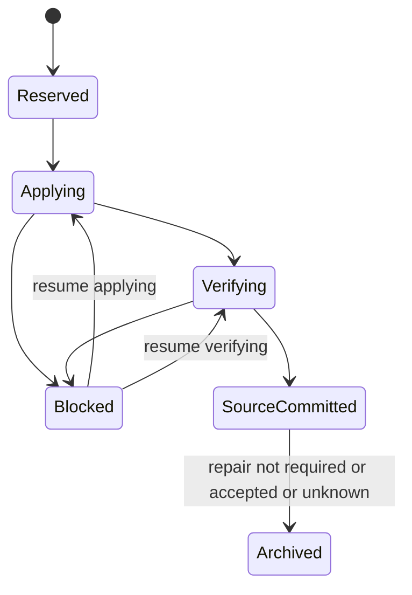

<!-- Copyright (c) Cratis. All rights reserved. -->
<!-- Licensed under the MIT license. See LICENSE file in the project root for full license information. -->

## Scope

The mutation registry records an immutable mutation request, its active lifecycle, and a terminal receipt inside an event store namespace. It is a **storage foundation for kernel contributors**, not an application-facing mutation API.

Normal revision, redaction, and backfill execution paths **do not yet use this registry**. Registering or transitioning a mutation does not modify events, dispatch repairs, wait for observers, or fence existing mutation paths. Runtime integration remains part of [issue 3920](https://github.com/Cratis/Chronicle/issues/3920); these foundations do not complete that issue.

Existing public observer, barrier, protobuf, and `WaitForCompletion` APIs are unchanged. This registry introduces no public snapshots, cuts, or applied-through positions.

## Access and operations

Resolve `IEventStoreNamespaceStorage.EventSequenceMutations` to obtain `IEventSequenceMutationRegistry`. The interface is in `Cratis.Chronicle.Storage.EventSequences.Mutations`. Providers that do not implement it return explicit `Unsupported` outcomes through the default implementation.

| Operation | Inputs | Behavior |
| --- | --- | --- |
| `Begin` | Request, proposed target, optional cancellation token | Reserves a free head and positive ordinal, resumes an identical request, or reports its archived receipt. |
| `Transition` | Target identity, predecessor state token, transition, optional cancellation token | Applies a legal state-machine transition using a complete compare-and-swap binding. |
| `Archive` | Target identity, terminal predecessor token, optional cancellation token | Persists a payload-free receipt and releases only the matching terminal head. |
| `BeginTracking` | Target identity, expected coverage, optional cancellation token | Changes `Untracked` coverage to `Unsealed`; repeating the operation reports `AlreadyTracking`. |

The proposed range is frozen only by a winning registration. Resuming an existing request ignores a newly proposed range. Reusing a registered ID with a different request returns `DefinitionConflict` rather than changing the original definition. A different mutation on an occupied target returns `MutationAlreadyInProgress`.

A losing claim can return `Contended`; retry the same immutable request. Invalid inputs, state conflicts, unsupported providers, and corrupt state are explicit outcomes, not successful no-ops. Cancellation and transport/storage exceptions can leave the durable outcome unknown: reconcile by retrying the same operation, not by inventing a new ID.

## Identities and state tokens

`EventSequenceMutationIdentity` preserves the exact display string and a strict UTF-8 key. It does not trim, case-fold, or normalize identifiers. NUL, malformed UTF-16, and identifiers exceeding 200 UTF-16 code units or 600 UTF-8 bytes are rejected.

`EventSequenceMutationDigestCalculator.CalculateId` derives a deterministic ID from the target, origin sequence, origin position, and mutation kind. Definition digests bind the namespace, immutable request, and frozen target. Terminal receipt digests cover the terminal history and definition digest. These hashes establish consistency; they are not authentication credentials.

A state token binds the event store, namespace, target key, mutation ID, ordinal, definition digest, state version, phase, blocked-from phase, and repair state. Versions start at one for each mutation. Therefore a version alone is never a sufficient storage fence: providers also compare the mutation identity, ordinal, and definition binding atomically.

Ordinals increase across head reuse. Claims compare the previously observed ordinal; a delayed claim cannot reuse an ordinal consumed by an intervening mutation. Ordinal exhaustion fails closed with `Corrupt`, and state-version exhaustion returns validation failure. Neither counter wraps.

## Lifecycle

Blocking records the source phase, so resuming cannot skip verification. A committed mutation requiring repair proceeds through `Pending` and `Dispatching`, then `Accepted` or `Unknown`. A mutation without repair uses `NotRequired`. Only these terminal repair outcomes can be archived. Transitioning these records does not itself perform the work their phase names describe.

An exact transition retry against the immediate successor returns `AlreadyApplied` and the same state. Older tokens cannot advance active state, including after a block/resume cycle. After archival, a correctly bound earlier token can receive `AlreadyArchived` with the receipt; this reports terminal lineage, **not** proof that an arbitrary requested transition ran.

## Archive recovery

Persistent providers insert the terminal receipt before releasing the head. These are two durable writes, not a transaction spanning the entire mutation operation.

| Retry situation | Result |
| --- | --- |
| Receipt absent, exact eligible terminal head present | Insert the receipt, release the head, return `Archived`. |
| Crash after receipt insertion but before head release | An exact archive retry verifies the receipt, releases only the matching terminal head, and returns `AlreadyArchived`. Repeating the original `Begin` also reconciles this release. |
| Head already released | The exact archive token returns the same `AlreadyArchived` receipt. |
| Head reused, including the same state version on another mutation | Return the original receipt without releasing or modifying the later mutation. |
| Provider object recreated | Persistent providers recover from stored history, with the same retry semantics. |
| Preterminal, future, or differently bound archive token | Return `StateConflict`; do not release any head. |

History does not retain the command payload. Retries validate stored receipt fields and the token's definition binding; they never depend on stale head payload columns. `Begin` can additionally recompute the definition digest from the caller's request and the original frozen range. In-memory archival also removes the payload-bearing registration.

There is no background recovery worker in these foundations. After an interrupted archive, the owner must retry the original request or exact terminal archive token to finish releasing that head.

## Provider storage

| Provider | Representation and concurrency |
| --- | --- |
| In-memory | Namespace-owned shared state, serialized by a lock. New wrappers over the same state preserve retries; process loss discards everything. |
| MongoDB | One head document per sequence and payload-free history by mutation ID, with a unique sequence/ordinal history index. Document compare-and-swap operations fence claims, transitions, and release. |
| SQL: SQLite, PostgreSQL, SQL Server | Namespace head/history tables, unique history mutation IDs, and conditional updates. Each operation opens a fresh context. SQL Server uses binary UTF-8 sequence keys to avoid case-folding and trailing-space equality. |

SQL namespace migrations create the registry tables. Dynamic event-sequence table migration also upgrades existing Tags-era tables with `Revisions` and `LastMutationOrdinal`, preserving existing rows. Legacy events have mutation ordinal zero; the non-sparse mutation-ordinal/sequence-number index includes them. MongoDB retains the same legacy ordinal default. The fields are persistence foundations, not evidence that current mutation paths stamp ordinals.

## Provider verification

Shared provider conformance exercises registration conflicts, scope/binding rejection, legal transitions, exact retries, stale tokens, concurrent begin, identity distinctions, and archive retries after recreation and head reuse. Controlled SQL and MongoDB interleavings exercise delayed claims and cross-mutation ABA without sleeps. Archive recovery specs cover receipt insertion before head release.

The SQL conformance spec defaults to SQLite. To run it against a disposable PostgreSQL or SQL Server instance, set `CHRONICLE_REGISTRY_SQL_PROVIDER` to `PostgreSQL` or `SqlServer` and `CHRONICLE_REGISTRY_SQL_CONNECTION` to an administrative test connection string. It creates and removes uniquely named test databases and exercises the registry migration. SQL Server requires `-p:InvariantGlobalization=false` for SqlClient. Never point these specs at a production server.

MongoDB specs use container fixtures. `CHRONICLE_SPECS_MONGODB_IMAGE` optionally selects a compatible local container image; the default remains `mongo`. Provider-specific infrastructure results must be reported separately: SQLite success alone does not verify PostgreSQL or SQL Server.

See the [kernel contribution overview](index.md) for the surrounding kernel architecture.
