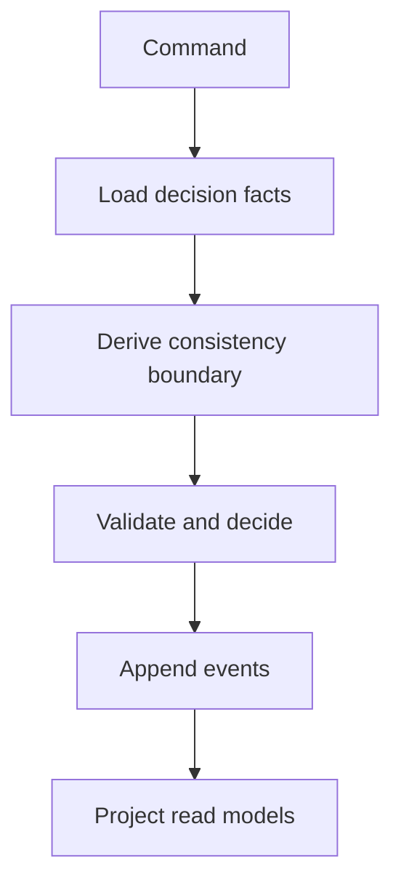

# Dynamic Consistency Boundary

A Dynamic Consistency Boundary (DCB) defines the minimal set of information that must be consistent to make a decision. The boundary is determined at runtime by the data a command actually uses, rather than by a fixed aggregate or transactional scope. This keeps decisions correct while allowing the rest of the system to remain eventually consistent and independently evolving.

## Core idea

- Consistency is scoped to the facts used to decide a change.
- The boundary can cross multiple event streams and read models.
- Events can still be appended independently once the decision is made.

## How it works in practice

1. Load the facts needed to decide.
2. Derive a boundary that represents those facts.
3. Enforce consistency for that boundary only.
4. Append new events and let read models catch up.

## Why it matters

A fixed aggregate boundary often forces unrelated data into a single consistency scope. DCB keeps correctness while avoiding unnecessary coupling. It improves throughput, reduces contention, and keeps models aligned with actual decision rules.

## References

- [https://dcb.events](https://dcb.events)
- [https://www.eventsourcing.dev/best-practices/dynamic-consistency-boundaries](https://www.eventsourcing.dev/best-practices/dynamic-consistency-boundaries)

