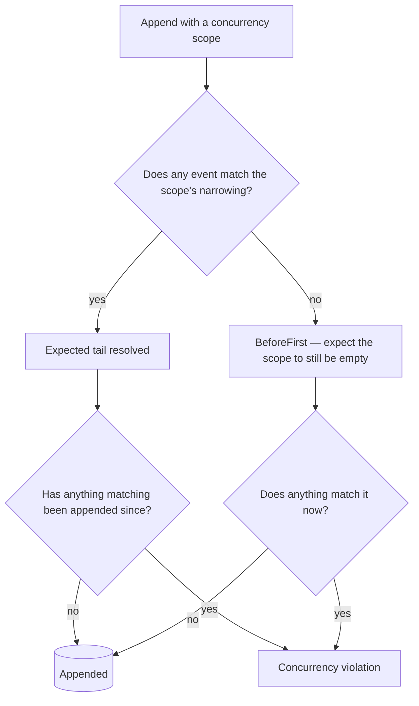

# Concurrency

Concurrency control in Chronicle ensures that multiple operations don't interfere with each other when appending events to the same event source. Chronicle provides a sophisticated concurrency control mechanism through the `ConcurrencyScope` concept, which allows you to define precisely how concurrency should be handled based on formalized event metadata tags.

## Understanding ConcurrencyScope

A `ConcurrencyScope` defines the boundaries and constraints for concurrent operations when appending events. It uses formalized, well-known event metadata tags that are indexed by Chronicle to scope concurrency control to specific aspects of your events, providing fine-grained control over when concurrency violations should be detected. These tags are separate from any user-controlled event tags you may add for categorization. See [Event Metadata Tags](../concepts/event-metadata-tags.md) for details.

### Formalized Metadata Tags for Concurrency

Chronicle uses the following formalized, indexed metadata tags to scope concurrency:

- **EventSourceId**: Unique identifier for the event source
- **EventSourceType**: Overarching, binding concept (e.g., Account)
- **EventStreamType**: A concrete process related to event source type (e.g., Onboarding, Transactions)
- **EventStreamId**: A marker to separate independent streams for a stream type (e.g., Monthly, Yearly)
- **EventTypes**: Specific event types to scope concurrency to

## Basic Usage

### Simple Concurrency Scope

The most basic form of concurrency control scopes to a specific sequence number for an event source:

<ChronicleClientTabs snippet="events/concurrency/basic" />

### Using ConcurrencyScopeBuilder

For more complex scenarios, use the `ConcurrencyScopeBuilder` to fluently construct concurrency scopes:

<ChronicleClientTabs snippet="events/concurrency/builder" />

## Scoping by Event Metadata Tags

### EventSourceType and EventStreamType

You can scope concurrency to specific event source types and stream types:

<ChronicleClientTabs snippet="events/concurrency/source-and-stream-type" />

### EventStreamId

Use event stream IDs to scope concurrency to specific streams within a stream type:

<ChronicleClientTabs snippet="events/concurrency/stream-id" />

### Event Types

Scope concurrency to specific event types to allow concurrent operations on different types of events:

<ChronicleClientTabs snippet="events/concurrency/event-types" />

## AppendMany with Concurrency Scopes

When appending multiple events, you can specify different concurrency scopes for different event sources:

<ChronicleClientTabs snippet="events/concurrency/append-many" />

## Event Source Operations with Concurrency

You can also use concurrency scopes with event source operations:

<ChronicleClientTabs snippet="events/concurrency/for-event-source-operations" />

## Handling Concurrency Violations

When a concurrency violation occurs, Chronicle will return a `ConcurrencyViolation` in the append result:

<ChronicleClientTabs snippet="events/concurrency/handling-violations" />

## Concurrency Strategies

Chronicle provides built-in concurrency strategies:

### Optimistic Concurrency Strategy

This strategy gets the current tail sequence number and uses it as the expected sequence number:

<ChronicleClientTabs snippet="events/concurrency/strategies" />

> **Note**: `[EventStreamType]` on a reactor or reducer scopes which events an *observer* receives (see [Filter by event stream type](filtering/by-event-stream-type)) — it does not set the `EventStreamType` used for concurrency scoping on an *append* call. Set `eventStreamType` explicitly on `Append`/`AppendMany`, or through `ConcurrencyScopeBuilder.WithEventStreamType(...)`, when you need concurrency scoped to a specific stream type.

## The First Append Into a Scope Is Checked Too

A concurrency check needs something to compare against, and the optimistic strategy gets it by reading the tail *through the scope's own narrowing*. When nothing matching that narrowing has been appended yet there is no tail to read — and the honest expectation for that append is not a sequence number but "no event matching this scope exists yet". The strategy says exactly that, using `EventSequenceNumber.BeforeFirst`, and the kernel checks it: if a matching event turned up between resolving the scope and the append arriving, the append is rejected with a `ConcurrencyViolation`.

This covers every *first* append into a scope:

- The **first event on a new event source** — two writers cannot both create it.
- The **first event carrying a new `EventSourceType`, `EventStreamType`, or `EventStreamId`** — even when the event source already has plenty of events under a different narrowing.

The second case is the one that used to be exposed. It is the append most at risk of a race — it opens a new partition on a stream that other writers are already using — and it is now covered by the same check as every later append.

### Expressing "This Must Not Exist Yet"

A concurrency scope no longer only protects a sequence you are *extending*. `EventSequenceNumber.BeforeFirst` means *before the first event*, so a scope can say "no event matching this narrowing may exist" — and the optimistic strategy produces exactly that scope whenever the narrowing matches nothing.

That makes "only one writer may open this partition" a concurrency concern you get for free. Reach for a [constraint](../constraints/index.md) when the rule has to hold for *every* writer forever, regardless of what any client asked for: a unique event type constraint permits exactly one event of a given type per event source, and the kernel enforces it whether or not the append declared a scope.

### Telling a Skipped Check From a Passing One

A skipped concurrency check and a passing one produce the same successful append, so the append result says which happened. `IAppendResult.ConcurrencyCheckPerformed` is `true` when the scope was actually compared against the event store, and `false` when nothing was:

- the append asked for no check (`ConcurrencyScope.None`), or carried no scope at all;
- the append declared a scope that narrows but names no expectation — a scope built by hand without resolving one. That case is still skipped, because `EventSequenceNumber.Unavailable` is the same value `ConcurrencyScope.None` carries and cannot be read as an expectation.

Assert on it in a test when a command's correctness depends on the check running.

### Migrating From the Unchecked First Append

Before this behavior existed, the first append into a narrowed scope was never checked — the strategy resolved `EventSequenceNumber.Unavailable` and the kernel skipped it. **Appends that succeeded then can now be rejected**, in exactly one situation: two writers both resolve an empty scope for the same narrowing and both append, and the second one loses.

That is the race the check exists to catch, so the fix is the same as for any other `ConcurrencyViolation` — retry against the state the winner produced, or surface the conflict to the caller. See [Handling Concurrency Violations](#handling-concurrency-violations).

If a first append genuinely must not be serialized against other writers, opt it out explicitly with `ConcurrencyScope.None` rather than relying on the old skip.

## Best Practices

1. **Use specific scoping**: Scope concurrency as narrowly as possible to avoid unnecessary blocking — every scope is checked, including [the first append into each one](#the-first-append-into-a-scope-is-checked-too)
2. **Event type scoping**: When possible, scope to specific event types to allow concurrent operations on different event types
3. **Handle violations gracefully**: Always check for concurrency violations and implement appropriate retry or fallback logic
4. **Use builders for complex scopes**: The `ConcurrencyScopeBuilder` provides a clear, fluent API for complex concurrency requirements
5. **Use concurrency scope strategies**: Inject `IConcurrencyScopeStrategies` to get a built-in strategy (such as optimistic concurrency) instead of hand-rolling sequence-number lookups
6. **Assert the check ran**: Read `IAppendResult.ConcurrencyCheckPerformed` when a behavior depends on serialization — [a skipped check looks exactly like a passing one](#telling-a-skipped-check-from-a-passing-one)
