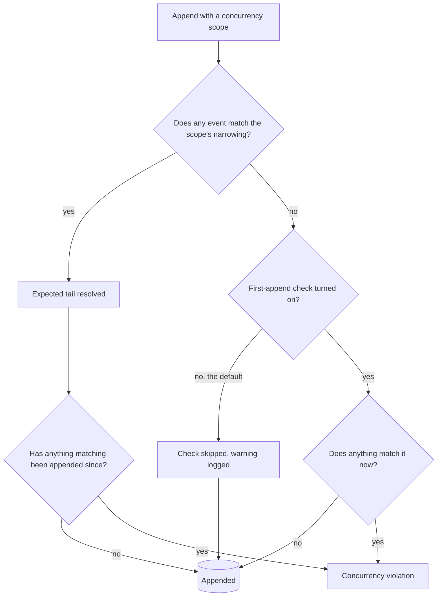

# Concurrency

Concurrency control in Chronicle ensures that multiple operations don't interfere with each other when appending events to the same event source. Chronicle provides a sophisticated concurrency control mechanism through the `ConcurrencyScope` concept, which allows you to define precisely how concurrency should be handled based on formalized event metadata tags.

## Understanding ConcurrencyScope

A `ConcurrencyScope` defines the boundaries and constraints for concurrent operations when appending events. It uses formalized, well-known event metadata tags that are indexed by Chronicle to scope concurrency control to specific aspects of your events, providing fine-grained control over when concurrency violations should be detected. These tags are separate from any user-controlled event tags you may add for categorization. See [Event Metadata Tags](../concepts/event-metadata-tags.md) for details.

### Formalized Metadata Tags for Concurrency

Chronicle uses the following formalized, indexed metadata tags to scope concurrency:

- **EventSourceId**: Unique identifier for the event source
- **EventSourceType**: Overarching, binding concept (e.g., Account)
- **EventStreamType**: A concrete process related to event source type (e.g., Onboarding, Transactions)
- **EventStreamId**: A marker to separate independent streams for a stream type (e.g., Monthly, Yearly)
- **EventTypes**: Specific event types to scope concurrency to

## Basic Usage

### Simple Concurrency Scope

The most basic form of concurrency control scopes to a specific sequence number for an event source:

<ChronicleClientTabs snippet="events/concurrency/basic" />

### Using ConcurrencyScopeBuilder

For more complex scenarios, use the `ConcurrencyScopeBuilder` to fluently construct concurrency scopes:

<ChronicleClientTabs snippet="events/concurrency/builder" />

## Scoping by Event Metadata Tags

### EventSourceType and EventStreamType

You can scope concurrency to specific event source types and stream types:

<ChronicleClientTabs snippet="events/concurrency/source-and-stream-type" />

### EventStreamId

Use event stream IDs to scope concurrency to specific streams within a stream type:

<ChronicleClientTabs snippet="events/concurrency/stream-id" />

### Event Types

Scope concurrency to specific event types to allow concurrent operations on different types of events:

<ChronicleClientTabs snippet="events/concurrency/event-types" />

## AppendMany with Concurrency Scopes

When appending multiple events, you can specify different concurrency scopes for different event sources:

<ChronicleClientTabs snippet="events/concurrency/append-many" />

## Event Source Operations with Concurrency

You can also use concurrency scopes with event source operations:

<ChronicleClientTabs snippet="events/concurrency/for-event-source-operations" />

## Handling Concurrency Violations

When a concurrency violation occurs, Chronicle will return a `ConcurrencyViolation` in the append result:

<ChronicleClientTabs snippet="events/concurrency/handling-violations" />

## Concurrency Strategies

Chronicle provides built-in concurrency strategies:

### Optimistic Concurrency Strategy

This strategy gets the current tail sequence number and uses it as the expected sequence number:

<ChronicleClientTabs snippet="events/concurrency/strategies" />

> **Note**: `[EventStreamType]` on a reactor or reducer scopes which events an *observer* receives (see [Filter by event stream type](filtering/by-event-stream-type)) — it does not set the `EventStreamType` used for concurrency scoping on an *append* call. Set `eventStreamType` explicitly on `Append`/`AppendMany`, or through `ConcurrencyScopeBuilder.WithEventStreamType(...)`, when you need concurrency scoped to a specific stream type.

## The First Append Into a Scope Is Not Checked by Default

A concurrency check needs something to compare against, and the optimistic strategy gets one by reading the tail *through the scope's own narrowing*. When nothing matching that narrowing has been appended yet there is no tail to read, so the strategy reports `EventSequenceNumber.Unavailable` — the same value that means "no expected sequence number was supplied at all". The kernel cannot act on that, so it skips the check, logs a warning, and lets the append through.

This is not limited to narrow scopes — it is every *first* append into a scope:

- The **first event on a new event source** has no tail, so its append is not checked.
- The **first event carrying a new `EventSourceType`, `EventStreamType`, or `EventStreamId`** is not checked either, even when the event source itself already has plenty of events under a different narrowing.

The second case is the one to watch. It is the append most exposed to a race — it opens a new partition on a stream that other writers are already using — and by default it is the one the check does not cover.

### Checking It — Opt In

Turn the check on and the strategy stops saying "no sequence number" for an empty narrowing and starts saying what a first append actually expects: *no event matching this narrowing may exist*. The kernel checks that, and rejects the append with a `ConcurrencyViolation` if a matching event turned up between the scope being resolved and the append arriving.

There are two levels, and you can use either or both:

<ChronicleClientTabs snippet="events/concurrency/first-append-check" />

- **Application-wide** — `ConcurrencyOptions.CheckFirstAppendIntoAScope`. Every scope the optimistic strategy resolves gets the check.
- **Per append** — `ConcurrencyScopeBuilder.ExpectingNoMatchingEvent()`. One behavior asks for the check without changing the default for everything else.

:::caution[This rejects appends that succeed with it off]
That is the point — it is the race the check exists to catch — but adopt it per behavior and be ready to handle `ConcurrencyViolation` on appends that never produced one before. Treat it like any other violation: retry against the state the winner produced, or surface the conflict. See [Handling Concurrency Violations](#handling-concurrency-violations).
:::

:::note[The default is scheduled to change]
`CheckFirstAppendIntoAScope` defaults to `false` so that upgrading within this major version changes nothing. **It is planned to become `true` in the next major version**, where the first append into a scope will be checked unless you opt out. Turning it on now — one behavior at a time — is how you get there without a surprise at the major boundary. To keep the unchecked behavior past that point, ask for no check explicitly with `ConcurrencyScope.None`.
:::

### Expressing "This Must Not Exist Yet"

By default a concurrency scope protects a sequence you are *extending*. With the check opted into, `EventSequenceNumber.BeforeFirst` means *before the first event*, so a scope can also say "no event matching this narrowing may exist" — which makes "only one writer may open this partition" expressible as a concurrency concern.

Reach for a [constraint](../constraints/index.md) instead when the rule has to hold for *every* writer forever, regardless of what any client asked for: a unique event type constraint permits exactly one event of a given type per event source, and the kernel enforces it whether or not the append declared a scope.

### Telling a Skipped Check From a Passing One

A skipped concurrency check and a passing one produce the same successful append, so the append result says which happened. `IAppendResult.ConcurrencyCheckPerformed` is `true` when the scope was actually compared against the event store, and `false` when nothing was:

- the append asked for no check (`ConcurrencyScope.None`), or carried no scope at all;
- the append was a first append into a scope and the check is not turned on — the default;
- the append declared a scope that narrows but names no expectation, built by hand without resolving one. That is always skipped, because `EventSequenceNumber.Unavailable` is the same value `ConcurrencyScope.None` carries and cannot be read as an expectation.

Assert on it in a test when a command's correctness depends on the check running. It is also how you confirm an opt-in actually took effect.

### Mixed-Version Deployments

A scope declares "I expect no matching event" in a **field of its own** on the wire, and sends `EventSequenceNumber.Unavailable` as its sequence number. `EventSequenceNumber.BeforeFirst` is an in-process value and never crosses the wire. That is what makes a client/kernel version mismatch safe in both directions when the check is opted into:

| Client | Kernel | First append into a narrowed scope, with the check on |
|---|---|---|
| current | current | **Checked.** Rejected if a matching event arrived in between |
| current | older | **Skipped**, with the `SkippingIncompleteConcurrencyScope` warning — the older behavior. The older kernel does not know the field, reads `Unavailable`, and declines to validate exactly as it always did |
| older | current | **Skipped**, same warning. The older client never sets the field, so the kernel has no expectation to check |

A skew therefore degrades to the same skip you get with the check off, and says so in the log — it never produces a check that reports success without running. Both directions are pinned by specs under `for_ConcurrencyScopeConverters/when_a_client_and_kernel_version_disagree`.

One caveat on the diagnostic itself: `IAppendResult.ConcurrencyCheckPerformed` is sent by the kernel, so a **current client against an older kernel always reads `false`** — the older kernel does not send the field. That is correct for a skipped first append and conservative for every other append (it under-reports a check that did run). It never over-reports.

## Best Practices

1. **Use specific scoping**: Scope concurrency as narrowly as possible to avoid unnecessary blocking — but note that the narrower the scope, the more scopes there are, and [the first append into each one is not checked unless you ask for it](#the-first-append-into-a-scope-is-not-checked-by-default)
2. **Event type scoping**: When possible, scope to specific event types to allow concurrent operations on different event types
3. **Handle violations gracefully**: Always check for concurrency violations and implement appropriate retry or fallback logic
4. **Use builders for complex scopes**: The `ConcurrencyScopeBuilder` provides a clear, fluent API for complex concurrency requirements
5. **Use concurrency scope strategies**: Inject `IConcurrencyScopeStrategies` to get a built-in strategy (such as optimistic concurrency) instead of hand-rolling sequence-number lookups
6. **Assert the check ran**: Read `IAppendResult.ConcurrencyCheckPerformed` when a behavior depends on serialization — [a skipped check looks exactly like a passing one](#telling-a-skipped-check-from-a-passing-one)
7. **Adopt the first-append check per behavior**: Turn on [the first-append check](#checking-it--opt-in) where two writers must not both open the same partition, ahead of it becoming the default in the next major version
