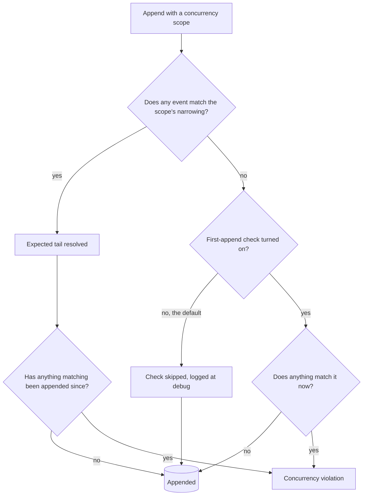

A Chronicle concurrency scope rejects an append when matching events have arrived after the position your decision relies on. Use it when two operations could read the same state and both try to act on it, such as two withdrawals from one account. Capture the expected position before reading the facts so the check covers the decision, not just the write.

:::caution[A scope guards a decision only if its position is captured before you read]
The default scope is built when you append: the client reads the tail then and uses it as the expected position. That covers only the moment between that read and the write. It does not cover the time you spent reading state and deciding. To guard a decision, capture the position before you read the facts, or use a [decision read](../read-models/decision-reads.mdx), which does it for you. A read model you read through `IReadModels` captures nothing. See [Choosing how a rule holds](../dynamic-consistency-boundary/choosing.mdx).
:::

A concurrency scope is how Chronicle expresses the append condition of a [Dynamic Consistency Boundary](../dynamic-consistency-boundary/chronicle.md). To derive the scope from a declared event source and its streams instead of building it by hand, see [Concurrency per event source and stream](../event-sources/concurrency.mdx).

## Choose between a scope and a decision read

| You want to guard | Use | Why |
|---|---|---|
| A rule over state you read from a projection (a count, a stock, a status) | A [decision read](../read-models/decision-reads.mdx) | It captures the position before it folds, and builds the scope for you |
| A change the user saw at a revision | An explicit scope built from that revision | The position is the revision the user saw, not what the server read |
| Events you read yourself, not through a projection | An explicit scope, with the tail captured before you read | You own the capture-then-read order |
| Every writer of a stream or source seeing every other | Dimensions declared on an [event source definition](../event-sources/concurrency.mdx) | The guard covers the whole range, whatever the event type |
| A value that must be unique | A [constraint](../constraints/index.md) | The kernel checks it for every writer, with no read |

What a guard covers, and how scopes and reads merge, is in [How guards are derived](../dynamic-consistency-boundary/how-guards-are-derived.mdx).

## Understanding ConcurrencyScope

A `ConcurrencyScope` combines an expected sequence position with filters that select which events matter to the decision. The kernel checks those matching events before accepting the append. For example, a scope for one account need not reject a write just because another account changed.

The filters use Chronicle's indexed event metadata, such as event source id and stream type. They are separate from user-controlled tags you add for categorization; adding a tag does not add a concurrency guard. See [Event Metadata Tags](../concepts/event-metadata-tags.md).

### Formalized Metadata Tags for Concurrency

Chronicle uses the following formalized, indexed metadata tags to scope concurrency:

- `EventSourceId` identifies the entity instance, such as one account.
- `EventSourceType` identifies the kind of entity, such as Account.
- `EventStreamType` identifies a process, such as Onboarding or Transactions.
- `EventStreamId` separates streams within that process, such as a particular month.
- `EventTypes` selects the event types that affect the decision.

## Basic Usage

### Simple Concurrency Scope

The simplest scope selects one event source and an expected sequence position. In this example, `42` stands for the position captured before reading the account's state; it is not a value to copy into your application:

<ChronicleClientTabs snippet="events/concurrency/basic" />

If another matching event arrived after that position, Chronicle rejects the append with a concurrency violation. Read fresh state and reconsider the operation before trying again.

### Using ConcurrencyScopeBuilder

Use `ConcurrencyScopeBuilder` when you need to combine filters, such as one event source and a subset of event types:

<ChronicleClientTabs snippet="events/concurrency/builder" />

## Incomplete explicit scopes

Caller-supplied scopes fail closed when they have narrowing but no expected position. A scope built with an unavailable tail, using either `ConcurrencyScopeBuilder` or `new ConcurrencyScope`, becomes a "no matching event may exist" expectation. This includes `with` copies and every append variant, including named tags and labelled batches.

| Supplied scope | Default behavior |
|---|---|
| Incomplete, with a source, stream, source type or nonempty event-type filter | Expect no matching event |
| Empty builder, empty event-type list or wildcard dimensions only | No check, with a client warning |
| `ConcurrencyScope.None` | No check |
| `ConcurrencyScope.NotSet` | Resolve through the configured strategy |
| Strategy-issued scope, including a `with` copy | Keep the strategy's first-append policy |

An empty event-type list means any type; it does not mean "the whole log must be empty". Use `ExpectingNoMatchingEvent()` explicitly when that is the expectation you intend.

`ConcurrencyOptions.SkipIncompleteExplicitScopes = true` restores legacy skipping of incomplete explicit scopes. It is separate from `CheckFirstAppendIntoAScope`, which controls strategy-issued scopes. These correctness changes apply even when read protection is off.

## Scoping by Event Metadata Tags

### EventSourceType and EventStreamType

You can scope concurrency to specific event source types and stream types:

<ChronicleClientTabs snippet="events/concurrency/source-and-stream-type" />

### EventStreamId

Use event stream IDs to scope concurrency to specific streams within a stream type:

<ChronicleClientTabs snippet="events/concurrency/stream-id" />

### Event Types

Scope concurrency to specific event types to allow concurrent operations on different types of events:

<ChronicleClientTabs snippet="events/concurrency/event-types" />

## AppendMany with Concurrency Scopes

When appending multiple events, you can specify different concurrency scopes for different event sources:

<ChronicleClientTabs snippet="events/concurrency/append-many" />

In .NET, the ordered-scope overload `AppendMany(events, correlationId, tags, concurrencyScopes)` also accepts several `KeyValuePair<EventSourceId, ConcurrencyScope>` entries with the same label and different predicates. Use this for a decision that reads several streams of one source, even if it appends only one event. Every predicate must hold; none is replaced by another. The kernel must advertise `concurrency-scope-conjunctions`, or the client refuses before sending the batch. A unit of work and an `EventsWithConcurrencyScopes` reactor result preserve the same conjunction. Use the result's `Entries` property rather than its single-scope-per-label dictionary accessor.

A reported violation includes `ScopeIndex`, the zero-based position in the submitted scope list, and `Scope`, the failed predicate and expected position. Either may be absent with older kernels or single-scope RPCs.

Every scope in the batch is checked once, against the state of the event store *before* the batch. A scope never sees events that the same batch is about to write, so two events for one event source do not trip over each other. The batch is also all-or-nothing: if any scope reports a violation, Chronicle appends none of the events and returns every violation it found.

## Event Source Operations with Concurrency

You can also use concurrency scopes with event source operations:

<ChronicleClientTabs snippet="events/concurrency/for-event-source-operations" />

## Handling Concurrency Violations

A `ConcurrencyViolation` means a matching append invalidated the expectation in your scope. Chronicle rejects your append; it does not choose a new decision for you. Inspect the result, read fresh state, and decide whether the operation is still valid before retrying. If the user must resolve the change, return the conflict instead.

<ChronicleClientTabs snippet="events/concurrency/handling-violations" />

## Concurrency Strategies

Chronicle provides built-in concurrency strategies:

### Optimistic Concurrency Strategy

This strategy gets the current tail sequence number and uses it as the expected sequence number:

<ChronicleClientTabs snippet="events/concurrency/strategies" />

> **Note**: `[EventStreamType]` on a reactor or reducer scopes which events an *observer* receives (see [Filter by event stream type](filtering/by-event-stream-type)) — it does not set the `EventStreamType` used for concurrency scoping on an *append* call. Set `eventStreamType` explicitly on `Append`/`AppendMany`, or through `ConcurrencyScopeBuilder.WithEventStreamType(...)`, when you need concurrency scoped to a specific stream type.

## The First Append Into a Scope Is Not Checked by Default

This section describes **strategy-issued** scopes. Caller-supplied scopes follow [Incomplete explicit scopes](#incomplete-explicit-scopes).

A concurrency check needs something to compare against, and the optimistic strategy gets one by reading the tail *through the scope's own narrowing*. When nothing matching that narrowing has been appended yet there is no tail to read, so the strategy reports `EventSequenceNumber.Unavailable` — the same value that means "no expected sequence number was supplied at all". The kernel cannot act on that, so it skips the check, notes it in a debug-level log line, and lets the append through — the skip is the designed default, so it is not logged as a warning.

```mermaid
flowchart TD
    A[Append with a concurrency scope] --> T{"Does any event match the scope's narrowing?"}
    T -->|yes| E[Expected tail resolved]
    E --> V{"Has anything matching been appended since?"}
    V -->|no| K[(Appended)]
    V -->|yes| R[Concurrency violation]
    T -->|no| C{"First-append check turned on?"}
    C -->|no, the default| S[Check skipped, logged at debug]
    S --> K
    C -->|yes| W{"Does anything match it now?"}
    W -->|no| K
    W -->|yes| R
```

This is not limited to narrow scopes — it is every *first* append into a scope:

- The **first event on a new event source** has no tail, so its append is not checked.
- The **first event carrying a new `EventSourceType`, `EventStreamType`, or `EventStreamId`** is not checked either, even when the event source itself already has plenty of events under a different narrowing.

The second case is the one to watch. It is the append most exposed to a race — it opens a new partition on a stream that other writers are already using — and by default it is the one the check does not cover.

### Checking It — Opt In

Turn the check on and the strategy stops saying "no sequence number" for an empty narrowing and starts saying what a first append actually expects: *no event matching this narrowing may exist*. The kernel checks that, and rejects the append with a `ConcurrencyViolation` if a matching event turned up between the scope being resolved and the append arriving.

There are two levels, and you can use either or both:

<ChronicleClientTabs snippet="events/concurrency/first-append-check" />

Set `ConcurrencyOptions.CheckFirstAppendIntoAScope` to enable the check for every scope the optimistic strategy resolves. To ask for it on one append instead, use `ConcurrencyScopeBuilder.ExpectingNoMatchingEvent()` without changing the application-wide default.

:::caution[This rejects appends that succeed with it off]
That is the point — it is the race the check exists to catch — but adopt it per behavior and be ready to handle `ConcurrencyViolation` on appends that never produced one before. Treat it like any other violation: retry against the state the winner produced, or surface the conflict. See [Handling Concurrency Violations](#handling-concurrency-violations).
:::

:::note[The default is scheduled to change]
`CheckFirstAppendIntoAScope` defaults to `false` so the strategy's first-append policy is unchanged within this major version. The separate explicit-scope correctness changes have their own compatibility switches. **It is planned to become `true` in the next major version**, where the first append into a scope will be checked unless you opt out. Turning it on now — one behavior at a time — is how you get there without a surprise at the major boundary. To keep the unchecked behavior past that point, ask for no check explicitly with `ConcurrencyScope.None`.
:::

### Expressing "This Must Not Exist Yet"

By default a concurrency scope protects a sequence you are *extending*. With the check opted into, `EventSequenceNumber.BeforeFirst` means *before the first event*, so a scope can also say "no event matching this narrowing may exist". That makes "only one writer may open this partition" expressible as a concurrency concern, and it gives you something more useful: proof that an identifier you just generated is new.

#### Why a generated identifier needs proof

Picture a small shop. Customers get a `CustomerId` (`cus_` plus a ULID). Orders get an `OrderId`, a TypeID with a time part and no tenant. Invitations get an `InviteCode`, a short NanoId. Support staff issue an `ApiKey`: 32 random bytes that are a secret. The key itself never becomes an identifier. Its stream is identified by a separate, non-sensitive `ApiKeyId`. The `CustomerId`, `OrderId`, `InviteCode` and `ApiKeyId` are minted by your code, and each one becomes the event source of a new stream.

A well-chosen generator makes a collision astronomically unlikely, but "unlikely" is a property of the generator, not of your event store. Nothing stops the same value from being produced twice by a bug, a replayed request, a seeded test generator or a clock that stepped back. If it happens, the second "new" stream silently appends onto the first, and two customers share one history.

A `BeforeFirst` scope closes that gap. The append says: "this identifier is new, and if it is not, refuse to write". Chronicle checks it for you, and the answer comes from the event store rather than from your generator.

#### Place an order

Placing an order writes `OrderPlaced` and one `OrderLineAdded` per line, all for a brand-new `OrderId`. The scope asks that no event exists for that `OrderId` yet:

<ChronicleClientTabs snippet="events/concurrency/fresh-identifier" />

Chronicle checks the scope once against the state before the batch, so the `OrderLineAdded` events do not count against the `OrderPlaced` event that arrives with them. Then it appends the whole batch as one operation. The scope names no event types, so *any* event for that `OrderId` is a collision; narrow it with `WithEventType` if only certain events should count.

Arc's [generated values](/arc/backend/csharp/commands/generated-values/) (`[GeneratedValue]`) mint identifiers inside a command handler. Arc does not prove a generated value is absent from your storage, so a handler that appends for a generated identifier is where this scope belongs.

#### When the identifier is taken

If an event already exists for the identifier, or another append for the same identifier lands between your check and your write, the result carries a `ConcurrencyViolation` and **nothing is appended**. `IsSuccess` is `false` and `HasConcurrencyViolations` is `true`, as shown in [Handling Concurrency Violations](#handling-concurrency-violations).

Chronicle numbers events as it writes them, and a storage write can collide with another writer that took the same sequence number. Chronicle then renumbers the append and tries again. Since version 19.40.1 it checks your scope again on **every** renumbered attempt, so a competing write that created the stream during the collision is reported as a violation instead of being written on top. Older kernels renumbered without checking again.

The fix on your side is short: generate a new identifier and append again, as the example does. Do not retry with the same identifier. The scope is telling you the stream is not yours.

#### Why low-entropy identifiers depend on it

A ULID or a TypeID carries enough randomness that you will probably never see a collision. An `InviteCode` does not: a NanoId of six or eight characters is meant to be typed by a person, and at that size collisions are a matter of when. For identifiers like that, the freshness check is how you find out, and the retry loop is part of the design rather than an edge case.

The `ApiKey` shows the limit of this check. Freshness applies to the stream's identifier, here the `ApiKeyId`, and says nothing about keeping a value private. **Never use a secret as an event source id.** Event source ids, like the rest of event metadata, are stored in plaintext and cannot be encrypted, and marking one `[PII]` is rejected. Keep the raw key out of events entirely and record only a fingerprint such as a hash of it, or, when you must store the secret itself, mark the payload property `[Encrypted]` (see [encrypted values](../security/encrypted-values.mdx)). Don't use `[PII]` for a secret: it is for personal data and enrolls the value in erasure. [Personal data in events](../compliance/pii.mdx) explains the surrogate-identifier pattern. Arc's `[NotAudited]` only keeps a value out of a command's causation; it does not protect the value anywhere else.

#### Choosing a guard

| What you need | Reach for |
|---|---|
| Prove a generated identifier is not already in use, at the moment you append | A `BeforeFirst` scope with `ExpectingNoMatchingEvent()` |
| Every writer, forever, may produce at most one event of a type for a source | A [unique event type constraint](../constraints/index.md) |
| The identifier is a non-sensitive natural key from outside | A unique constraint on that value, or a deterministic event source id derived from it |
| Extending an existing stream without overwriting a concurrent change | A sequence-number scope from the [optimistic strategy](#optimistic-concurrency-strategy) |

#### When not to use it

For a non-sensitive natural key, a deterministic event source id can make repeated uses land on the same stream by design. Do not put personal data, such as an email address or national number, in the event source id. Use a non-sensitive surrogate and protected event content instead; see [Personal data in events](../compliance/pii.mdx).

If the rule must hold for writers that never declared a scope, use a constraint. A scope only protects appends that carry it; the kernel enforces a constraint for every writer.

A freshness scope also does not make retries succeed after an error. A write can commit before its connection drops. Retrying with the same identifier then reports a violation because your own earlier events created the stream. Before generating another identifier, resolve whether that earlier attempt was stored. See [When the outcome is unknown](./appending#when-the-outcome-is-unknown) for recovery and keyed appends.

### Telling a Skipped Check From a Passing One

A skipped concurrency check and a passing one produce the same successful append, so the append result says which happened. `IAppendResult.ConcurrencyCheckPerformed` is `true` when the scope was actually compared against the event store, and `false` when nothing was:

- the append asked for no check (`ConcurrencyScope.None`), or carried no scope at all;
- the append was a first append into a scope and the check is not turned on — the default;
- an incomplete explicit scope has no narrowing, or `SkipIncompleteExplicitScopes` restores legacy skipping. A narrowed explicit scope otherwise expects no matching event.

Assert on it in a test when a command's correctness depends on the check running. It is also how you confirm an opt-in actually took effect.

### Mixed-Version Deployments

A scope declares "I expect no matching event" in a **field of its own** on the wire, and sends `EventSequenceNumber.Unavailable` as its sequence number. `EventSequenceNumber.BeforeFirst` is an in-process value and never crosses the wire. That is what makes a client/kernel version mismatch safe in both directions when the check is opted into:

| Client | Kernel | First append into a narrowed scope, with the check on |
|---|---|---|
| current | current | **Checked.** Rejected if a matching event arrived in between |
| current | older | **Skipped**, with the `SkippingIncompleteConcurrencyScope` warning — the older behavior. The older kernel does not know the field, reads `Unavailable`, and declines to validate exactly as it always did |
| older | current | **Skipped**, same log line — at debug level, since for a current kernel this is the designed default. The older client never sets the field, so the kernel has no expectation to check |

A skew therefore degrades to the same skip you get with the check off, and says so in the log — it never produces a check that reports success without running. Both directions are pinned by specs under `for_ConcurrencyScopeConverters/when_a_client_and_kernel_version_disagree`.

One caveat on the diagnostic itself: `IAppendResult.ConcurrencyCheckPerformed` is sent by the kernel, so a **current client against an older kernel always reads `false`** — the older kernel does not send the field. That is correct for a skipped first append and conservative for every other append (it under-reports a check that did run). It never over-reports.

## Revisions and redactions are outside append conditions

Append conditions detect matching **appended** events after a boundary. Revisions and redactions rewrite existing history without advancing that append boundary. They are not detected by plain concurrency scopes you build yourself or by constraints. [Decision-read guards](../read-models/decision-reads.mdx#limits) additionally carry a mutation epoch that a revision or redaction advances.

For example, a decision reads through position 100 and sees a credit of 100 at position 80. An administrator revises that credit to 0. A withdrawal appended at 101 can still pass its condition: the revision did not append a matching event above 100. A fresh fold can see the revised value, but a plain scope has no mutation guard.

For plain scopes and constraints, coordinate history mutations operationally: pause affected command producers, drain in-flight decisions, perform the revision or redaction, then resume with fresh reads. Quiesce affected commands during projection-definition deployments too. Retrying a stale decision or adding more scopes does not close this gap.

## Best Practices

Choose filters from the facts the decision depends on. Narrowing by event type lets unrelated operations proceed, but omitting an event type that affects the rule leaves the decision unprotected. Each narrower scope also has its own [first-append behavior](#the-first-append-into-a-scope-is-not-checked-by-default). Turn on that check where two writers must not both open the same partition.

Capture the position before reading from the event log or folding fresh state. A materialized read model may lag behind that position, leaving the decision unaware of events its scope already covers. Use a [decision read](../read-models/decision-reads.mdx) when the rule depends on projected state. For a user editing a revision they previously saw, use that revision instead; see the [editing conflict scenario](../dynamic-consistency-boundary/scenarios.mdx#an-editing-conflict).

Use `ConcurrencyScopeBuilder` for explicit filters or inject `IConcurrencyScopeStrategies` for a built-in strategy. Neither replaces choosing the correct capture point. Check violations on every append and assert `IAppendResult.ConcurrencyCheckPerformed` in tests when correctness depends on the guard running: [a skipped check looks like a passing one](#telling-a-skipped-check-from-a-passing-one). [Choosing how a rule holds](../dynamic-consistency-boundary/choosing.mdx) helps distinguish these guards from constraints enforced for every writer.
