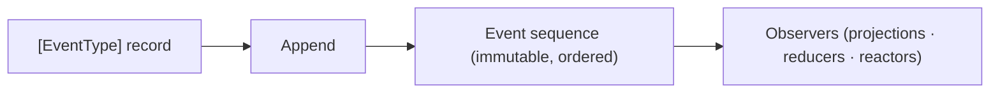

# Events

Events are immutable facts that describe what happened in your system. Chronicle identifies events by their event type rather than the .NET CLR type, which makes the CLR type a convenient vessel for expressing intent and structure.

<ChronicleClientTabs snippet="events/index/event-type" />

## Event Sequences and the Event Log

Events live in event sequences, which are ordered, append-only streams. Each event receives a monotonically increasing sequence number that makes it possible to replay events, resume processing, and reason about how far consumers have progressed.

Chronicle includes a specialized event sequence called the event log. It is the default sequence used throughout the system and is exposed through the `IEventLog` API.

<ChronicleClientTabs snippet="events/index/event-log" />

## Working with Events

Use these topics to append, read, and manage events:

- [Appending](appending)
- [Appending with tags](appending-with-tags)
- [Filtering reducers and reactors](filtering/index.md)
- [Appending many](appending-many)
- [Observing appends](observing-appends)
- [Getting events](getting-events)
- [Getting state](getting-state)
- [Concurrency](concurrency)
- [Cross-cutting properties](cross-cutting-properties)
- [Revision](revision.md)
- [Redaction](redaction)
