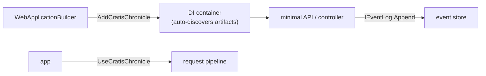

When your app is a web API, Chronicle fits the way you already build: it plugs into the `WebApplicationBuilder`, registers itself in the dependency-injection container, and lets your endpoints append events by taking `IEventLog` as a dependency. There's almost no glue — a couple of calls in `Program.cs` and your routes can start recording facts.

We'll build a small library domain and expose an endpoint that borrows a book. If you're not building a web app — a background processor or scheduled host — the [Worker Service guide](./worker.md) covers that host instead, and the [console guide](./console.md) shows the bare-bones version with no container at all.

You can find the [complete ASP.NET Core quickstart sample](https://github.com/Cratis/Samples/tree/main/Chronicle/Quickstart/AspNetCore) on GitHub,
which also uses the [shared code in the Common project](https://github.com/Cratis/Samples/tree/main/Chronicle/Quickstart/Common).

[!INCLUDE [pre-requisites](./prereq.md)]

[!INCLUDE [docker](./docker.md)]

## Setup project

Start by creating a folder for your project and then create a .NET web project inside this folder:

```shell
dotnet new web
```

Add a reference to the [Chronicle package](https://www.nuget.org/packages/Cratis.Chronicle) and
[Chronicle ASP.NET Core package](https://www.nuget.org/packages/Cratis.Chronicle.AspNetCore):

```shell
dotnet add package Cratis.Chronicle.AspNetCore
```

## WebApplication

When using ASP.NET Core you typically use the `WebApplicationBuilder` to build up your application.
This includes having an IOC (Inversion of Control) container setup for dependency injection of all your services.
Chronicle supports this paradigm out of the box, and there are convenience methods for hooking this up real easily.

In your `Program.cs` simply change your setup to the following:

```csharp
var builder = WebApplication.CreateBuilder(args)
    .AddCratisChronicle(options => options.EventStore = "Quickstart");
```

[Snippet source](https://github.com/cratis/samples/blob/main/Chronicle/Quickstart/AspNetCore/Program.cs#L19-L20)

The code adds Chronicle to your application and sets the name of the event store to use.
In contrast to what you need to do when running bare-bone as shown in the [console](./console.md) sample,
all discovery and registration of artifacts will happen automatically.

```csharp
var app = builder.Build();
app.UseCratisChronicle();
```

[Snippet source](https://github.com/cratis/samples/blob/main/Chronicle/Quickstart/AspNetCore/Program.cs#L30-L31)

Those two lines are the entire host integration — `AddCratisChronicle` registers and discovers everything in the container, and `UseCratisChronicle` hooks Chronicle into the request pipeline:



[!INCLUDE [common](./common.md)]

## Using in APIs

Appending events is typically something you would be doing directly, or indirectly through an API exposed as a minimal
API or a Controller.

```csharp
        app.MapPost("/api/books/{bookId}/borrow/{userId}", async (
            [FromServices] IEventLog eventLog,
            [FromRoute] Guid bookId,
            [FromRoute] Guid userId) => await eventLog.Append(bookId, new BookBorrowed(userId)));
```

[Snippet source](https://github.com/cratis/samples/blob/main/Chronicle/Quickstart/Common.AspNetCore/Api.cs#L19-L22)

The code exposes an API endpoint that takes parameters for what book to borrow and what user is borrowing it.
It then appends a `BookBorrowed` event. The `bookId` is used as the [event source](../concepts/event-source.md), while
the `userId` is part of the event.

## Services

Chronicle will leverage the IOC container to get instances of any artifacts it discovers and will create instances of,
such as **Reactors**, **Reducers** and **Projections**.
In order for this to work, the artifacts needs to be registered as services. In your `Program.cs` file you would add
service registrations for the artifacts you have:

```csharp
        builder.Services.AddTransient<UsersReactor>();
        builder.Services.AddTransient<BooksReducer>();
        builder.Services.AddTransient<BorrowedBooksProjection>();
        builder.Services.AddTransient<OverdueBooksProjection>();
        builder.Services.AddTransient<ReservedBooksProjection>();
```

[Snippet source](https://github.com/cratis/samples/blob/main/Chronicle/Quickstart/Common.AspNetCore/CommonServices.cs#L14-L18)

This can become very tedious to do as your solution grows, Cratis Fundamentals offers a way couple of extension methods
that will automatically hook this up:

```csharp
builder.Services
    .AddBindingsByConvention()
    .AddSelfBindings();
```

The first statement adds service bindings by convention, which is basically any service that implements an interface with the same name only prefixed with `I` will be automatically registered (`IFoo` -> `Foo`). The second statement automatically registers all
class instances as themselves, meaning you can then take dependencies to concrete types without having to register them.

[!INCLUDE [common](./mongodb.md)]

In addition to this, since you're in an environment with dependency injection enabled you typically want to register
the things being used to be able to take these in as dependencies into your types such as controllers, route handler or
any other type that needs it.

For instance, for MongoDB, it can be very convenient to not have to think about the actual `MongoClient` and just focus on
what you need; access to the specific database or specific collections.

The following code shows how to set this up for your `WebApplicationBuilder` to enable that scenario.

```csharp
        builder.Services.AddSingleton<IMongoClient>(new MongoClient("mongodb://localhost:27017"));
        builder.Services.AddSingleton(provider => provider.GetRequiredService<IMongoClient>().GetDatabase("Quickstart"));
        builder.Services.AddTransient(provider => provider.GetRequiredService<IMongoDatabase>().GetCollection<Book>("book"));
```

[Snippet source](https://github.com/cratis/samples/blob/main/Chronicle/Quickstart/Common.AspNetCore/MongoDBServices.cs#L15-L17)

> Note: The code adds service registrations for typed collections based on types found in the [sample code](https://github.com/Cratis/Samples/tree/main/Chronicle/Quickstart/Common).

With this you can now quite easily create a type that encapsulates getting the data that takes a specific collection as a dependency:

```csharp
public class Books(IMongoCollection<Book> collection)
{
    public IEnumerable<Book> GetAll() => collection.Find(Builders<Book>.Filter.Empty).ToList();
}
```

[Snippet source](https://github.com/cratis/samples/blob/main/Chronicle/Quickstart/Common/Books.cs#L9-L12)

## Recap

You added Chronicle to an ASP.NET Core app with two lines in `Program.cs` — `AddCratisChronicle` to register and discover everything, `UseCratisChronicle` to hook into the pipeline — then appended events straight from a minimal API endpoint and read them back through MongoDB collections injected by the container. Because you're in a DI world, your reactors, reducers, projections, and collections are all just registered services.

## Where to go next

- **Put a typed UI on top** — [Arc](/arc/) adds commands, queries, and generated TypeScript proxies so React stays in lockstep with your C#. See [Build a full-stack feature](/build-a-full-app/).
- **Build the domain step by step** — the [tutorial](/chronicle/tutorial/) walks the library model one concept at a time.
- **A different host** — the same artifacts run unchanged in a [Worker Service](./worker.md) or a bare [console](./console.md) app.

