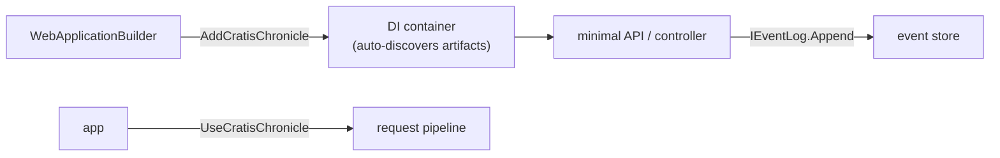

When your app is a web API, Chronicle fits the way you already build: it plugs into the `WebApplicationBuilder`, registers itself in the dependency-injection container, and lets your endpoints append events by taking `IEventLog` as a dependency. There's almost no glue — a couple of calls in `Program.cs` and your routes can start recording facts.

We'll build a small library domain and expose an endpoint that borrows a book. If you're not building a web app — a background processor or scheduled host — the [Worker Service guide](./worker.md) covers that host instead, and the [console guide](./console.md) shows the bare-bones version with no container at all.

## Before you start

Have the Chronicle kernel running locally. [Run Chronicle locally](./running-chronicle.md) brings it up with a single `docker run` and lists the prerequisites (.NET 8+, Docker); this guide assumes it's listening on `chronicle://localhost:35000`.

You can also find the [complete ASP.NET Core quickstart sample](https://github.com/Cratis/Samples/tree/main/Chronicle/Quickstart/AspNetCore) on GitHub.

## Set up the project

Create a folder for your project, then a .NET web project inside it:

```shell
dotnet new web
```

Add a reference to the [Chronicle ASP.NET Core package](https://www.nuget.org/packages/Cratis.Chronicle.AspNetCore) (it brings in the base [Chronicle package](https://www.nuget.org/packages/Cratis.Chronicle) for you):

```shell
dotnet add package Cratis.Chronicle.AspNetCore
```

## Register Chronicle on the host

ASP.NET Core builds your app through the `WebApplicationBuilder`, which already has a dependency-injection container. Chronicle hooks straight into it — two calls in `Program.cs` are the entire integration:

```csharp
var builder = WebApplication.CreateBuilder(args)
    .AddCratisChronicle(options => options.EventStore = "Quickstart");

var app = builder.Build();
app.UseCratisChronicle();
```

`AddCratisChronicle` registers Chronicle's services and names the event store to use; `UseCratisChronicle` hooks it into the request pipeline. Unlike the bare-bones [console](./console.md) version, all discovery and registration of your artifacts happens automatically — the container finds your reactors, reducers, and projections for you.



[!INCLUDE [common](./common.md)]

## Append from an endpoint

In a web app you usually append events from a route handler rather than inline. Take `IEventLog` as a dependency and append — the container injects it:

```csharp
app.MapPost("/api/books/{bookId}/borrow", async (
    [FromServices] IEventLog eventLog,
    [FromRoute] Guid bookId,
    [FromQuery] string memberName) =>
        await eventLog.Append(bookId, new BookBorrowed(memberName)));
```

The `bookId` from the route is the [event source](../concepts/event-source.md) — the book this fact is about — and `memberName` is the event's payload. That one `Append` is all it takes; the projection and any reactors pick it up from there.

## Register your artifacts

Chronicle creates its discovered artifacts — reactors, reducers, projections — through the container, so they need to be registered as services. For a handful, register them explicitly:

```csharp
builder.Services.AddTransient<BookReturnedNotifier>();
```

As the solution grows this gets tedious, so Cratis Fundamentals can do it by convention:

```csharp
builder.Services
    .AddBindingsByConvention()
    .AddSelfBindings();
```

`AddBindingsByConvention` registers any service that implements an interface of the same name prefixed with `I` (`IFoo` → `Foo`); `AddSelfBindings` registers concrete classes as themselves, so you can depend on them directly without registering each one.

## Configure the MongoDB client

The `Books` query reads documents Chronicle wrote, so the MongoDB driver needs to match how Chronicle stores them — register these conventions once at startup:

[!INCLUDE [mongodb](./mongodb.md)]

Then register the database and the collections you want to inject, so a type can take an `IMongoCollection<Book>` dependency without ever touching `MongoClient`:

```csharp
builder.Services.AddSingleton<IMongoClient>(new MongoClient("mongodb://localhost:27017"));
builder.Services.AddSingleton(provider => provider.GetRequiredService<IMongoClient>().GetDatabase("Quickstart"));
builder.Services.AddTransient(provider => provider.GetRequiredService<IMongoDatabase>().GetCollection<Book>("book"));
```

Now the `Books` query from the read-model section above resolves its collection straight from the container.

## Recap

You added Chronicle to an ASP.NET Core app with two lines in `Program.cs` — `AddCratisChronicle` to register and discover everything, `UseCratisChronicle` to hook into the pipeline — then appended events straight from a minimal API endpoint and read them back through MongoDB collections injected by the container. Because you're in a DI world, your reactors, projections, and collections are all just registered services.

## Where to go next

- **Put a typed UI on top** — [Arc](/arc/) adds commands, queries, and generated TypeScript proxies so React stays in lockstep with your C#. See [Build a full-stack feature](/build-a-full-app/).
- **Build the domain step by step** — the [tutorial](/chronicle/tutorial/) walks the library model one concept at a time.
- **A different host** — the same artifacts run unchanged in a [Worker Service](./worker.md) or a bare [console](./console.md) app.
