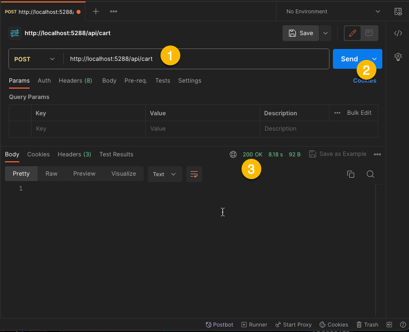

# Basic

This is a basic tutorial that walks through how to get started with Cratis.
The tutorial expects basic knowledge of C#, .NET and Docker.

To understand the concepts that Cratis is built upon, please read more in
the [concepts section](../concepts).

## Prerequisites

To work with Cratis you'll need the following installed:

- [Docker](https://docs.docker.com/engine/install/)
- [.NET 6.0 or better](https://dotnet.microsoft.com/en-us/download)


Also recommend database tools to be able to see what is happening in the database:

- [MongoDB Compass](https://www.mongodb.com/products/tools/compass)
- [MongoDB for VSCode](https://www.mongodb.com/products/tools/vs-code)

## Setup

After making sure you have the prerequisites in place, you need to
setup the server and then create your client.

### Server

You can start the Cratis server, also known as the **Kernel** by doing the
following in a shell.

```shell
docker run -d \
    -p 27017:27017 \
    -p 8080:80 \
    -p 8081:81 \
    --add-host="host.docker.internal:host-gateway" \
    aksioinsurtech/cratis:latest-development
```

This should yield something like the following:

```shell
e04e1c02819a96ae3f85a2b4579cb1cab8623625fc272ece857ef37397dcd322
```

The **development** image of Cratis comes with a built in MongoDB instance.
For production workloads you would typically use the regular image.
All Cratis images can be found [here](https://hub.docker.com/r/aksioinsurtech/cratis).

> Note: Cratis is as of version 9.4.3 using an HTTP based protocol. This requires the
> Cratis server to be able to call the client using HTTP as well. Therefor we add the
> `--add-host` option to the `docker run`. This is only for localhost scenarios.
> The client communicates to the server where the client is located, based on configuration
> ASP.NET Core exposes. This will be changed to gRPC in a future version of Cratis.

Now that you have the server running, its time to create the client and
start working with Cratis.

### Client

Create a folder for your Cratis client, you could call it "ECommerce".
Then run the following shell command:

```shell
dotnet new web
```

You need to add the Cratis package, do so by running the following in the shell:

```shell
dotnet add package Aksio.Cratis.AspNetCore
```

Open up the `Program.cs` file that was generated and change it to the following:

```c#
var builder = WebApplication.CreateBuilder(args);
builder.UseCratis();    // Adds the necessary Cratis configuration
var app = builder.Build();
app.UseCratis();        // Makes sure to get Cratis client started
app.Run();
````

The code hooks into the ASP.NET Core builders and configures Cratis.
Make note that the first `UseCratis()` method sets up configuration and has an
overload that allows you to specify more configuration, such as what tenancy model
to use (single or multi, single is default).

To verify that everything is working at this stage, run the following in the shell:

```shell
dotnet run
```

You should be seeing something like the following:

```shell
Building...
info: Aksio.Cratis.ClientBuilder[0]
      Configuring Cratis client
info: Aksio.Cratis.ClientBuilder[1]
      Configuring services
info: Aksio.Cratis.ClientBuilder[2]
      Configuring compliance
info: Aksio.Cratis.ClientBuilder[3]
      Using single kernel client @ 'http://localhost:8080/'
info: Microsoft.Hosting.Lifetime[14]
      Now listening on: http://localhost:5288
info: Microsoft.Hosting.Lifetime[0]
      Application started. Press Ctrl+C to shut down.
info: Microsoft.Hosting.Lifetime[0]
      Hosting environment: Development
info: Microsoft.Hosting.Lifetime[0]
      Content root path: /Users/einari/Projects/Playground/CratisTutorial
info: Aksio.Cratis.Connections.RestKernelConnection[14]
      Attempting to connect
info: Aksio.Cratis.EventSequences.Outbox.OutboxProjectionsRegistrar[1]
      Registering outbox projections
info: Aksio.Cratis.Observation.ObserversRegistrar[0]
      Registering observers
info: Aksio.Cratis.Reducers.ReducersRegistrar[0]
      Registering reducers
info: Aksio.Cratis.Projections.ProjectionsRegistrar[1]
      Registering projections
info: Aksio.Cratis.Schemas.SchemasConnectionLifecycleParticipant[1]
      Registering event types
info: Aksio.Cratis.Connections.RestKernelConnection[11]
      Connected to Cratis Kernel
info: Aksio.Cratis.Connections.RestKernelConnection[12]
      Setting up client ping
```

Make sure it says `Connected to Cratis Kernel` in the one of log lines.
You can stop the client at this stage (Ctrl+C - break).

## Create your first event

Events are just types that are can either be a `class` or a `record` type.
We recommend using a `record`, as that gives you an immutable type. Events are
not be changed in any way, they represent a state change that happened to your
system.

> Note: You can read more about what we typically think of what an event is and how you
> can name them [here](../concepts/event.md)

Lets add an event type called `ItemAddedToCart` by adding a file called `ItemAddedToCart.cs`.
Add the following to it:

```csharp
using Aksio.Cratis.Events;

namespace ECommerce;

[EventType("1e9bbdfb-444f-4b48-9087-8b1b8a1de996")]
public record ItemAddedToCart(string ItemId, int Quantity);
```

The event needs to have a unique identifier. This helps on identifying the event uniquely in the
system without having to rely on the .NET typename. This also means you can rename the event at
any time and it will by the Cratis Kernel be identified as the same event.

## Turning into read model

All systems need to be able to show the current state. In the context of event sourcing and specifically
Cratis, we refer to this state as read models. Events are not necessarily the best way
to show what a systems current state is. Therefor you typically want to transform the events
into more digestible data (**read models**) that you can present a user or make available through an API.

In Cratis you can do this in multiple ways, but in this tutorial we will focus on what is called
a `Reducer`.

> Note: Documentation on more ways of observing events and projecting to read state will come soon.

A reducer specifies with its content what events it is interested in, you can view this as a
**map** stage. The reducer then is responsible to define what the state should look like given
the event it is passed. The reducer then typically looks at the current state of a **read model**,
if any, and then makes changes to the model and returns the result.

Cratis will then figure out what has changed and perform an optimal update towards the target
database.

> Note: MongoDB is the only database supported at this stage. This will be expanded on.

First you will need a **read model**. Create a file called `Cart.cs` and add the following to it:

```csharp
namespace ECommerce;

public record Cart(string Id, IEnumerable<CartItem> Items);
public record CartItem(string ItemId, int Quantity);
```

The code introduces a **read model** called `Cart` which can then hold multiple `CartItems`.
The `Cart` is typically something you display to a user in an e-commerce solution.

With the **read model** in place, we can move on to creating the actual reducer.
Create a file called `CartReducer.cs` and add the following code to it:

```csharp
using Aksio.Cratis.Events;
using Aksio.Cratis.Reducers;

namespace ECommerce;

[Reducer("2040382a-62ef-4aa1-9d83-7f65aa57e611")]
public class CartReducer : IReducerFor<Cart>
{
    public Task<Cart> ItemAdded(ItemAddedToCart @event, Cart? initial, EventContext context)
    {
        initial ??= new Cart(context.EventSourceId, Array.Empty<CartItem>());
        return Task.FromResult(initial with
        {
            Items = initial.Items?.Append(new CartItem(@event.ItemId, @event.Quantity)) ??
                new[] { new CartItem(@event.ItemId, @event.Quantity) }
        });
    }
}
```

The code implements the `IReducerFor<>` interface, specifying the `Cart` as the **read model**
the **reducer** is for. The interface itself is just a marker interface and helps the system
know what the reducer is for. Within the **reducer** you add methods that represent the
different events you want to *map* and *reduce* from.

Cratis uses a discovery mechanism that looks for specific method signatures. The signatures are:

```csharp
public Task<TReadModel> {MethodName}(TEvent event, TReadModel? initial, EventContext context);
public Task<TReadModel> {MethodName}(TEvent event, TReadModel? initial);
public TReadModel {MethodName}(TEvent event, TReadModel? current, EventContext context);
public TReadModel {MethodName}(TEvent event, TReadModel? current);
```

The `EventContext` is optional, and its also optional whether or not you want it to be asynchronous.
If there already is an instance of the **read model**, you will get that passed to you, otherwise
this will be null.

> Note: Cratis resolves the key to the **read model** by using what is known as the [event source id](../concepts/event-source.md).
> This is somewhat limiting and Cratis will in a future version support custom defined keys defined by the observer (e.g. reducer) itself.

Since Cratis uses the configured service container to resolve instances, it relies on there
being a registration of the `CartReducer`. By default, ASP.NET Core does not discover any
types and automatically register them, so you have to manually register it with the `Services`.

Add the following line after the first `app.UseCratis()`.

```csharp
builder.Services.AddTransient<CartReducer>();
```

With all this in place, you're now ready to start producing and appending events.

## Appending the event

The last thing you want to do is to add an endpoint that you can call that appends an
event to the event store. This event will then be consumed by the reducer you wrote and
produce the read model.

Open up the `Program.cs` file. At the bottom of the file before the `app.Run()` call,
add the following code:

```csharp
app.MapPost("/api/cart", async () =>
{
    var eventLog = app.Services.GetRequiredService<IEventLog>();
    await eventLog.Append(Guid.NewGuid(), new ItemAddedToCart(Guid.NewGuid().ToString(), 1));
});
```

The code exposes an API on the `/api/cart` route as a POST action.
Within the handle method, it uses the registered application services (`app.Services`) to get
an instance of the `IEventLog`.

> Note: Since the `IEventLog` is registered with the service container, you can take a dependency
> to `IEventLog` and other Cratis services as a constructor argument. This is for instance very
> helpful if creating a WebAPI controller or similar.

Your entire `Program.cs` should now look like the following:

```csharp
using Aksio.Cratis.Compliance.GDPR;
using Aksio.Cratis.EventSequences;
using ECommerce;

var builder = WebApplication.CreateBuilder(args);
builder.UseCratis();

builder.Services.AddTransient<CartReducer>();

var app = builder.Build();
app.UseCratis();

app.MapPost("/api/cart", async () =>
{
    var eventLog = app.Services.GetRequiredService<IEventLog>();
    await eventLog.Append(Guid.NewGuid(), new ItemAddedToCart(Guid.NewGuid().ToString(), 1));
});

app.Run();
```

Run your program using `dotnet run`.

You should now be able to do a POST action to the newly created API.
This can be done using things like [curl](https://curl.se).

Run the following from your shell (remember to put in the correct port shown in the log output):

```shell
curl -iX POST http://localhost:5288/api/cart
```

You should then see the following:

```shell
HTTP/1.1 200 OK
Content-Length: 0
Date: Mon, 25 Sep 2023 17:42:50 GMT
Server: Kestrel
```

Doing the same using [Postman](https://www.postman.com):



By opening your tool of choice for working with the MongoDB server, you should now be able to
see an instance of a `Cart` with one `CartItem` on it. The `carts` collection will be in the
`cratis-shared` database.


Congratulations 🎉 you have produced your first end to end **event** to **read model** flow.

## Whats next

This is a fairly simple sample, we recommend reading more in our [recipes](../recipes/).
For more complex configuration options, head over [here](../configuration/).
If you want to use something like Docker Compose to run things, you can find a recipe for
that [here](../recipes/docker-compose.md).
