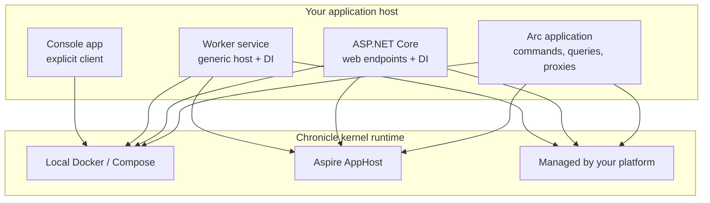

Chronicle can feel like several things at once: a client library, a .NET host integration, and a kernel
process your applications connect to. The trick is to separate those choices. Your application code can
run in a console app, a worker, ASP.NET Core, or Arc. The Chronicle kernel can run locally in Docker,
inside an Aspire AppHost, or as infrastructure managed by your platform.

Pick the smallest layer that answers the question you have today. You can move up the layers without
changing your events, projections, reducers, or reactors.

## The app host decides how much wiring you own

| Layer | What you write | What Chronicle wires | Use it when |
| --- | --- | --- | --- |
| [Console](./console.md) | `new ChronicleClient(...)`, `GetEventStore(...)`, append events yourself | Nothing hidden. You see the client and event store directly. | You are learning, debugging a small reproduction, or writing a script. |
| [Worker Service](./worker.md) | `Host.CreateApplicationBuilder`, `AddCratisChronicle(...)`, a `BackgroundService` | DI registration and artifact discovery for reactors, reducers, and projections. | You process events, run background workflows, or keep derived state updated. |
| [ASP.NET Core](./aspnetcore.md) | `WebApplication.CreateBuilder`, `AddCratisChronicle(...)`, `UseCratisChronicle()` | DI registration, artifact discovery, and request-pipeline integration. | You expose HTTP endpoints, controllers, or minimal APIs that append events. |
| [Arc + Chronicle](/arc/backend/chronicle/) | Arc commands and queries; Chronicle-backed command return values and projections | Arc's command/query pipeline plus Chronicle event appending, identity, tenancy, and read-model integration. | You want a typed full-stack CQRS app with generated TypeScript proxies. |

The domain artifacts stay the same across these hosts. A `BookRegistered` event, a `BookStatus`
projection, and a `NotifyWaitingList` reactor can start in a console sample and later run unchanged in a
worker, web API, or Arc application.

## The kernel runtime decides who operates Chronicle

| Runtime | What it gives you | Use it when |
| --- | --- | --- |
| [Local Docker](./running-chronicle.md) | One kernel reachable at `chronicle://localhost:35000`, with the workbench on port `8080`. | You need the fastest local feedback loop. |
| [Docker Compose](/chronicle/hosting/docker-compose/) | Chronicle and storage as named services in a local or CI topology. | You want repeatable local infrastructure for a team or pipeline. |
| [Aspire AppHost](/chronicle/hosting/aspire/) | Chronicle as an Aspire resource with endpoints and storage references wired into dependent projects. | Your .NET solution already uses Aspire to compose services locally. |
| [Production-managed kernel](/chronicle/hosting/production/) | A Chronicle container, durable storage, TLS, secrets, health checks, and versioned deployment owned by your platform. | The application should only know the Chronicle connection string and credentials. |

There is no special "managed client" mode in your application. Managed means the kernel and its storage
are operated outside the app: Kubernetes, Docker, cloud infrastructure, or your internal platform owns
the process; your app gets a connection string.

## Common paths

| If you are... | Start with | Then move to |
| --- | --- | --- |
| Learning Chronicle from scratch | [Get started](/chronicle/get-started/), then [Console](./console.md) | [Tutorial](/chronicle/tutorial/) |
| Adding events to an existing web API | [Run Chronicle locally](./running-chronicle.md) and [ASP.NET Core](./aspnetcore.md) | [Production hosting](/chronicle/hosting/production/) |
| Building background event processors | [Worker Service](./worker.md) | [Reactors](/chronicle/reactors/) and [Reducers](/chronicle/reducers/) |
| Building a full-stack Cratis app | [Arc + Chronicle](/arc/backend/chronicle/) | [Build a full-stack feature](/build-a-full-app/) |
| Preparing a team environment | [Docker Compose](/chronicle/hosting/docker-compose/) or [Aspire](/chronicle/hosting/aspire/) | [Production hosting](/chronicle/hosting/production/) and [Data Protection Key Encryption](/chronicle/hosting/encryption-certificate/) |

If you are unsure, use this rule: learn in a console app, ship user-facing endpoints in ASP.NET Core or
Arc, run background work in a worker, and let your platform own the production kernel.
