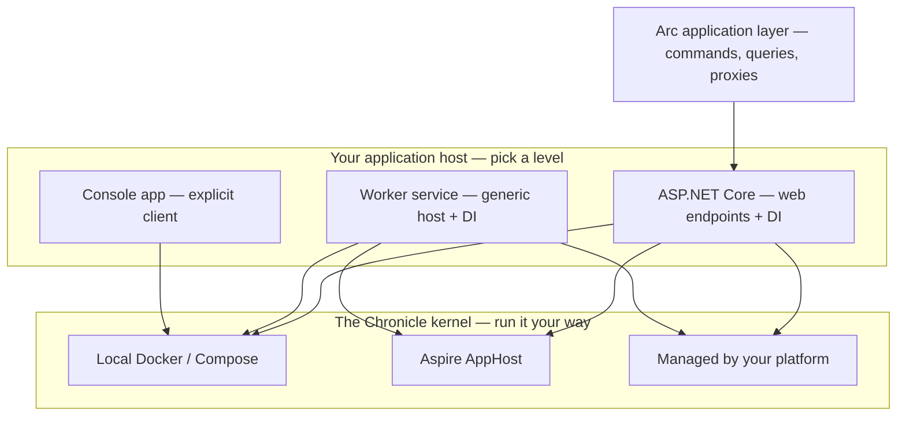

import { Tabs, TabItem, Aside } from '@astrojs/starlight/components';

Chronicle can feel like several things at once: a client library, a .NET host integration, and a kernel
process your applications connect to. The trick is to separate two decisions that are both yours to make.
First, **which application host your code runs in** — a console app, a worker service, or ASP.NET Core.
Second, **how you run the Chronicle kernel** — locally in Docker, inside an Aspire AppHost, or as
infrastructure your platform operates.

Pick the smallest level that answers the question you have today. You can move up the levels without
changing your events, projections, reducers, or reactors. And by the end of this page you'll also have a
kernel running locally, ready for whichever host you picked.



## The app host decides how much wiring you own

| Level | What you write | What Chronicle wires | Use it when |
| --- | --- | --- | --- |
| [Console](./console.md) | `new ChronicleClient(...)`, `GetEventStore(...)`, append events yourself | Nothing hidden. You see the client and event store directly. | You are learning, debugging a small reproduction, or writing a script. |
| [Worker Service](./worker.md) | `Host.CreateApplicationBuilder`, `AddCratisChronicle(...)`, a `BackgroundService` | DI registration and artifact discovery for reactors, reducers, and projections. | You process events, run background workflows, or keep derived state updated. |
| [ASP.NET Core](./aspnetcore.md) | `WebApplication.CreateBuilder`, `AddCratisChronicle(...)`, `UseCratisChronicle()` | DI registration, artifact discovery, and request-pipeline integration. | You expose HTTP endpoints, controllers, or minimal APIs that append events. |
| [Arc + Chronicle](/arc/backend/chronicle/) | Arc commands and queries; Chronicle-backed command return values and projections | Arc's command/query pipeline plus Chronicle event appending, identity, tenancy, and read-model integration. | You want a typed full-stack CQRS app with generated TypeScript proxies. |

<Aside type="note" title="Arc is not a host model">
Arc is an **application layer**, not a fourth host. It sits on top of the host you choose — in practice
ASP.NET Core — and adds commands, queries, and generated TypeScript proxies above the same
Chronicle wiring. Choosing Arc doesn't exempt you from this page: you still pick a host level
underneath it and still run the kernel one of the ways below.
</Aside>

The domain artifacts stay the same across these levels. A `BookRegistered` event, a `BookStatus`
projection, and a `NotifyWaitingList` reactor can start in a console sample and later run unchanged in a
worker, web API, or Arc application.

## You decide who runs the kernel

The kernel has no opinion about where it lives. It's a container plus the storage you point it at — so
you and your team choose how to run it, and you can change that choice later without touching
application code:

| How you run it | What it gives you | Use it when |
| --- | --- | --- |
| [Local Docker](#run-chronicle-locally) | One kernel reachable at `chronicle://localhost:35000`, with the workbench on port `8080`. | You need the fastest local feedback loop. |
| [Docker Compose](/chronicle/hosting/docker-compose/) | Chronicle and storage as named services in a local or CI topology. | You want repeatable local infrastructure for a team or pipeline. |
| [Aspire AppHost](#let-aspire-wire-it-up) | Chronicle as an Aspire resource with endpoints and storage references wired into dependent projects. | Your .NET solution already uses Aspire to compose services locally. |
| [Production-managed kernel](/chronicle/hosting/production/) | A Chronicle container, durable storage, TLS, secrets, health checks, and versioned deployment owned by your platform. | The application should only know the Chronicle connection string and credentials. |

There is no special "managed client" mode in your application. Managed simply means you've handed the
kernel and its storage to whoever operates your infrastructure — Kubernetes, Docker, cloud services, or
an internal platform team — and your app gets a connection string.

Whichever way you go in production, local development starts the same: with a kernel on your machine.
Let's get one running.

## Run Chronicle locally

Before a single line of your host code can append an event, the kernel has to be up and reachable. You
only need to do this once per machine — leave it running in the background and come back to your code.

### Prerequisites

- [.NET 8 or higher](https://dot.net) — the SDK you build and run your app with.
- [Docker Desktop or compatible](https://www.docker.com/products/docker-desktop/) — the kernel ships as a container.
- *Optional:* a MongoDB client such as [MongoDB Compass](https://www.mongodb.com/products/tools/compass), handy for peeking at the read models a projection builds. You don't need it to follow the guides — the built-in [workbench](#see-it-in-the-workbench) shows you the events.

### The fastest start: the development image

The `latest-development` image bundles MongoDB, so there's nothing else to install or wire up — one
command and the kernel is running:

```shell
docker run -d -p 27017:27017 -p 8080:8080 -p 35000:35000 cratis/chronicle:latest-development
```

Three ports, three jobs:

| Port | What it is |
| --- | --- |
| `35000` | The kernel endpoint your app connects to (`chronicle://localhost:35000`). |
| `8080` | The [Chronicle workbench](#see-it-in-the-workbench) — a web UI for browsing your event store. |
| `27017` | The bundled MongoDB, where projections write their read models. |

That's everything most local work needs. If you'd rather run against a database you already have — or a
different engine entirely — read on; otherwise jump to [picking your host guide](#next-connect-your-host).

### Bring your own database

The `latest-development-slim` image leaves the database out, so you point Chronicle at one you run
yourself. Two environment variables tell it where to go:

- `Cratis__Chronicle__Storage__Type`
- `Cratis__Chronicle__Storage__ConnectionDetails`

The Compose files below bring up the kernel and a database together. Pick the tab for your engine.

<Tabs syncKey="database">
<TabItem label="MongoDB">

Chronicle uses MongoDB transactions and change streams, so MongoDB must run as a replica set (or a
sharded cluster) — a standalone `mongod` won't do. This file initializes a single-node replica set for
local development:

```yaml
services:
  chronicle:
    image: cratis/chronicle:latest-development-slim
    depends_on:
      - mongodb
      - mongodb-init
    environment:
      - Cratis__Chronicle__Storage__Type=MongoDB
      - Cratis__Chronicle__Storage__ConnectionDetails=mongodb://mongodb:27017/?directConnection=true
    ports:
      - 8080:8080
      - 35000:35000

  mongodb:
    image: mongo:8
    command: ["mongod", "--replSet", "rs0", "--bind_ip_all"]
    ports:
      - 27017:27017

  mongodb-init:
    image: mongo:8
    depends_on:
      - mongodb
    restart: "no"
    command:
      - /bin/bash
      - -lc
      - |
        until mongosh --host mongodb --quiet --eval "db.adminCommand('ping')" >/dev/null 2>&1; do
          sleep 1
        done
        mongosh --host mongodb --quiet --eval "
        try {
          rs.status();
        } catch (e) {
          rs.initiate({
            _id: 'rs0',
            members: [{ _id: 0, host: 'localhost:27017' }]
          });
        }"
```

Why this setup:

- `host: 'localhost:27017'` makes the replica set topology usable from host tools (for example `mongosh` and Compass) when they connect to `mongodb://localhost:27017/?replicaSet=rs0`.
- Chronicle still reaches MongoDB over the Docker network (`mongodb:27017`) and uses `directConnection=true` to avoid following the advertised host back to `localhost` inside the Chronicle container.
- `directConnection=true` does not disable transactions; transactions still work because MongoDB is running as a replica set.
- If your existing data volume was initialized with a different replica-set host, run `docker compose down -v` (or wipe the MongoDB data volume) before starting again so `rs.initiate()` can apply the new host.

</TabItem>
<TabItem label="PostgreSQL">

```yaml
services:
  chronicle:
    image: cratis/chronicle:latest-development-slim
    depends_on:
      - postgres
    environment:
      - Cratis__Chronicle__Storage__Type=PostgreSql
      - Cratis__Chronicle__Storage__ConnectionDetails=Host=postgres;Port=5432;Database=chronicle;Username=postgres;Password=postgres
    ports:
      - 8080:8080
      - 35000:35000

  postgres:
    image: postgres:16
    environment:
      - POSTGRES_DB=chronicle
      - POSTGRES_USER=postgres
      - POSTGRES_PASSWORD=postgres
    ports:
      - 5432:5432
```

</TabItem>
<TabItem label="SQL Server">

<Aside type="caution">
The SQL Server credentials in this example are for local development only. For production, use secure
credentials and manage secrets through Docker secrets, environment files, or an external secret manager.
</Aside>

```yaml
services:
  chronicle:
    image: cratis/chronicle:latest-development-slim
    depends_on:
      - sqlserver
    environment:
      - Cratis__Chronicle__Storage__Type=MsSql
      - Cratis__Chronicle__Storage__ConnectionDetails=Server=sqlserver,1433;Database=Chronicle;User Id=sa;Password=Your_strong_password123!;TrustServerCertificate=True;Encrypt=False
    ports:
      - 8080:8080
      - 35000:35000

  sqlserver:
    image: mcr.microsoft.com/mssql/server:2025-latest
    environment:
      - ACCEPT_EULA=Y
      - MSSQL_SA_PASSWORD=Your_strong_password123!
    ports:
      - 1433:1433
```

</TabItem>
<TabItem label="SQLite">

SQLite is file-based, so there's no second container — just a volume for the database file:

```yaml
services:
  chronicle:
    image: cratis/chronicle:latest-development-slim
    environment:
      - Cratis__Chronicle__Storage__Type=Sqlite
      - Cratis__Chronicle__Storage__ConnectionDetails=Data Source=/data/chronicle.db
    volumes:
      - chronicle-data:/data
    ports:
      - 8080:8080
      - 35000:35000

volumes:
  chronicle-data:
```

</TabItem>
</Tabs>

Bring any of these up the usual way, in the background:

```shell
docker compose up -d
```

Want local observability too — logs, traces, and metrics next to the kernel? The
[Docker Compose hosting guide](/chronicle/hosting/docker-compose/) adds the Aspire dashboard to the same
topology.

### See it in the workbench

Whichever image you ran, it includes the **Chronicle workbench** — a web UI for poking at your event
store. Open [http://localhost:8080](http://localhost:8080), pick an event store, and look at
**Sequences** to watch events land in order. It's the quickest way to confirm the kernel is up and your
app is actually appending.

## Let Aspire wire it up

If your solution composes services with [Aspire](https://learn.microsoft.com/dotnet/aspire/), you don't
write Compose files at all — the database choice flows from the Aspire app model. The
`Cratis.Chronicle.Aspire` package adds Chronicle as a resource in your AppHost:

```shell
dotnet add package Cratis.Chronicle.Aspire
```

For development, one line gives you the same batteries-included kernel as the `docker run` above —
`AddCratisChronicle()` uses the development image with embedded MongoDB:

```csharp
var builder = DistributedApplication.CreateBuilder(args);

var chronicle = builder.AddCratisChronicle();

builder.AddProject<Projects.MyApi>("api")
    .WithReference(chronicle);

builder.Build().Run();
```

To choose a database, pass a configure callback. Aspire then switches to the slim image (no embedded
MongoDB) and the `With*` method you pick sets the kernel's storage type and connection string from the
resource you hand it — the same two environment variables you saw in the Compose files, now derived from
your app model instead of hand-written:

<Tabs syncKey="database">
<TabItem label="MongoDB">

```csharp
var mongo = builder.AddConnectionString("chronicle-mongo");

var chronicle = builder.AddCratisChronicle("chronicle", c => c.WithMongoDB(mongo));
```

`mongo` can be any resource with a connection string — a MongoDB Atlas connection string as shown, or a
container added directly in the AppHost with `builder.AddMongoDB("mongo")`.

</TabItem>
<TabItem label="PostgreSQL">

```csharp
var postgres = builder.AddPostgres("postgres").AddDatabase("chronicle-db");

var chronicle = builder.AddCratisChronicle("chronicle", c => c.WithPostgreSql(postgres));
```

</TabItem>
<TabItem label="SQL Server">

```csharp
var sql = builder.AddSqlServer("sql").AddDatabase("chronicle-db");

var chronicle = builder.AddCratisChronicle("chronicle", c => c.WithMsSql(sql));
```

</TabItem>
<TabItem label="SQLite">

SQLite is file-based, so you pass the connection string directly instead of a resource:

```csharp
var chronicle = builder.AddCratisChronicle("chronicle", c => c.WithSqlite("Data Source=/data/chronicle.db"));
```

</TabItem>
</Tabs>

`WithReference(chronicle)` hands your application projects a `chronicle://host:port` connection string
pointing at the kernel's gRPC endpoint — no hardcoded ports. The
[Aspire integration guide](/chronicle/hosting/aspire/) covers the rest: exposed endpoints, compliance
key storage with HashiCorp Vault or Azure Key Vault, and the full AppHost walkthrough.

## Next: connect your host

The kernel is running and listening on `chronicle://localhost:35000`. Now connect your app to it:

- **Just exploring?** The [Get started quickstart](/chronicle/get-started/) scaffolds a ready-to-run app from a template — the fastest way to see the whole loop.
- **[Console](./console.md)** — the bare-bones version, no DI container, every connection explicit.
- **[Worker service](./worker.md)** — a background host for the reacting side of an event-sourced system.
- **[ASP.NET Core](./aspnetcore.md)** — a web API that appends events straight from its endpoints.

## Common paths

| If you are... | Start with | Then move to |
| --- | --- | --- |
| Learning Chronicle from scratch | [Get started](/chronicle/get-started/), then [Console](./console.md) | [Tutorial](/chronicle/tutorial/) |
| Adding events to an existing web API | [Run Chronicle locally](#run-chronicle-locally), then [ASP.NET Core](./aspnetcore.md) | [Production hosting](/chronicle/hosting/production/) |
| Building background event processors | [Worker Service](./worker.md) | [Reactors](/chronicle/reactors/) and [Reducers](/chronicle/reducers/) |
| Building a full-stack Cratis app | [Arc + Chronicle](/arc/backend/chronicle/) | [Build a full-stack feature](/build-a-full-app/) |
| Preparing a team environment | [Docker Compose](/chronicle/hosting/docker-compose/) or [Aspire](#let-aspire-wire-it-up) | [Production hosting](/chronicle/hosting/production/) and [Data Protection Key Encryption](/chronicle/hosting/encryption-certificate/) |

If you are unsure, use this rule: learn in a console app, ship user-facing endpoints in ASP.NET Core or
Arc, run background work in a worker, and let your platform own the production kernel.
