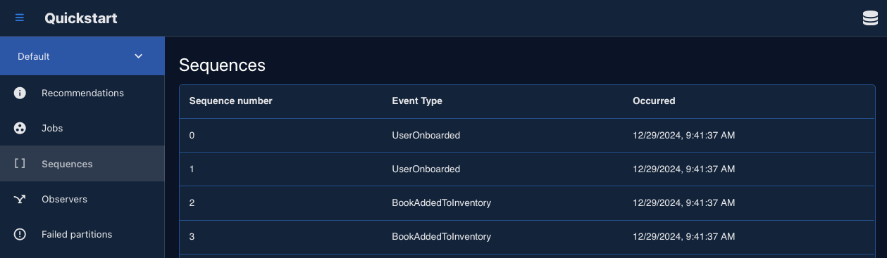
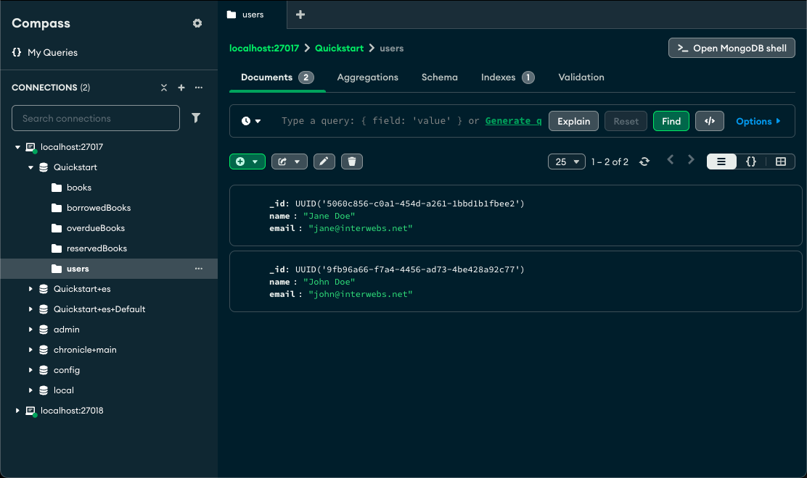
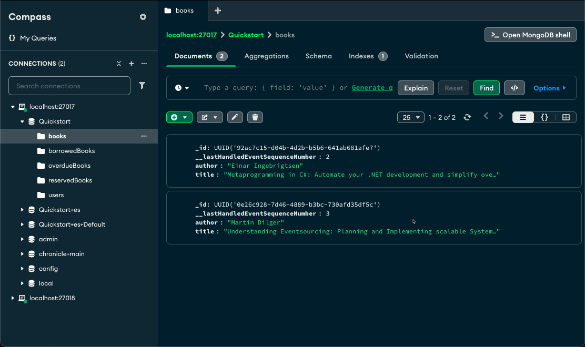
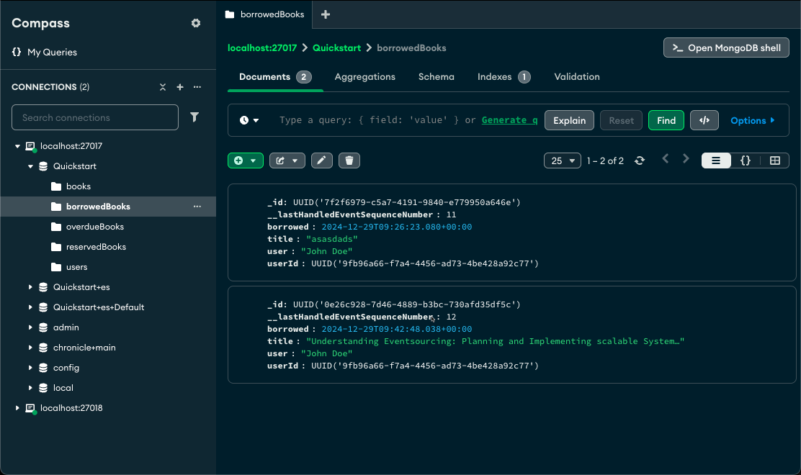

## Events

Defining an event is straightforward. You can use either a C# `class` or a `record` type.
We recommend using a `record` type because records are immutable, which aligns with the nature of an [event](../concepts/event.md).

To define an event type, simply add the `[EventType]` attribute to the new type. This attribute allows the discovery system to automatically detect all event types. You can read more about event types [see documentation](../concepts/event-type.md).

Below is a set of events we will use for our library sample.

```csharp
[EventType]
public record UserOnboarded(string Name, string Email);

[EventType]
public record BookAddedToInventory(string Title, string Author, string ISBN);

[EventType]
public record BookBorrowed(Guid UserId);
```

[Snippet source](https://github.com/cratis/samples/blob/main/Chronicle/Quickstart/Common/Events.cs#L9-L16)

## Appending events

Once you have defined the events, you can start using them.
Events represent state changes in your system, and you use them by appending them to an [event sequence](../concepts/event-sequence.md).

Chronicle provides a default event sequence called the **event log**. The **event log** is typically the main sequence you use, similar to the `main` branch of a **Git** repository.

You can access the **event log** through a property on the `IEventStore` type:

```csharp
var eventLog = eventStore.EventLog;
```

The event log provides methods for appending single or multiple events to the event sequence.
In this example, we will use the method for appending a single event.

The following code appends a couple of `UserOnboarded` events to indicate that users have been onboarded to the system.

```csharp
        await eventLog.Append(Guid.NewGuid(), new UserOnboarded("Jane Doe", "jane@interwebs.net"));
        await eventLog.Append(Guid.NewGuid(), new UserOnboarded("John Doe", "john@interwebs.net"));
```

[Snippet source](https://github.com/cratis/samples/blob/main/Chronicle/Quickstart/Common/DemoData.cs#L13-L14)

Next, we want to append a couple of events to represent books being added to our inventory:

```csharp
        await eventLog.Append(Guid.NewGuid(), new BookAddedToInventory("Metaprogramming in C#: Automate your .NET development and simplify overcomplicated code", "Einar Ingebrigtsen", "978-1837635429"));
        await eventLog.Append(Guid.NewGuid(), new BookAddedToInventory("Understanding Eventsourcing: Planning and Implementing scalable Systems with Eventmodeling and Eventsourcing", "Martin Dilger", "979-8300933043"));
```

[Snippet source](https://github.com/cratis/samples/blob/main/Chronicle/Quickstart/Common/DemoData.cs#L18-L19)

Notice that the first parameter for the `Append` method is the [event source identifier](../concepts/event-source.md).
This identifier uniquely represents the object we're working on, similar to a **primary key** in a database.
In our example, we are dealing with two concepts: **user** and **book**, so the identifiers will uniquely represent individual users and books.

After running your application, the events will be appended. You can verify this by opening the Chronicle workbench,
which is included in the Chronicle development image. Open your browser and navigate to [http://localhost:8080](http://localhost:8080).

Then, go to the **Quickstart** event store and select **Sequences**. You should now be able to see the events:



## Creating read state

Events represent all the changes that have occurred in our system. With event sourcing, we typically don't use the events directly to display the current state.
Instead, we react to these changes to produce and update the current state.
This current state is referred to as the read state, or more concretely, read models.

We use the events as the **write** state and the read models as the **read** state.
The process of transforming events into read models is called projecting.

Chronicle supports multiple ways to project from one or more events to a **read model**.

### Reactor

Creating a **Reactor** offers the most flexibility. It can be used in any scenario where you want to react to an event being appended.
This means it can perform tasks beyond just producing the current state of your application.
It is ideal for *if-this-then-that* scenarios but can also be used for data creation.

Let's start by defining a read model that will be used in the reducer.

```csharp
public record User(Guid Id, string Name, string Email)
```

[Snippet source](https://github.com/cratis/samples/blob/main/Chronicle/Quickstart/Common/User.cs#L7-L7)

The following code reacts to the `UserOnboarded` event and then creates a new `User` and inserts into a MongoDB database.

```csharp
using Cratis.Chronicle.Events;
using Cratis.Chronicle.Reactors;
using MongoDB.Driver;

namespace Quickstart;

public class UsersReactor : IReactor
{
    public async Task Onboarded(UserOnboarded @event, EventContext context)
    {
        var user = new User(Guid.Parse(context.EventSourceId), @event.Name, @event.Email);
        var collection = Globals.Database.GetCollection<User>("users");
        await collection.InsertOneAsync(user);
    }
}
```

[Snippet source](https://github.com/cratis/samples/blob/main/Chronicle/Quickstart/Console/UsersReactor.cs#L5-L19)

> Note: The code leverages a `Globals` object that is found as part of the full sample and is configured with the
> MongoDB database to use.

The method `Onboarded` is not defined by the `IReactor` interface. The `IReactor` interface serves as a marker interface for discovery purposes.
Methods in a reactor are convention-based, meaning they will be automatically detected and invoked as long as they adhere to the expected signature conventions.

Supported method signatures include:

```csharp
void <MethodName>(EventType @event);
void <MethodName>(EventType @event, EventContext context);
Task <MethodName>(EventType @event);
Task <MethodName>(EventType @event, EventContext context);
```

Opening your database client, you should be able to see the users:



### Reducer

If you don't need the flexibility of a **Reactor** and are only interested in producing the correct current state, a **Reducer** is the ideal choice.
It functions similarly to a **Reactor** but abstracts away the database management, allowing Chronicle to handle it for you.

Let's begin by defining a read model that will be used in the reducer.

```csharp
public record Book(Guid Id, string Title, string Author, string ISBN)
```

[Snippet source](https://github.com/cratis/samples/blob/main/Chronicle/Quickstart/Common/Book.cs#L7-L7)

For the read model we will need code that produces the correct state.
The following code reacts to `BookAddedToInventory` and produces the new state that should be persisted.

```csharp
using Cratis.Chronicle.Events;
using Cratis.Chronicle.Reducers;

namespace Quickstart.Common;

public class BooksReducer : IReducerFor<Book>
{
    public Task<Book> Added(BookAddedToInventory @event, Book? initialState, EventContext context) =>
         Task.FromResult(new Book(Guid.Parse(@context.EventSourceId), @event.Title, @event.Author, @event.ISBN));
}
```

[Snippet source](https://github.com/cratis/samples/blob/main/Chronicle/Quickstart/Common/BooksReducer.cs#L5-L14)

The method `Added` is not defined by the `IReducerFor<>` interface. The `IReducerFor<>` interface serves as a marker interface for discovery purposes.
It requires a generic argument specifying the type of the read model. Chronicle uses this type to gather information about properties and types for the underlying database.

Methods in a reducer are convention-based, meaning they will be automatically detected and invoked as long as they adhere to the expected signature conventions.

Supported method signatures include:

```csharp
ReadModel <MethodName>(EventType @event, ReadModel? initialState);
ReadModel <MethodName>(EventType @event, , ReadModel? initialState, EventContext context);
Task<ReadModel> <MethodName>(EventType @event, ReadModel? initialState);
Task<ReadModel> <MethodName>(EventType @event, ReadModel? initialState, EventContext context);
```

> Note: Chronicle only supports MongoDB for reducers at the moment.

Opening your database client, you should be able to see the books:



### Projections

While reducers provide a programmatic, imperative approach to altering state in your system, [projections](../concepts/projection.md) offer a declarative approach.
Although projections may not have the flexibility of a **reducer** or the power of a **reactor**, they possess unique capabilities
that can be challenging to achieve with a **reactor** or **reducer**. For instance, projections support relationships such as one-to-many
and one-to-one. When your goal is to produce state, projections will often be sufficient and will help you achieve your objectives more quickly.

Let's start by defining a read model that will be used in the projection.

```csharp
public record BorrowedBook(Guid Id, Guid UserId, string Title, string User, DateTimeOffset Borrowed, DateTimeOffset Returned)
```

[Snippet source](https://github.com/cratis/samples/blob/main/Chronicle/Quickstart/Common/BorrowedBook.cs#L7-L7)

The projection declares operations to do in a fluent manner, effectively mapping out the events it is interested in and
telling the projection engine what to do with them.

```csharp
using Cratis.Chronicle.Projections;

namespace Quickstart.Common;

public class BorrowedBooksProjection : IProjectionFor<BorrowedBook>
{
    public void Define(IProjectionBuilderFor<BorrowedBook> builder) => builder
        .From<BookBorrowed>(from => from
            .Set(m => m.UserId).To(e => e.UserId)
            .Set(m => m.Borrowed).ToEventContextProperty(c => c.Occurred))
        .Join<BookAddedToInventory>(bookBuilder => bookBuilder
            .On(m => m.Id)
            .Set(m => m.Title).To(e => e.Title))
        .Join<UserOnboarded>(userBuilder => userBuilder
            .On(m => m.UserId)
            .Set(m => m.User).To(e => e.Name))
        .RemovedWith<BookReturned>();
}
```

[Snippet source](https://github.com/cratis/samples/blob/main/Chronicle/Quickstart/Common/BorrowedBooksProjection.cs#L5-L22)

With this projection, we specify that from the `BookBorrowed` event, we are interested in storing which user borrowed the book and the time it was borrowed.
The time is derived from the `Occurred` property of the `EventContext`. For display purposes, we want to show the name of the book and the name of the user
who borrowed it. Instead of performing complex queries to retrieve this information when getting the data, we can produce it as the events occur.
We achieve this by leveraging the **Join** functionality of the projection engine. By joining with another event that holds the necessary information,
we can populate the read model. To get the book title, we join with the `BookBorrowed` event, and for the user's name, we join with the `UserOnboarded` event.

> Note: The lambdas provided to the projection builders are not callbacks that get executed; they are expressions representing properties in a type-safe manner, ensuring compile-time checks.

To verify that the projection works and produces the correct read models, we need code that generates the `BookBorrowed` event:

```csharp
eventLog.Append("92ac7c15-d04b-4d2b-b5b6-641ab681afe7", new BookBorrowed(Guid.Parse("5060c856-c0a1-454d-a261-1bbd1b1fbee2")));
```

> Note: the EventSourceId type is of type of string while the `BookBorrowed` event is expecting a `Guid`. Both of the
> hardcoded identifiers are typically things you would need to grab from the read model for a real system.

Running this and opening your database client, you should be able to see the borrowed books:


