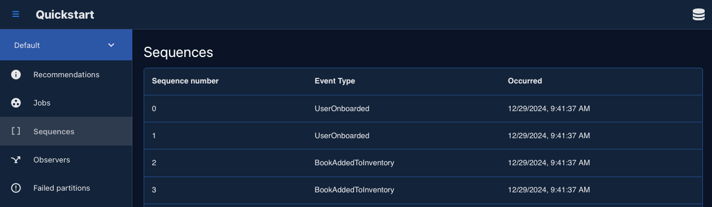

## Define some events

Everything in Chronicle starts with a fact. You model facts as `record` types marked with `[EventType]` — records because an event, once it happened, never changes. The attribute is how Chronicle discovers the type; it takes no name, the type name *is* the identity.

Here are the facts of a small library — a book arrives, gets borrowed, and comes back:

```csharp
using Cratis.Chronicle.Events;

[EventType]
public record BookAdded(string Title, string Isbn);

[EventType]
public record BookBorrowed(string MemberName);

[EventType]
public record BookReturned;
```

`BookReturned` carries no data at all — that it *happened*, on a particular book's stream, is the whole story. Not every fact needs a payload.

## Append them

You record a fact by **appending** it to an [event sequence](../concepts/event-sequence.md). Chronicle gives you one by default — the **event log**, the main sequence you'll use, much like the `main` branch of a Git repository. Reach it through the event store:

```csharp
var eventLog = eventStore.EventLog;

var bookId = Guid.NewGuid();
await eventLog.Append(bookId, new BookAdded("The Pragmatic Programmer", "978-0135957059"));
```

That first argument is the [event source id](../concepts/event-source.md) — the identity of the thing this fact is about, like a primary key. Every event you append against `bookId` becomes part of *that book's* stream of history.

> [!TIP]
> We use a raw `Guid` here to keep the quickstart short. In real code you'd wrap it in a strongly-typed `BookId` so the compiler can't confuse a book's id with a member's — the [tutorial](/chronicle/tutorial/) shows exactly that.

Run your app, then open the <a href="http://localhost:8080" target="_blank" rel="noopener">workbench</a>, pick your event store, and select **Sequences** — your `BookAdded` is sitting there at sequence number `0`, permanent and in order.

> [!NOTE]
> If you are using the Development or Development-slim image, log in with username **Admin** and password **ChangeMeNow!**. See [Workbench — Development](../workbench/development.md) for details.



## Turn events into a read model

Events are the **write** side — the source of truth. To *read* current state you don't query the log directly; you let Chronicle fold the events into a **read model** for you. The declarative way to do that is a [projection](../concepts/projection.md): you declare the shape you want and which events feed each field, and Chronicle keeps it in sync — no update code, ever.

```csharp
using Cratis.Chronicle.Keys;
using Cratis.Chronicle.Projections.ModelBound;

[FromEvent<BookAdded>]
public record Book(
    [Key]
    Guid Id,

    string Title,

    string Isbn,

    [SetValue<BookAdded>(false)]
    [SetValue<BookBorrowed>(true)]
    [SetValue<BookReturned>(false)]
    bool OnLoan,

    [SetFrom<BookBorrowed>(nameof(BookBorrowed.MemberName))]
    string? BorrowedBy);
```

Read the attributes as a sentence: a book comes into the view from `BookAdded`; `OnLoan` is `false` when it's added, `true` when borrowed, `false` again when returned; `BorrowedBy` is whoever borrowed it. You're *declaring* how facts map onto the view — Chronicle replays the events in order and applies the mapping.

> [!NOTE]
> The class-level `[FromEvent<BookAdded>]` maps event properties onto read model properties **by naming convention** — `BookAdded.Title` flows into `Title` and `BookAdded.Isbn` into `Isbn` without a single per-property attribute. You only reach for `[SetFrom<T>]` when the names differ, the way `BookBorrowed.MemberName` feeds `BorrowedBy` here.

One view rarely answers every question. The librarian's next one is "what's out on loan right now?" — and rather than filtering `Book`, you declare a second, purpose-built read model whose very *existence* tracks the loan:

```csharp
[FromEvent<BookBorrowed>]
[RemovedWith<BookReturned>]
public record BorrowedBook(
    [Key]
    Guid Id,

    string MemberName);
```

The moment a `BookBorrowed` lands, a `BorrowedBook` instance appears — keyed by the book's id, its `MemberName` mapped by the same naming convention. When the matching `BookReturned` arrives, `[RemovedWith<BookReturned>]` removes the instance from the view again. The collection always holds exactly the books that are out *right now* — no flag to maintain, no filter to remember, no cleanup job.

## Query the read models

The most direct way to look at a read model is to ask Chronicle itself. `IReadModels` — reached through `eventStore.ReadModels` — hands you every instance of a read model, one call per view:

```csharp
var books = await eventStore.ReadModels.GetInstances<Book>();
var borrowedBooks = await eventStore.ReadModels.GetInstances<BorrowedBook>();
```

These results are **strongly consistent**: Chronicle replays the read model's events on demand, so what comes back reflects every event appended up to that instant — including the one you appended a moment ago. That replay is also the cost: every call processes *all* the events feeding the read model, which is perfect for a quickstart but not necessarily what you'd put on a hot path in production. You can cap the work by passing an event count — `GetInstances<Book>(eventCount: 1_000)` — but a capped replay can stop before the newest events and hand you incomplete results. [Getting a collection of instances](../read-models/getting-collection-instances.md) covers the details.

By default Chronicle also **materializes** every projection into the **sink** storage configured for the event store — MongoDB unless you change it — under a database named after the event store and a collection named after the read model. Materialization happens in the background as events arrive, so it's **eventually consistent**: a freshly appended event may take a moment to show up. In exchange, a query costs nothing but a database fetch. The `Materialized` API reads those stored instances back, a page at a time:

```csharp
var page = await eventStore.ReadModels.Materialized.GetInstances<Book>(skip: 0, take: 20);
```

`skip` and `take` are plain paging (they default to `0` and `50`), so you can window through a large collection without ever loading all of it — [Materialized read models](../read-models/materialized-pagination.md) shows the paging and observing patterns.

Neither call filters, though: `GetInstances` returns everything (you'd filter with LINQ in memory), and `Materialized` only pages. When you need to filter efficiently — "which books are on loan?" — query the [sink](../sinks/index.md)'s database directly with its native tools. Our sink is MongoDB, so the `Book` read model is an ordinary collection and the driver does what it does best:

```csharp
public class Books(IMongoCollection<Book> collection)
{
    public IEnumerable<Book> OnLoan() => collection.Find(b => b.OnLoan).ToList();
}
```

Append a `BookBorrowed` against the same `bookId`, query again, and `OnLoan` is `true` with `BorrowedBy` set — and a `BorrowedBook` now sits in its collection. Append a `BookReturned` and both flip back: the flag clears, the `BorrowedBook` disappears. You never wrote an `UPDATE`. The trade-offs between the on-demand and materialized paths are laid out in [read model consistency](../read-models/consistency.md).

## React when something happens

Projections build *state*. When you need to *do something* the moment a fact lands — notify someone, call another system — you write a **reactor**. `IReactor` is a marker; you just add a method whose first parameter is the event you care about, and Chronicle routes matching events to it:

```csharp
using Cratis.Chronicle.Events;
using Cratis.Chronicle.Reactors;

public class BookReturnedNotifier : IReactor
{
    public Task BookReturned(BookReturned @event, EventContext context)
    {
        // context.EventSourceId is the BookId this happened to
        Console.WriteLine($"Book {context.EventSourceId} was returned — notify the next member in line.");
        return Task.CompletedTask;
    }
}
```

No registration, no wiring — drop the class in and every `BookReturned` flows to it. Reactors must be idempotent, because the same event may be delivered more than once (during a replay or a recovery). In a real app you'd inject a notification service here — the [tutorial](/chronicle/tutorial/) and the [Reactors](../reactors/index.md) guide show that, along with how reactors get their dependencies under a host.

That's the whole loop — **append → project → react**. The [tutorial](/chronicle/tutorial/) builds exactly this library one concept at a time and explains each as you go; the [Projections](../projections/index.md), [Reducers](../reducers/index.md), and [Reactors](../reactors/index.md) guides go deeper on each piece.
