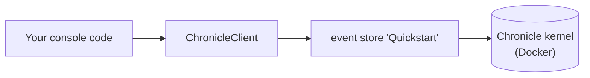

A console app is the smallest place to run Chronicle: no web host, no dependency-injection container, nothing between you and the client. That's exactly why it's the clearest place to start — every moving part is something you write explicitly, so nothing is hidden by convention. (The [Worker Service](./worker.md) and [ASP.NET Core](./aspnetcore.md) guides let the host's DI container wire the same pieces up for you; start here if you want to see what that wiring actually does.)

We'll build a small, familiar domain — a library — and by the end you'll have appended events and projected them into read models you can query in MongoDB.

## Before you start

Have the Chronicle kernel running locally. [Run Chronicle locally](./running-chronicle.md) brings it up with a single `docker run` and lists the prerequisites (.NET 8+, Docker); this guide assumes it's listening on `chronicle://localhost:35000`.

You can also find the [complete Console quickstart sample](https://github.com/Cratis/Samples/tree/main/Chronicle/Quickstart/Console) on GitHub.

## Set up the project

Create a folder for your project, then a .NET console project inside it:

```shell
dotnet new console
```

Add a reference to the [Chronicle client package](https://www.nuget.org/packages/Cratis.Chronicle):

```shell
dotnet add package Cratis.Chronicle
```

## Connect the client

Everything in Chronicle is reached through a `ChronicleClient`. From a client you ask for the **event store** you want to work with — here, one named `Quickstart`. Because there's no DI container to do it for you, you create the client yourself:

```csharp
using Cratis.Chronicle;
using Cratis.Chronicle.Connections;

// ChronicleConnectionString.Development points at the local dev kernel on chronicle://localhost:35000
using var client = new ChronicleClient(ChronicleConnectionString.Development);
var eventStore = await client.GetEventStore("Quickstart");
```

`ChronicleConnectionString.Development` is the built-in connection string for the local development kernel — the same one `new ChronicleClient()` uses when you call it with no arguments. Spelling it out keeps the console version explicit; point it elsewhere with `ChronicleConnectionString.Default` (no credentials) or your own `new ChronicleConnectionString("chronicle://…")`.

That single `eventStore` is your handle to everything that follows:



[!INCLUDE [common](./common.md)]

## Configure the MongoDB client

The `Books` query above reads documents Chronicle wrote. For your `IMongoCollection<Book>` to deserialize them, the MongoDB driver needs to match how Chronicle stores documents — register these conventions once at startup:

[!INCLUDE [mongodb](./mongodb.md)]

With the conventions registered, the `Books` query reads the projection's documents exactly as written.

## Recap

You wired Chronicle into a bare console app by hand: created a `ChronicleClient`, opened the `Quickstart` event store, appended events for a small library domain, projected them into a `Book` read model with model-bound attributes, and reacted to one with a reactor. Because there was no DI container, every connection was explicit and in plain sight.

## Where to go next

- **[Build the same domain step by step](/chronicle/tutorial/)** — the tutorial walks the library model one concept at a time, explaining each as you go.
- **Let a host wire it up** — move the same code into a [Worker Service](./worker.md) or an [ASP.NET Core](./aspnetcore.md) app and let its DI container register the artifacts for you.
- **Understand the pieces** — the [Concepts](/chronicle/concepts/) section defines events, projections, reducers, and reactors in depth.
