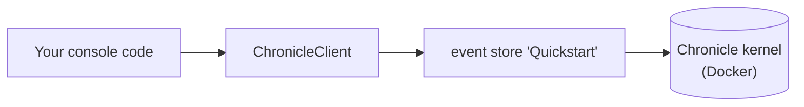

A console app is the smallest place to run Chronicle: no web host, no dependency-injection container, nothing between you and the client. That's exactly why it's the clearest place to start — every moving part is something you write explicitly, so nothing is hidden by convention. (The [Worker Service](./worker.md) and [ASP.NET Core](./aspnetcore.md) guides let the host's DI container wire the same pieces up for you; start here if you want to see what that wiring actually does.)

We'll build a small, familiar domain — a library — and by the end you'll have appended events and projected them into read models you can query in MongoDB.

[!INCLUDE [pre-requisites](./prereq.md)]

You can find the [complete Console quickstart sample](https://github.com/Cratis/Samples/tree/main/Chronicle/Quickstart/Console) on GitHub,
which also uses the [shared code in the Common project](https://github.com/Cratis/Samples/tree/main/Chronicle/Quickstart/Common).

[!INCLUDE [docker](./docker.md)]

## Set up the project

Create a folder for your project, then a .NET console project inside it:

```shell
dotnet new console
```

Add a reference to the [Chronicle client package](https://www.nuget.org/packages/Cratis.Chronicle):

```shell
dotnet add package Cratis.Chronicle
```

## Connect the client

Everything in Chronicle is reached through a `ChronicleClient`. From a client you ask for the **event store** you want to work with — here, one named `Quickstart`. Because there's no DI container to do it for you, you create the client yourself and tell it to discover and register your artifacts automatically:

```csharp
using Cratis.Chronicle;

// Explicitly use the Chronicle Options to set the naming policy to camelCase for the projection/reducer sinks
using var client = new ChronicleClient(ChronicleOptions.FromUrl("http://localhost:35000").WithCamelCaseNamingPolicy());
var eventStore = await client.GetEventStore("Quickstart");
```

[Snippet source](https://github.com/cratis/samples/blob/main/Chronicle/Quickstart/Console/Program.cs#L11-L15)

That single `eventStore` is your handle to everything that follows:



[!INCLUDE [common](./common.md)]

[!INCLUDE [common](./mongodb.md)]

With this you can query the collections as expected using the **MongoDB.Driver**:

```csharp
public class Books(IMongoCollection<Book> collection)
{
    public IEnumerable<Book> GetAll() => collection.Find(Builders<Book>.Filter.Empty).ToList();
}
```

[Snippet source](https://github.com/cratis/samples/blob/main/Chronicle/Quickstart/Common/Books.cs#L9-L12)

## Recap

You wired Chronicle into a bare console app by hand: created a `ChronicleClient`, opened the `Quickstart` event store, appended events for a small library domain, and turned them into read models three different ways — a reactor, a reducer, and a projection. Because there was no DI container, every connection was explicit and in plain sight.

## Where to go next

- **[Build the same domain step by step](/chronicle/tutorial/)** — the tutorial walks the library model one concept at a time, explaining each as you go.
- **Let a host wire it up** — move the same code into a [Worker Service](./worker.md) or an [ASP.NET Core](./aspnetcore.md) app and let its DI container register the artifacts for you.
- **Understand the pieces** — the [Concepts](/chronicle/concepts/) section defines events, projections, reducers, and reactors in depth.
