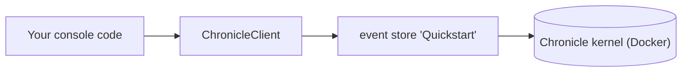

A console app is the smallest place to run Chronicle: no web host, no dependency-injection container, nothing between you and the client. That's exactly why it's the clearest place to start — every moving part is something you write explicitly, so nothing is hidden by convention. (The [Worker Service](./worker) and [ASP.NET Core](./aspnetcore) guides let the host's DI container wire the same pieces up for you; start here if you want to see what that wiring actually does.)

We'll build a small, familiar domain — a library — and by the end you'll have appended events and projected them into read models you can query in MongoDB.

## Before you start

Have the Chronicle kernel running locally. [Run Chronicle locally](./choose-hosting-model#run-chronicle-locally) brings it up with a single `docker run` and lists the prerequisites (.NET 8+, Docker); this guide assumes it's listening on `chronicle://localhost:35000`.

For a runnable console application, see the [SimpleConsole sample](https://github.com/Cratis/Chronicle/tree/main/Samples/SimpleConsole) on GitHub. It uses an employee domain rather than the library domain in this guide.

## Set up the project

Create a folder for your project, then a .NET console project inside it:

```shell
dotnet new console
```

Add a reference to the [Chronicle client package](https://www.nuget.org/packages/Cratis.Chronicle):

```shell
dotnet add package Cratis.Chronicle
```

## Connect the client

Everything in Chronicle is reached through a `ChronicleClient`. From a client you ask for the **event store** you want to work with — here, one named `Quickstart`. Because there's no DI container to do it for you, you create the client yourself:

<ChronicleClientTabs snippet="get-started/console/connect" />

Each client has a built-in development connection for the local kernel, which carries the kernel's well-known development credentials: `ChronicleConnectionString.Development` in C#, `ChronicleOptions.development()` in Kotlin and TypeScript, and `Chronicle.Connections.ConnectionString.development()` in Elixir. Spell it out as shown. The .NET client also uses these credentials when you call `new ChronicleClient()` with no arguments, but not every client fills them in for a connection string without credentials. To connect to another kernel, pass your own `chronicle://…` connection string.

That single `eventStore` is your handle to everything that follows:



[!INCLUDE [common](./_includes/common.mdx)]

## Configure the MongoDB client

The `Books` query above reads documents Chronicle wrote. For your `IMongoCollection<Book>` to deserialize them, the MongoDB driver needs to match how Chronicle stores documents — register these conventions once at startup:

[!INCLUDE [mongodb](./_includes/mongodb.mdx)]

With the conventions registered, the `Books` query reads the projection's documents exactly as written.

## Recap

You wired Chronicle into a bare console app by hand: created a `ChronicleClient`, opened the `Quickstart` event store, appended events for a small library domain, projected them into the `Book` and `BorrowedBook` read models with model-bound attributes, queried them both on demand and from the materialized sink, and reacted to one with a reactor. Because there was no DI container, every connection was explicit and in plain sight.

## Where to go next

- **[Build the same domain step by step](/chronicle/tutorial/)** — the tutorial walks the library model one concept at a time, explaining each as you go.
- **Let a host wire it up** — move the same code into a [Worker Service](./worker) or an [ASP.NET Core](./aspnetcore) app and let its DI container register the artifacts for you.
- **Understand the pieces** — the [Concepts](/chronicle/concepts/) section defines events, projections, reducers, and reactors in depth.
