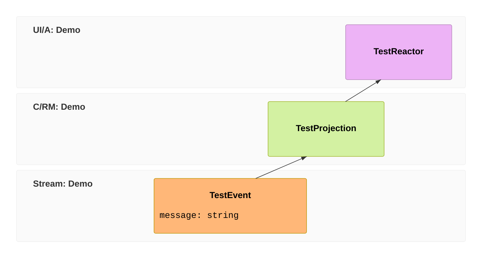

import { Steps, Tabs, TabItem, Aside } from '@astrojs/starlight/components';

The fastest way to understand Chronicle is to watch one fact travel through it. So that's what we'll do here: install a template, scaffold a tiny app, and run it. In a couple of minutes you'll have appended an event and seen it ripple out into both a read model *and* a live reaction — the loop that every Chronicle application is built on.

We won't write much code yet — the template gives us a working example to read. Once it's running and the shape makes sense, the [tutorial](/chronicle/tutorial/) picks up the thread and has you build a real domain from scratch.

<Aside type="note" title="Never done event sourcing?">
You don't need any to follow along — the steps work without it. If you'd rather understand the *why* before the *how*, read [Why Event Sourcing](/chronicle/why-event-sourcing/) first, then come back. Either order is fine.
</Aside>

## Prerequisites

- The [.NET SDK](https://dotnet.microsoft.com/download) — .NET 8 or newer.
- [Docker](https://www.docker.com/) with Compose. Chronicle runs as a small kernel next to your app, and the template wires it up with a `docker-compose.yml` so you don't have to install anything else.

## Scaffold and run it

<Steps>

1. **Install the Cratis templates.** This adds a family of `dotnet new` starters — a console one for learning the core, and a full-stack web one with a React frontend.

   ```bash title="Install the templates"
   dotnet new install Cratis.Templates
   ```

2. **Scaffold a project.** Start with the console template — it's the smallest thing that exercises the entire event-sourcing loop, and it's the one the tutorial builds on.

   <Tabs>
   <TabItem label="Console (start here)" icon="seti:c-sharp">
   ```bash title="Scaffold the console starter"
   dotnet new cratis-chronicle-console -o Library
   cd Library
   ```
   </TabItem>
   <TabItem label="Full-stack web" icon="seti:react">
   ```bash title="Scaffold a full-stack app"
   dotnet new cratis -o Library
   cd Library
   ```

   This gives you an [Arc](/arc/) + Chronicle backend with a React frontend and generated, type-safe proxies. The event-sourcing concepts are identical — there's just a UI on top. When it's running, continue with [Build a full-stack feature](/build-a-full-app/).
   </TabItem>
   </Tabs>

3. **Start Chronicle.** The template ships a `docker-compose.yml` for the Chronicle kernel and its storage. Bring it up in the background:

   ```bash title="Start the Chronicle kernel"
   docker compose up -d
   ```

4. **Run the app.**

   ```bash title="Run it"
   dotnet run
   ```

   The scaffolded program appends one event and reacts to it. You'll see the reaction print, then the app waits for a keypress:

   ```text title="Output" frame="terminal"
   Received event with message: Hello world!
   ```

</Steps>

That one line of output is the whole point — let's unpack how it got there.

## What you just ran

That one line came out of a complete Chronicle loop. Here it is as an **[event model](/event-modeling/)** — a fact is appended, a projection folds it into a read model, and a reactor acts on it:



The template's `Program.cs` is about twenty lines, and it wires up exactly those three blocks. Here's the heart of it:

```csharp title="Program.cs"
using var client = new ChronicleClient();
var eventStore = await client.GetEventStore("ChronicleConsole");

await eventStore.EventLog.Append("some-event-source", new TestEvent("Hello world!"));
```

Reading top to bottom: a `ChronicleClient` connects to the kernel you just started with Docker, you ask it for an **event store** by name, and you **append** a `TestEvent` to its event log. That `Append` is the only thing that *changes* anything — everything below reacts to it.

The event itself is just a record marked as a fact:

```csharp title="The event — an immutable fact"
[EventType]
public record TestEvent(string Message);
```

And two artifacts sit waiting for that fact to happen. A **projection** folds the event into a read model — state you can query — declaratively, with no update code:

```csharp title="The projection — builds queryable state"
[FromEvent<TestEvent>]
public record TestProjection(
    string Message,
    [SetFromContext<TestEvent>(nameof(EventContext.EventSourceId))] string EventSource);
```

A **reactor** *does something* when the event arrives — here, it writes the line you saw:

```csharp title="The reactor — does something when it happens"
public class TestReactor : IReactor
{
    public Task React(TestEvent @event)
    {
        Console.WriteLine($"Received event with message: {@event.Message}");
        return Task.CompletedTask;
    }
}
```

Notice what you *didn't* write: no registration, no wiring, no "on startup, subscribe this handler to that event". Chronicle **discovers** the event, projection, and reactor by convention — the `[EventType]` attribute, the `IReactor` marker, the `[FromEvent<>]` attribute — and routes the appended fact to each. That convention-over-configuration discovery is what keeps a growing Chronicle app from drowning in plumbing.

<Aside type="tip" title="That's the whole model">
Append a fact → a projection builds state from it → a reactor acts on it. **Append → project → react.** Every Chronicle application, however large, is that loop repeated. You just ran it end to end.
</Aside>

## See it in the workbench

The Docker image includes the **Chronicle workbench** — a web UI for poking at your event store. Open [http://localhost:8080](http://localhost:8080) and log in with the development credentials (username `Admin`, password `ChangeMeNow!`). Choose the `ChronicleConsole` event store and look at **Sequences**: there's your `TestEvent`, sitting at sequence number `0`, permanent and in order. Append more and watch the log grow. This is the source of truth your projection and reactor were both reading from.

## Where to go next

- **Build something real, step by step** — the [tutorial](/chronicle/tutorial/) builds a small library system one concept at a time, and explains each as you go. It's the best next stop.
- **Wire Chronicle into an existing app** — [choose an application host model and run the kernel](./choose-hosting-model), then follow the guide for [ASP.NET Core](./aspnetcore.md), a [Worker Service](./worker.md), or a bare [Console](./console.md).
- **Understand the model** — [Why Event Sourcing](/chronicle/why-event-sourcing/) makes the case, and the [Concepts](/chronicle/concepts/) section defines every term you just met.
- **Go full-stack** — put commands and a React UI on top with [Build a full-stack feature](/build-a-full-app/).
