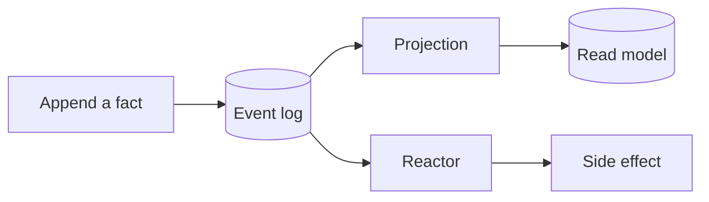
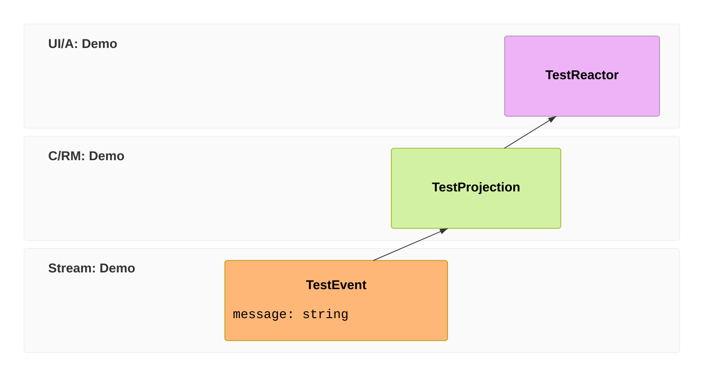

import { Aside } from '@astrojs/starlight/components';

The fastest way to understand Chronicle is to watch one fact travel through it. Chronicle stores the fact as an event, projections fold it into read models, and reactors respond to it. That loop is the same no matter which client SDK you use.

This page is the shared Chronicle starting point. It explains the common model and shows the same examples in every supported client. Use the client-specific setup guides for package installation, project scaffolding, host integration, and runtime idioms.

<Aside type="note" title="Never done event sourcing?">
You don't need any event-sourcing background to follow the loop below. If you'd rather understand the *why* before the *how*, read [Why Event Sourcing](/chronicle/why-event-sourcing/) first, then come back. Either order is fine.
</Aside>

## Pick a client

Start with the client that matches the application you are building. The setup guide owns the language-specific details; the rest of this page owns the Chronicle concepts.

| Client | Setup guide |
| --- | --- |
| .NET | [.NET client](/chronicle/clients/dotnet/getting-started/) |
| Kotlin | [Kotlin client](/chronicle/clients/kotlin/get-started/) |
| Java | [Kotlin/JVM client](/chronicle/clients/kotlin/get-started/) |
| Elixir | [Elixir client](/chronicle/clients/elixir/get-started/) |
| TypeScript | [TypeScript client](/chronicle/clients/typescript/getting-started/) |

<Aside type="note" title="Java uses the JVM client">
Java examples are owned by the Kotlin/JVM client repo. Use the JVM setup guide, then choose the Java tab when reading shared examples.
</Aside>

## Start Chronicle

Chronicle application code connects to a running Chronicle kernel. For local development, the fastest path is the development image:

```shell
docker run -d -p 27017:27017 -p 8080:8080 -p 35000:35000 cratis/chronicle:latest-development
```

The kernel listens on `chronicle://localhost:35000`, the workbench runs on `http://localhost:8080`, and the bundled MongoDB stores materialized read models. If you need Docker Compose, Aspire, a separate database, or production-style hosting, use [Choose an application host model](./choose-hosting-model).

## The Chronicle loop

One event-sourced interaction has three parts:


```mermaid
flowchart LR
    Append["Append a fact"]
    EventLog[("Event log")]
    Projection["Projection"]
    ReadModel[("Read model")]
    Reactor["Reactor"]
    Effect["Side effect"]

    Append --> EventLog
    EventLog --> Projection
    Projection --> ReadModel
    EventLog --> Reactor
    Reactor --> Effect
```

In [event modeling](/event-modeling/) notation, the tiny example below is:


```mermaid
eventmodeling

tf 01 evt Demo.TestEvent { message: string }
tf 02 rmo Demo.TestProjection ->> 01
tf 03 pcr Demo.TestReactor
```

Each client has its own syntax, but the Chronicle shape is the same: create a client, choose an event store, and append a fact to the event log.

<ChronicleClientTabs snippet="get-started/client-flow" clients="csharp,kotlin,java,elixir,typescript" />

Reading top to bottom: the client connects to the kernel, asks for an **event store** by name, and **appends** a `TestEvent` to its event log. That append is the only operation that changes the event store. Everything else reacts to the recorded fact.

The event itself is just a record marked as a fact:

<ChronicleClientTabs snippet="get-started/test-event" clients="csharp,kotlin,java,elixir,typescript" />

A **projection** folds that event into a read model: state you can query, rebuild, and store in a sink:

<ChronicleClientTabs snippet="get-started/test-projection" clients="csharp,kotlin,java,elixir,typescript" />

A **reactor** does something when the event arrives:

<ChronicleClientTabs snippet="get-started/test-reactor" clients="csharp,kotlin,java,elixir,typescript" />

Discovery and registration are client-specific. Some hosts discover annotated artifacts; others register modules, classes, or functions explicitly. The invariant is the same: events are facts, projections derive read models, and reactors observe events to produce side effects.

<Aside type="tip" title="That's the whole model">
Append a fact → a projection builds state from it → a reactor acts on it. **Append → project → react.** Every Chronicle application, however large, repeats that loop.
</Aside>

## Inspect it in the workbench

The development image includes the **Chronicle workbench** — a web UI for inspecting event stores. Open [http://localhost:8080](http://localhost:8080) and log in with the development credentials: username `Admin`, password `ChangeMeNow!`.

After you run one of the client setup guides or the example flow above, choose the event store your client used and open **Sequences**. The `TestEvent` is permanent and ordered in the event log. Append more events and watch the sequence grow. That log is the source of truth your projections and reactors read from.

## Where to go next

- **Pick your client** — start with [.NET](/chronicle/clients/dotnet/getting-started/), [Kotlin/JVM](/chronicle/clients/kotlin/get-started/), [Elixir](/chronicle/clients/elixir/get-started/), or [TypeScript](/chronicle/clients/typescript/getting-started/).
- **Build something real, step by step** — the [tutorial](/chronicle/tutorial/) builds a small library system one concept at a time.
- **Run Chronicle your way** — [choose an application host model and run the kernel](./choose-hosting-model).
- **Understand the model** — [Why Event Sourcing](/chronicle/why-event-sourcing/) makes the case, and the [Concepts](/chronicle/concepts/) section defines every term you just met.
