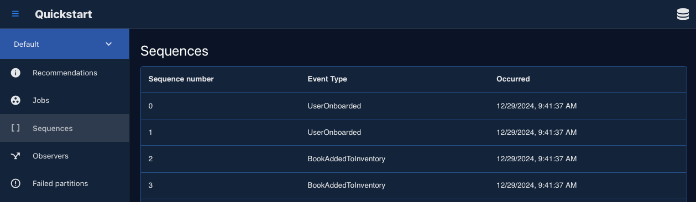
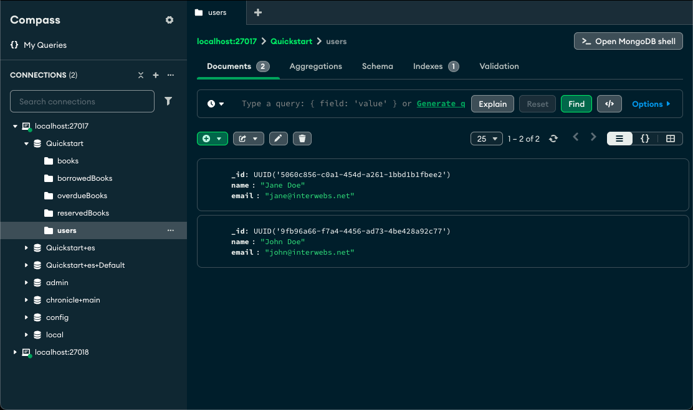
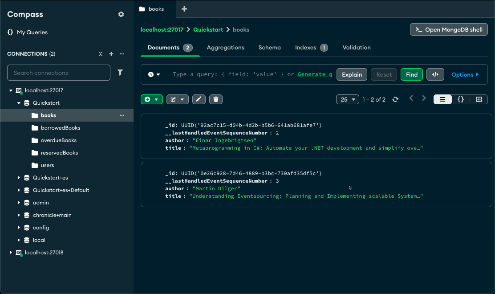
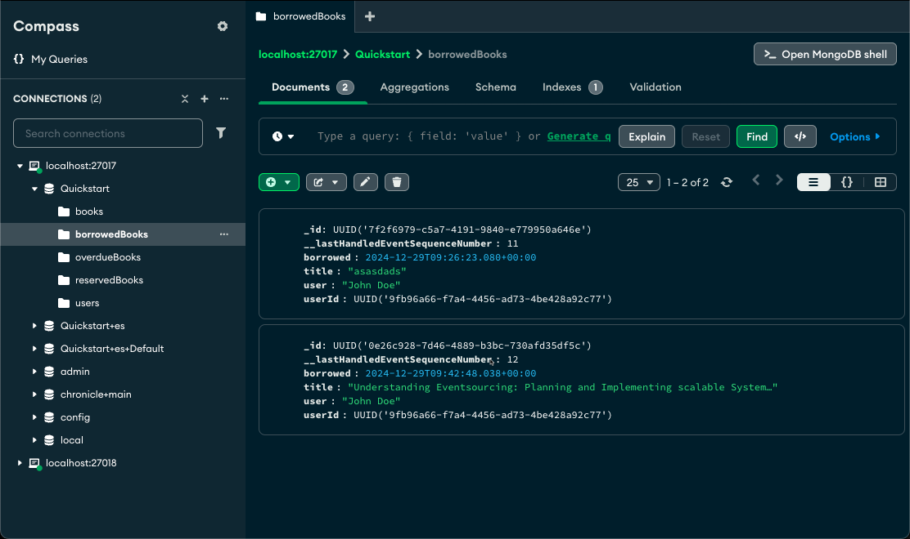

# Quickstart Console

## Pre-requisites

- [.NET 8 or higher](https://dot.net)
- [Docker Desktop or compatible](https://www.docker.com/products/docker-desktop/)
- MongoDB client (e.g. [MongoDB Compass](https://www.mongodb.com/products/tools/compass))

## Objective

The quickstart will take you through creating a simple solution touching on the most
important aspects for getting started. The sample will focus on a simple and well understood
domain; a library.

You can find the full working sample [here](https://github.com/Cratis/Samples/tree/main/Chronicle/Quickstart/Console)
which also leverages common things from [here](https://github.com/Cratis/Samples/tree/main/Chronicle/Quickstart/Common).

## Docker

Chronicle comes as a [Docker Image](https://hub.docker.com/r/cratis/chronicle).
For local development, we recommend using the development images. The tag `latest-development`
will get you the latest version of it.

The development image contains a MongoDB server and means that you don't need anything else.

You can run the server as a daemon by running the following command in your terminal:

```shell
docker run -d -p 27017:27017 -p 8080:8080 -p 35000:35000 cratis/chronicle:latest-development
```

If you prefer to have a Docker Compose file, we recommend the following setup with Aspire to give
you open telemetry data:

{{snippet:Quickstart-DockerCompose}}

## Client

Chronicle is accessed through its client called `ChronicleClient`.
From this instance you can get the event store you want to work with.

The simplest thing you can do is to rely on the automatic discovery of artifacts by telling
the event store to discover and register everything automatically.

The following snippet configures the minimum and discovers everything for you.

{{snippet:Quickstart-Setup}}

## Events

Defining an event is very simple. You can either use a C# `class` or a `record` type.
We recommend using a `record` type, since records are immutable, much like an [event](../../concepts/event.md)
should be.

With the type defined you simply add the `[EventType]` attribute for the new type.
The reason you do this is for the discovery system to be able to pick up all the event types
automatically. Read more about the concept of event types [here](../../concepts/event-type.md).

Below defines a set of events we want to use for our library sample.

{{snippet:Quickstart-Events}}

## Appending events

Once you have defined the events, you can start using them. As events represent state changes to your
system, we use them by appending them to an [event sequence](../../concepts/event-sequence.md).

Chronicle has a default event sequence called **event log**. The **event log** is typically the
main sequence you use, think of it is as the `main` branch of a **Git** repository.

You can get the **event log** from a property on the `IEventStore` type:

```csharp
var eventLog = eventStore.EventLog;
```

The event log offers methods for appending one or many events to the event sequence.
We will be using the singular one.

The following code appends a couple of `UserOnboarded` events to signify that users has been onboarded to
the system.

{{snippet:Quickstart-DemoData-Users}}

The next thing we want is to append a couple of events to represents books being added to our inventory of
books:

{{snippet:Quickstart-DemoData-Books}}

Notice that the first parameter for the `Append` method is the [event source identifier](../../concepts/event-source.md).
This is the unique identifier of the object we're working on. Consider it the **primary key** of the conceptual instance.
In our case we are working with two concepts; **user** and **book**, so the identifiers will represent unique users and books.

Running your application now will append the events. You can verify this by opening the Chronicle workbench,
which is part of the Chronicle development image. Navigate your browser to [http://localhost:8080](http://localhost:8080).
Navigate then to the **Quickstart** event store and then **Sequences**. You should now be able to see the events:



## Creating read state

Events represent all the things that has caused a state change to our system. With event sourcing we typically don't use the events
directly to show what the current state is. We want to react to these changes and produce and mutate the current state.
This current state is referred to as the read state, or more concretely represented as read models.
We use the events as the **write** state and the read models as the **read** state.
The process of going from events to read models is called projecting.

Chronicle supports multiple ways for you to project from one or more events to a **read model**.

### Reactor

Creating a **Reactor** is the most flexible one. It can be used in any scenario were you want to react to an event being appended.
This means that it can do other things than just produce the current state of your application. It is perfect
for *if-this-then-that* type of scenarios. But it can be used for data creation as well.

Lets start by defining a read model that will be used in the reducer.

{{snippet:Quickstart-User}}

The following code reacts to the `UserOnboarded` event and then creates a new `User` and inserts into a MongoDB database.

{{snippet:Quickstart-UsersReactor}}

> Note: The code leverages a `Globals` object that is found as part of the full sample and is configured with the
> MongoDB database to use.

The method `Onboarded` does not come from the `IReactor` interface. The `IReactor` interface is in fact just a marker interface
used for discovery purposes. Everything you put on a reactor is convention based. As long as you follow the convention, the
methods will be picked up and called.

Supported signatures are:

```csharp
void <MethodName>(EventType @event);
void <MethodName>(EventType @event, EventContext context);
Task <MethodName>(EventType @event);
Task <MethodName>(EventType @event, EventContext context);
```

Opening your database client, you should be able to see the users:



### Reducer

If you don't need the power of a **Reactor** and you're only interested in producing the correct current state,
a **Reducer** does just that. Very similar to a **Reactor** in many ways, but you don't have to think about the
database; Chronicle will take care of that part for you.

Lets start by defining a read model that will be used in the reducer.

{{snippet:Quickstart-Book}}

For the read model we will need code that produces the correct state.
The following code reacts to `BookAddedToInventory` and produces the new state that should be persisted.

{{snippet:Quickstart-Quickstart-BooksReducer}}

The method `Added` does not come from the `IReducerFor<>` interface. The `IReducerFor<>` interface is in fact just a marker interface
used for discovery purposes. It requires a generic argument telling the type of the read model. Chronicle will get the type and collect
information about it to map out properties and types for the underlying database.
Everything you put on a reducer is convention based. As long as you follow the convention, the
methods will be picked up and called.

Supported signatures are:

```csharp
ReadModel <MethodName>(EventType @event, ReadModel? initialState);
ReadModel <MethodName>(EventType @event, , ReadModel? initialState, EventContext context);
Task<ReadModel> <MethodName>(EventType @event, ReadModel? initialState);
Task<ReadModel> <MethodName>(EventType @event, ReadModel? initialState, EventContext context);
```

> Note: Chronicle only supports MongoDB for reducers at the moment.

Opening your database client, you should be able to see the books:



### Projections

While reducers gives you a programmatic imperative approach to alter state in your system, projections gives you a declarative
approach. Although it does not hold the flexibility of a **reducer** or the power of a **reactor**, it holds its own set of
powers that that would be hard to achieve yourself with a **reactor** or **reducer**. For instance, it supports relationships
such as one-to-many and also one-to-one. When you're just producing state, projections will for the most part get you there,
and it will get you there faster.

Lets start by defining a read model that will be used in the projection.

{{snippet:Quickstart-BorrowedBook}}

The projection declares operations to do in a fluent manner, effectively mapping out the events it is interested in and
telling the projection engine what to do with them.

{{snippet:Quickstart-BorrowedBooksProjection}}

With this projection we're saying that from the `BookBorrowed` event, we're interested in storing what user it was borrowed
to and at what time it was borrowed. The time is derived from the `EventContext` `Occurred` property of the event.
For display purposes we want to show the name of the book and the name of the user that has borrowed the book.
Rather than having to do complex queries to look this up, we have an opportunity to produce this information as it happens.
We can achieve this by leveraging the **Join** functionality of the projection engine. You can simply join to another event
that holds this information and then put this onto the read model. To get the title of the book we join with the `BookBorrowed`
event to get this. And for the name of the user we join the `UserOnboarded` event.

> Note: The lambdas given to the projection builders are not callbacks that gets called, they are expressions representing properties
> in a type safe manner, giving compile time checks.

To see that the projection works and produces correct read models, we will need code that produces the `BookBorrowed` event:

```csharp
eventLog.Append("92ac7c15-d04b-4d2b-b5b6-641ab681afe7", new BookBorrowed(Guid.Parse("5060c856-c0a1-454d-a261-1bbd1b1fbee2")));
```

> Note: the EventSourceId type is of type of string while the `BookBorrowed` event is expecting a `Guid`. Both of the
> hardcoded identifiers are typically things you would need to grab from the read model for a real system.

Running this and opening your database client, you should be able to see the borrowed books:



## MongoDB

In order for your MongoDB Client to be correct, Chronicle assumes a couple of settings.
If you try to get documents using the C# MongoDB Client, you will need to add the following configuration to your
application:

{{snippet:Quickstart-MongoDBDefaults}}
