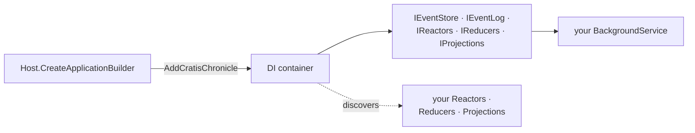

A worker service is the natural home for the *reacting* side of an event-sourced system: no web front end, just a long-running host that processes events, runs scheduled jobs, or keeps derived data up to date. Setting Chronicle up here is mostly a matter of letting the generic host's DI container do the wiring — register Chronicle once, then inject what you need wherever you need it.

This guide gets Chronicle running in a fresh worker service. If you're building a web API instead, the [ASP.NET Core guide](./aspnetcore.md) covers that host; for the bare-bones, no-container version, see the [console guide](./console.md).

[!INCLUDE [pre-requisites](./prereq.md)]

[!INCLUDE [docker](./docker.md)]

## Setup project

Start by creating a folder for your project and then create a .NET worker service project inside this folder:

```shell
dotnet new worker
```

Add a reference to the [Chronicle client package](https://www.nuget.org/packages/Cratis.Chronicle):

```shell
dotnet add package Cratis.Chronicle
```

> **Note:** For worker services you only need the base `Cratis.Chronicle` package — the `Cratis.Chronicle.AspNetCore` package is for web applications only.

## Host setup

Open your `Program.cs` and configure Chronicle using `AddCratisChronicle` on the `IHostApplicationBuilder`:

```csharp
var builder = Host.CreateApplicationBuilder(args);

builder.AddCratisChronicle(options =>
{
    options.EventStore = "MyWorkerApp";
});

builder.Services.AddHostedService<Worker>();

var host = builder.Build();
await host.RunAsync();
```

The `AddCratisChronicle` call:

- Registers `IChronicleClient`, `IEventStore`, and all the event store components (`IEventLog`, `IReactors`, `IReducers`, `IProjections`, `IReadModels`) in the DI container.
- Automatically discovers and registers all artifacts (Reactors, Reducers, Projections) from the loaded assemblies.
- Reads configuration from the `Cratis:Chronicle` section of `appsettings.json` (connection string, timeouts, etc.).

That one call is the whole integration — from here on, Chronicle is just another set of services in the container:



## Configuration

Chronicle reads its connection settings from `appsettings.json`. Add the following to yours:

```json
{
  "Cratis": {
    "Chronicle": {
      "ConnectionString": "chronicle://localhost:35000",
      "EventStore": "MyWorkerApp"
    }
  }
}
```

You can also configure the event store name inline (as shown above) and keep the connection string in configuration.

## Worker implementation

Inject `IEventStore` or any of the event store sub-services into your hosted service:

```csharp
public class Worker(IEventStore eventStore) : BackgroundService
{
    protected override async Task ExecuteAsync(CancellationToken stoppingToken)
    {
        // Connect to Chronicle and start processing
        await eventStore.Connection.Connect();

        // Keep running until the host shuts down
        await Task.Delay(Timeout.Infinite, stoppingToken);
    }
}
```

## Structural dependencies

For custom identity providers, correlation ID accessors, or namespace resolvers, use the `configure` callback:

```csharp
builder.AddCratisChronicle(
    configureOptions: options => options.EventStore = "MyWorkerApp",
    configure: b => b
        .WithIdentityProvider(new MyServiceIdentityProvider())
        .WithNamespaceResolver(new MyTenantResolver()));
```

See [Structural Dependencies](../configuration/structural-dependencies.md) for a full list of configurable dependencies.

## Namespace resolution

By default the worker uses the default namespace for all operations. To support multi-tenant scenarios, provide a custom `IEventStoreNamespaceResolver` via `ChronicleClientOptions`:

```csharp
builder.AddCratisChronicle(options =>
{
    options.EventStore = "MyWorkerApp";
    options.EventStoreNamespaceResolverType = typeof(MyTenantNamespaceResolver);
});
```

Or pass a resolver instance directly through the builder:

```csharp
builder.AddCratisChronicle(
    configureOptions: options => options.EventStore = "MyWorkerApp",
    configure: b => b.WithNamespaceResolver(new MyTenantNamespaceResolver(config)));
```

See [Namespace resolution](../namespaces/dotnet-client.md) for details on built-in resolvers.

## Services

Chronicle uses the DI container to create instances of Reactors, Reducers, and Projections it discovers. Register them as services in `Program.cs`:

```csharp
builder.Services.AddTransient<MyReactor>();
builder.Services.AddTransient<MyReducer>();
```

For larger solutions, the Cratis Fundamentals convention-based registration helpers keep this manageable:

```csharp
builder.Services
    .AddBindingsByConvention()
    .AddSelfBindings();
```

## Recap

You added Chronicle to a worker service with a single `AddCratisChronicle` call, pointed it at an event store through `appsettings.json`, and injected `IEventStore` into a `BackgroundService` to start processing. The generic host's DI container did the wiring — discovering your reactors, reducers, and projections and handing you the services to use them.

## Where to go next

- **[Build a domain step by step](/chronicle/tutorial/)** — the tutorial walks a small library model one concept at a time, defining the events and read models your worker will process.
- **Reacting to events** — a worker's main job; see [Reactors](/chronicle/reactors/) for the patterns.
- **A different host** — the same artifacts run unchanged behind a web API ([ASP.NET Core](./aspnetcore.md)) or with no container at all ([console](./console.md)).

