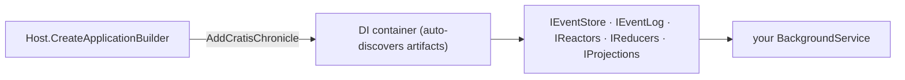

A worker service is the natural home for the *reacting* side of an event-sourced system: no web front end, just a long-running host that processes events, runs scheduled jobs, or keeps derived data up to date. Setup is mostly a matter of letting the generic host's DI container do the wiring — register Chronicle once, then inject what you need wherever you need it.

We'll build the same small library domain as the other host guides. If you're building a web API instead, the [ASP.NET Core guide](./aspnetcore.md) covers that host; for the bare-bones, no-container version, see the [console guide](./console.md).

## Before you start

Have the Chronicle kernel running locally. [Run Chronicle locally](./choose-hosting-model#run-chronicle-locally) brings it up with a single `docker run` and lists the prerequisites (.NET 8+, Docker); this guide assumes it's listening on `chronicle://localhost:35000`.

## Set up the project

Create a folder for your project, then a .NET worker service inside it:

```shell
dotnet new worker
```

Add a reference to the [Chronicle client package](https://www.nuget.org/packages/Cratis.Chronicle):

```shell
dotnet add package Cratis.Chronicle
```

> [!NOTE]
> A worker only needs the base `Cratis.Chronicle` package — `Cratis.Chronicle.AspNetCore` is for web applications.

## Register Chronicle on the host

The generic host builds your app through `IHostApplicationBuilder`, which already has a dependency-injection container. One call hooks Chronicle into it and names the event store to use:

```csharp
var builder = Host.CreateApplicationBuilder(args);

builder.AddCratisChronicle(options => options.EventStore = "Quickstart");
builder.Services.AddHostedService<Worker>();

var host = builder.Build();
await host.RunAsync();
```

Like the [ASP.NET Core](./aspnetcore.md) host, `AddCratisChronicle` registers Chronicle's services — `IEventStore`, `IEventLog`, `IReactors`, `IReducers`, `IProjections` — and automatically discovers and registers your artifacts (reactors, reducers, projections) from the loaded assemblies. It reads its connection settings from the `Cratis:Chronicle` section of `appsettings.json`:



```json title="appsettings.json"
{
  "Cratis": {
    "Chronicle": {
      "ConnectionString": "chronicle://localhost:35000",
      "EventStore": "Quickstart"
    }
  }
}
```

[!INCLUDE [common](./common.md)]

## Append from the worker

In a worker you append from your `BackgroundService` rather than inline. Inject `IEventStore` (or `IEventLog` directly) and append inside `ExecuteAsync`:

```csharp
public class Worker(IEventStore eventStore) : BackgroundService
{
    protected override async Task ExecuteAsync(CancellationToken stoppingToken)
    {
        await eventStore.Connection.Connect();

        var bookId = Guid.NewGuid();
        await eventStore.EventLog.Append(bookId, new BookAdded("The Pragmatic Programmer", "978-0135957059"));

        // Keep running so reactors and projections keep processing.
        await Task.Delay(Timeout.Infinite, stoppingToken);
    }
}
```

The projections and the `BookReturnedNotifier` reactor pick those events up from the kernel — the worker stays alive to keep processing them.

## Configure the MongoDB client

The `Books` query reads documents Chronicle wrote, so the MongoDB driver needs to match how Chronicle stores them — register these conventions once at startup:

[!INCLUDE [mongodb](./mongodb.md)]

Then register the database and the collection so a type can take an `IMongoCollection<Book>` dependency:

```csharp
builder.Services.AddSingleton<IMongoClient>(new MongoClient("mongodb://localhost:27017"));
builder.Services.AddSingleton(provider => provider.GetRequiredService<IMongoClient>().GetDatabase("Quickstart"));
builder.Services.AddTransient(provider => provider.GetRequiredService<IMongoDatabase>().GetCollection<Book>("Books"));
```

## Register your artifacts

Chronicle creates its discovered artifacts through the container, so they need to be registered as services. For a handful, register them explicitly; as the solution grows, let Cratis Fundamentals do it by convention:

```csharp
builder.Services
    .AddBindingsByConvention()
    .AddSelfBindings();
```

`AddBindingsByConvention` registers any service that implements an interface of the same name prefixed with `I` (`IFoo` → `Foo`); `AddSelfBindings` registers concrete classes as themselves.

## Going further

- **Multi-tenant namespaces** — provide a custom `IEventStoreNamespaceResolver` to route operations per tenant. See [Namespace resolution](../namespaces/dotnet-client.md).
- **Structural dependencies** — supply custom identity providers, correlation-id accessors, or namespace resolvers through the `configure` callback on `AddCratisChronicle`. See [Structural dependencies](../configuration/structural-dependencies.md).

## Recap

You added Chronicle to a worker service with a single `AddCratisChronicle` call, pointed it at an event store through `appsettings.json`, and appended events from a `BackgroundService` — the generic host's DI container discovered your reactors, reducers, and projections and handed you the services to use them. The same library domain runs here unchanged from the other hosts.

## Where to go next

- **[Build the domain step by step](/chronicle/tutorial/)** — the tutorial walks the library model one concept at a time.
- **Reacting to events** — a worker's main job; see [Reactors](/chronicle/reactors/) for the patterns.
- **A different host** — the same artifacts run unchanged behind a web API ([ASP.NET Core](./aspnetcore.md)) or with no container at all ([console](./console.md)).
