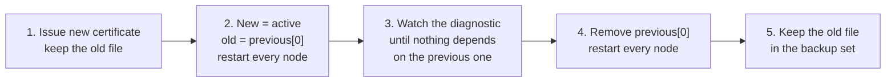

# Data Protection Key Encryption

Chronicle uses ASP.NET Core Data Protection to securely manage encryption keys for OAuth tokens and other sensitive data. In production environments, these keys must be protected with an X.509 certificate to ensure security across multiple Chronicle instances.

## Overview

When Chronicle runs in a clustered environment, all instances need access to the same Data Protection keys to correctly encrypt and decrypt tokens. These keys are stored in MongoDB and shared across all instances using Orleans grains.

In production, an encryption certificate is **required**. In development builds it is optional for convenience.

One PFX serves three consumers, and they fail in different ways when it is missing — worth knowing, because only one of them is loud:

| Consumer | Without the certificate, in a production build |
| --- | --- |
| **OpenIddict** — the internal OAuth authority | **The server refuses to start.** This is the failure a production deployment hits first, before anything else can go wrong. |
| **Webhook credentials** | Throws `EncryptionCertificateNotConfigured` **lazily**, the first time a webhook secret is encrypted or decrypted — so a server that started fine can still fail here later. |
| **Data Protection keys** | Nothing fails. Chronicle starts, and the keys are simply written unencrypted. Data Protection never refuses to start and never generates a certificate of its own. |

## Configuration

### JSON Configuration

Add the encryption certificate configuration to your `chronicle.json`:

```json
{
    "encryptionCertificate": {
        "certificatePath": "/path/to/encryption-cert.pfx",
        "certificatePassword": "your-certificate-password"
    }
}
```

### Environment Variables

Configure using environment variables (recommended for containerized deployments):

```bash
# Path to the PFX certificate file
Cratis__Chronicle__EncryptionCertificate__CertificatePath=/app/certs/encryption-cert.pfx

# Certificate password
Cratis__Chronicle__EncryptionCertificate__CertificatePassword=your-certificate-password
```

### Configuration Properties

| Property             | Type   | Required (Production) | Description                                |
|----------------------|--------|----------------------|---------------------------------------------|
| certificatePath      | string | Yes                  | Path to the PFX certificate file for the **active** certificate |
| certificatePassword  | string | Yes*                 | Password for the certificate (* can be empty if cert has no password) |
| previous             | array  | No                   | Certificates that were active before, kept for decryption only — see [Rotating the certificate](#rotating-the-certificate) |

Every certificate you configure must carry its private key. A PFX exported without one is rejected at
startup with `EncryptionCertificateWithoutPrivateKey`: all three consumers need to decrypt, not just encrypt.

### The certificate ring

`certificatePath` is one position in an ordered **ring**. The certificate there is *active* — everything
written from now on is protected with it. Anything under `previous` is kept loaded so what it protected
stays readable, and is never used to protect anything new.

```json
{
    "encryptionCertificate": {
        "certificatePath": "/certs/encryption-2026.pfx",
        "certificatePassword": "the-new-password",
        "previous": [
            {
                "certificatePath": "/certs/encryption-2025.pfx",
                "certificatePassword": "the-old-password"
            }
        ]
    }
}
```

As environment variables, the list is indexed the way the configuration binder indexes every list:

```bash
Cratis__Chronicle__EncryptionCertificate__CertificatePath=/certs/encryption-2026.pfx
Cratis__Chronicle__EncryptionCertificate__CertificatePassword=the-new-password
Cratis__Chronicle__EncryptionCertificate__Previous__0__CertificatePath=/certs/encryption-2025.pfx
Cratis__Chronicle__EncryptionCertificate__Previous__0__CertificatePassword=the-old-password
```

An existing single-certificate configuration keeps working unchanged — it is a ring with nothing behind
the active position.

The ring is read once at startup and held for the life of the process, so changing it takes a restart.
**Every node in a cluster must be given the same ring**, for the same reason they must share one
certificate today: Data Protection keys live in the shared storage, and any node may have to read what
another wrote.

### What a broken ring does

Chronicle refuses to start rather than run with a ring that is missing a certificate, because a certificate
quietly absent from the ring is data quietly becoming unreadable:

| Configuration | What happens |
| --- | --- |
| `certificatePath` set, but no file there | `EncryptionCertificateFileNotFound`, naming the path |
| A `previous` entry whose file is not there | `EncryptionCertificateFileNotFound`, naming the path |
| A `previous` entry with no `certificatePath` | `EncryptionCertificateWithoutPath` |
| `previous` set with no active certificate | `PreviousEncryptionCertificatesWithoutActive` |
| The same certificate active *and* previous | `DuplicateEncryptionCertificateInRing` — an overlap that is not one |
| A certificate carrying no private key | `EncryptionCertificateWithoutPrivateKey` |

> [!IMPORTANT]
> Pointing `certificatePath` at a file that is not there used to be silent: Data Protection wrote its keys
> unencrypted and OpenIddict reported that no certificate was configured when one was. It now stops
> startup. If a deployment starts failing on this after an upgrade, it was never protecting its keys.

Configuring **no** certificate at all is unchanged — see [Development Mode](#development-mode).

## Generating a Certificate

You can use the same certificate for both TLS and Data Protection key encryption, or generate a separate certificate specifically for key encryption.

### Using .NET CLI

```bash
# Generate a certificate for key encryption
dotnet dev-certs https -ep ./encryption-cert.pfx -p YourSecurePassword123
```

### Using OpenSSL

```bash
# Generate a private key
openssl genrsa -out encryption.key 2048

# Create a self-signed certificate
openssl req -x509 -new -nodes -key encryption.key -sha256 -days 3650 \
    -out encryption.crt \
    -subj "/CN=Chronicle Data Protection/O=Your Organization"

# Convert to PFX format
openssl pkcs12 -export -out encryption-cert.pfx \
    -inkey encryption.key -in encryption.crt \
    -password pass:YourSecurePassword123
```

## Docker Configuration

Mount the certificate when running Chronicle in Docker:

```yaml
version: '3.8'

services:
  chronicle:
    image: cratis/chronicle:latest
    ports:
      - "35000:35000"
    volumes:
      - ./certs/encryption-cert.pfx:/app/certs/encryption-cert.pfx:ro
    environment:
      - Cratis__Chronicle__Storage__ConnectionDetails=mongodb://mongodb:27017
      - Cratis__Chronicle__EncryptionCertificate__CertificatePath=/app/certs/encryption-cert.pfx
      - Cratis__Chronicle__EncryptionCertificate__CertificatePassword=YourSecurePassword123
```

### Using Same Certificate for TLS and Encryption

You can use the same PFX certificate for both TLS and Data Protection key encryption:

> [!WARNING]
> Sharing one file means TLS renewal rotates your encryption certificate. Whatever replaces that file —
> cert-manager, ACME, an ingress controller — is doing a hard replacement on a schedule you do not control,
> and unless the file it replaces is first moved into `previous`, everything it protected becomes
> unreadable. If the certificate is shared, treat every TLS renewal as a
> [rotation](#rotating-the-certificate); if you cannot, give encryption its own certificate.

```yaml
services:
  chronicle:
    image: cratis/chronicle:latest
    volumes:
      - ./certs/chronicle.pfx:/app/certs/chronicle.pfx:ro
    environment:
      # TLS configuration
      - Cratis__Chronicle__Tls__CertificatePath=/app/certs/chronicle.pfx
      - Cratis__Chronicle__Tls__CertificatePassword=YourPassword
      # Data Protection key encryption (same certificate)
      - Cratis__Chronicle__EncryptionCertificate__CertificatePath=/app/certs/chronicle.pfx
      - Cratis__Chronicle__EncryptionCertificate__CertificatePassword=YourPassword
```

## Multi-Instance Deployments

In clustered deployments, all Chronicle instances must use the **same** encryption certificate — and, during a rotation, the same `previous` list. This ensures that any instance can decrypt Data Protection keys stored in the shared MongoDB database.

```yaml
services:
  chronicle-1:
    image: cratis/chronicle:latest
    environment:
      - Cratis__Chronicle__EncryptionCertificate__CertificatePath=/app/certs/encryption-cert.pfx
      - Cratis__Chronicle__EncryptionCertificate__CertificatePassword=SharedPassword
    volumes:
      - ./certs/encryption-cert.pfx:/app/certs/encryption-cert.pfx:ro

  chronicle-2:
    image: cratis/chronicle:latest
    environment:
      - Cratis__Chronicle__EncryptionCertificate__CertificatePath=/app/certs/encryption-cert.pfx
      - Cratis__Chronicle__EncryptionCertificate__CertificatePassword=SharedPassword
    volumes:
      - ./certs/encryption-cert.pfx:/app/certs/encryption-cert.pfx:ro
```

## Rotating the certificate

A rotation is forward only, and every step is a restart of **every** node with the same ring. Nothing is
re-encrypted in bulk — the previous certificate stays in the ring until nothing needs it any more.



1. **Issue the new certificate.** Keep the file the current one lives in — you are going to need it in the
   ring, and in the backup set for longer than that.
2. **Make the new one active and the old one previous.** Restart every node. From this point new Data
   Protection keys and new webhook credentials are protected with the new certificate, and everything the
   old one protected is still readable.
3. **Wait until nothing depends on the previous certificate.** Read the diagnostic below. Data Protection
   creates new keys on its own schedule; there is nothing to force and no migration to run.
4. **Remove the entry from `previous`.** Restart every node. The certificate is now retired.
5. **Keep the retired file in the backup set** until the oldest restorable backup is newer than step 2.
   See [Backup and restore ordering](#backup-and-restore-ordering) — this is the step that loses data when
   it is skipped.

> [!WARNING]
> Overwriting the file at `certificatePath` with a different key pair is **not** a rotation. The ring only
> helps when the previous file is kept and listed under `previous`; replacing a file in place leaves no
> overlap and makes everything the old key pair protected unreadable.

### What each consumer does during the overlap

| Consumer | During the overlap |
| --- | --- |
| **Data Protection keys** | New keys are protected with the active certificate; any certificate in the ring can unprotect, so keys written before the rotation stay readable |
| **OpenIddict** — the internal OAuth authority | Every certificate in the ring is registered, so tokens issued under the previous one keep validating. OpenIddict chooses which certificate *issues* by its own rule — it prefers the X.509 key with the furthest expiration date, not the one Chronicle marks active. In a normal rotation the new certificate outlives the old one and the two agree; promote a certificate that expires *earlier* than one still in the ring and OpenIddict keeps issuing under the longer-lived one |
| **Webhook credentials** — Chronicle's value encryption | Values are written with the active certificate and carry the key id of the certificate that protected them, so a value needing a retired certificate is reported as such instead of failing as if it were corrupt. Existing values are rewritten only when the credential itself is changed |

> [!IMPORTANT]
> Finish a rolling upgrade before rotating, and before creating or changing webhook credentials during
> one. A credential written by an upgraded node carries a key id, which a node still running an older
> version cannot read.

An **expired** certificate still decrypts — RSA does not consult the validity window — so a previous
certificate that has expired keeps doing its job in the ring. It cannot be the active one.

## Watching a rotation

`GET /diagnostics/encryption-certificates` answers the questions a rotation raises: what is in the ring,
which certificate is active, and whether anything still depends on a previous one. It requires
authentication like every other non-anonymous endpoint, and it names key ids, subjects and paths — never
key material.

```bash
curl --silent \
  --header "Authorization: Bearer $CHRONICLE_ACCESS_TOKEN" \
  https://chronicle:35000/diagnostics/encryption-certificates
```

```json
{
  "ring": {
    "isConfigured": true,
    "activeKeyId": "90E5D2C993BFB12A7E6B45D64664C18A7E4A93F0",
    "certificates": [
      {
        "keyId": "90E5D2C993BFB12A7E6B45D64664C18A7E4A93F0",
        "role": "Active",
        "subject": "CN=Chronicle Encryption 2026",
        "notBefore": "2026-01-01T00:00:00+00:00",
        "notAfter": "2027-01-01T00:00:00+00:00",
        "certificatePath": "/certs/encryption-2026.pfx",
        "hasExpired": false
      },
      {
        "keyId": "8CBEF43CE4B7B56664D66D6285A4A2064551ACE5",
        "role": "Previous",
        "subject": "CN=Chronicle Encryption 2025",
        "notBefore": "2025-01-01T00:00:00+00:00",
        "notAfter": "2026-01-01T00:00:00+00:00",
        "certificatePath": "/certs/encryption-2025.pfx",
        "hasExpired": true
      }
    ],
    "isRotating": true
  },
  "dataProtectionKeys": [
    {
      "keyId": "90E5D2C993BFB12A7E6B45D64664C18A7E4A93F0",
      "role": "Active",
      "keyCount": 1
    },
    {
      "keyId": "8CBEF43CE4B7B56664D66D6285A4A2064551ACE5",
      "role": "Previous",
      "keyCount": 1
    }
  ],
  "keysNotProtectedByCertificate": 0,
  "previousCertificatesInUse": true,
  "retiredCertificatesInUse": false,
  "canRetirePreviousCertificates": false
}
```

| Field | What it tells you |
| --- | --- |
| `ring` | The certificates this node actually loaded, active first. This is what has to match across the cluster |
| `dataProtectionKeys` | How many stored Data Protection keys are encrypted to each certificate. Read out of storage — each stored key records the certificate it needs |
| `previousCertificatesInUse` | Stored keys still depend on a certificate in the `previous` position. Removing it now makes them unreadable |
| `retiredCertificatesInUse` | Stored keys depend on a certificate that is in **neither** position. Those keys are already unreadable — this is what a rotation done in the wrong order, or a restore into a ring that has moved on, looks like |
| `keysNotProtectedByCertificate` | Stored keys no certificate protects at all, which is what a deployment running without an encryption certificate produces |
| `canRetirePreviousCertificates` | Step 4 of the rotation is safe: the ring is rotating and nothing depends on the previous certificates |

Two things this does **not** cover, and they matter:

- **Webhook credentials are not enumerated.** A previous certificate reported with no Data Protection keys
  may still be needed by a stored webhook credential. Chronicle logs a warning the first time it reads a
  value with a previous certificate, naming the key id — watch for that before step 4, and rewrite the
  credential to move it onto the active certificate.
- **It reports this node.** Read it on every node during a rolling restart; a node left on the old ring
  reports the old ring.

The ring is also logged at every boot, one line per certificate, so the ring a node came up with is in its
logs whether or not anyone calls the endpoint.

## Backup and restore ordering

Losing this ordering loses data irrecoverably: a backup restored into a ring that no longer holds the
certificate its contents were protected with is unreadable, and nothing about the restore reports it.

### What has to be in the backup set

| Item | Where it lives | Why |
| --- | --- | --- |
| Every certificate in the ring, plus the passwords | Wherever you keep certificates — a secret store, not the database | Nothing else can decrypt what they protected |
| The storage backend (MongoDB or SQL) | Your database backups | Holds the Data Protection key ring, the webhook definitions and their encrypted credentials, and the OAuth applications and tokens |
| The compliance key store, when one is configured | Vault, Azure Key Vault, or the general storage | PII keys — a separate subsystem the encryption certificate never protects. See [Compliance Storage](configuration/compliance-storage.md) |

The Data Protection key ring is **inside** the storage backend, not a separate artifact — a database backup
already carries it. What a database backup cannot carry is the certificate that unlocks it.

### Retention: a certificate outlives its ring

**A certificate has to stay in the backup set for at least as long as the oldest backup you would still
restore** — which is longer than it stays in the ring. Retire a certificate from the ring on Monday, delete
the file on Tuesday, and every backup taken before the rotation becomes unreadable, silently, until the day
someone tries to restore one.

The safe rule: never delete a certificate file until every backup that predates its rotation has aged out.

### Restore order

1. **Restore the certificate ring first**, in the shape it had when the backup was taken — including every
   `previous` entry that was live then. Restoring the *current* ring is the mistake this ordering exists to
   prevent.
2. **Restore the storage backend** (MongoDB or SQL).
3. **Restore the compliance key store**, if one is configured, to the same point in time as the storage. A
   PII key that is newer or older than the events it protects reads back as an empty string.
4. **Start one node and read the diagnostic before starting the rest.** Keys reported with the role
   `Retired` mean the ring is missing a certificate the restored data needs — add it back under `previous`
   and restart before serving traffic.

> [!CAUTION]
> A backup taken *before* a rotation contains data protected by the certificate that was active then. If
> that certificate has since been retired from the ring, restoring the backup produces data nothing can
> read. Put the certificate back under `previous` before you restore, not after.

### What survives losing the cluster

Losing every running node but keeping the documented backup set is recoverable: the certificate ring
restores the Data Protection keys held in the storage backup, which in turn restore every certificate-
encrypted server secret. Losing the certificates is not recoverable by any means — there is no escrow, no
recovery key and no support path.

## Development Mode

In development mode (when Chronicle is built with the `DEVELOPMENT` configuration), the encryption certificate is **optional**. This allows for easier local development without certificate management overhead.

### Auto-Generated Certificates (Development Only)

When no encryption certificate is configured **and Chronicle is compiled with DEVELOPMENT mode**, the value-encryption subsystem — the one that protects webhook credentials — automatically generates a self-signed certificate the first time it needs one. This certificate is:

- **Location**: Stored in a `certificates` folder in the current working directory
- **Filename**: `encryption-cert.pfx`
- **Password**: `chronicle-auto-generated` (auto-assigned)
- **Validity**: 10 years from generation
- **Reuse**: If the certificate already exists, Chronicle will use it instead of generating a new one

This feature is designed to simplify local development and testing. The certificate is created lazily on first encrypt or decrypt rather than at startup, and persisted for subsequent runs so encrypted data remains accessible across restarts. Data Protection does not take part in this — it never generates a certificate, so its keys stay unencrypted whenever none is configured.

> **Important**: In **production builds** (without the DEVELOPMENT directive) there is no auto-generation. Two things happen instead: OpenIddict makes the server **refuse to start**, and — if you get past that — the value-encryption subsystem throws `EncryptionCertificateNotConfigured` on first use.
>
> The refusal to start comes from the **internal OAuth authority**, so it only applies when that authority is running. Turning the `oAuthAuthority` feature off, or configuring an external authority via `authentication.authority` (which disables the internal one automatically), removes the startup requirement — see [Features](configuration/features.md). The value-encryption behavior is independent of that and is unchanged.

### Running Without Configuration

To run without a certificate in development:

```bash
# No certificate configuration needed in development
docker run -d \
  --name chronicle-dev \
  -p 35000:35000 \
  -e Cratis__Chronicle__Storage__ConnectionDetails=mongodb://localhost:27017 \
  cratis/chronicle:latest-development
```

> **Warning**: Auto-generated certificates should **never** be used in production environments. They are not cryptographically secure for production use and are intended only for development convenience. Production deployments **must** configure a proper encryption certificate.

## Security Best Practices

1. **Use strong passwords** - Certificate passwords should be complex and unique
2. **Protect certificate files** - Store certificates securely and limit access
3. **Rotate through the ring** - Follow [Rotating the certificate](#rotating-the-certificate); never replace the file in place
4. **Separate concerns** - Consider using different certificates for TLS and key encryption. A certificate shared with TLS is replaced on the TLS renewal schedule, which is not a schedule you control, and every such replacement is a rotation
5. **Backup certificates** - See [Backup and restore ordering](#backup-and-restore-ordering); losing the certificate means losing access to encrypted keys, with no recovery path
6. **Use secrets management** - In production, use a secrets manager (Azure Key Vault, HashiCorp Vault, etc.) to store certificate passwords

## Troubleshooting

### Certificate Not Found

If you see an error about the certificate not being found:

1. Verify the certificate path is correct and accessible
2. Check file permissions on the certificate file
3. Ensure the path uses forward slashes in Docker/Linux environments

### Invalid Certificate Password

If authentication fails after configuration:

1. Verify the certificate password is correct
2. Check for special characters that may need escaping in environment variables
3. Ensure the password matches what was used during certificate generation

### A value needs a certificate that is not in the ring

`EncryptionCertificateNotInRing` names the key id the value was protected with and the key ids the ring
holds. It means that certificate was retired while something still depended on it. Put the file back under
`previous`, restart, and read the value — there is no way to recover it without the certificate.

`ValueNotDecryptableWithAnyCertificate` is the same situation for a value written before Chronicle labeled
ciphertext with a key id: nothing in the ring opens it, so the certificate that did is gone from the ring.

Both messages name key ids and nothing else. Neither prints the protected value.

## Next Steps

- [Local Certificates](local-certificates) - TLS certificate setup for development
- [Production Hosting](production.md) - Production deployment requirements
- [Compliance Storage](configuration/compliance-storage.md) - The PII key store and its own backup ordering
- [Configuration](configuration/index.md) - Complete configuration reference

