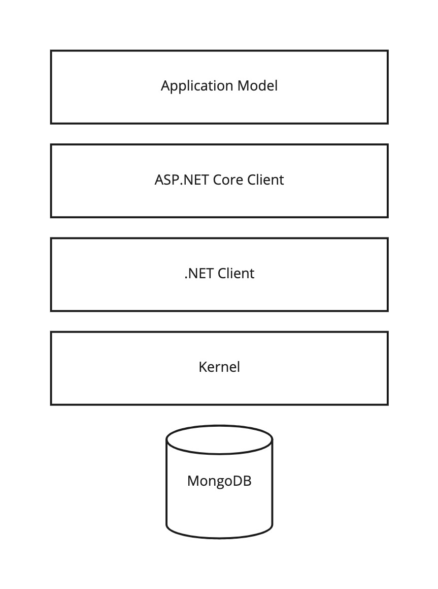

# Introduction

Cratis is an open source event sourcing platform focused on making event sourcing as simple as your average CRUD
application whether you're building a monolith or a microservice solution. Leveraging MongoDB as storage engine.

You can find the source code over at [GitHub](https://github.com/aksio-insurtech/cratis).

Cratis consists of more than just an event store and a client, it also offers an optional application model that
simplifies development with concepts like [CQRS](https://en.wikipedia.org/wiki/Command%E2%80%93query_separation#Command_Query_Responsibility_Segregation).

The stack of Cratis looks like the following:

You are in control of which parts of the stack you want, and you don't have to take all the layers if that
does not fit your needs.

## Principles

In developing Cratis we are guided by the following principles

* Be where the developers are - integrate into existing most popular development environments / frameworks.
* Truly democratize; focus on the majority of developers.
* Don't force principles and approaches onto developers.
* Always ask the question; can it be made simpler?
* Enable developers to create well architected solutions without them having to do so consciously.

## Fundamentals

Cratis has a set of general productivity utilities that it leverages internally in the Kernel and the clients.
These are packaged, documented and available for anyone else.

You can read more about the fundamentals [here](./fundamentals/index.md)

## Kernel

The Kernel is the heart of Cratis, it does all the heavy lifting. Any clients on top delegates the work to the
Kernel. It is built on top of Microsoft Orleans and is built for scale. You can see the Kernel as the server
component and specifically the event store database representation.

You can read more about the Kernel [here](./kernel/index.md).

## Client

## Pillars

## Multi-tenancy

### New ACID

#### Associative

#### Commutative

#### Idempotent

#### Distributed
